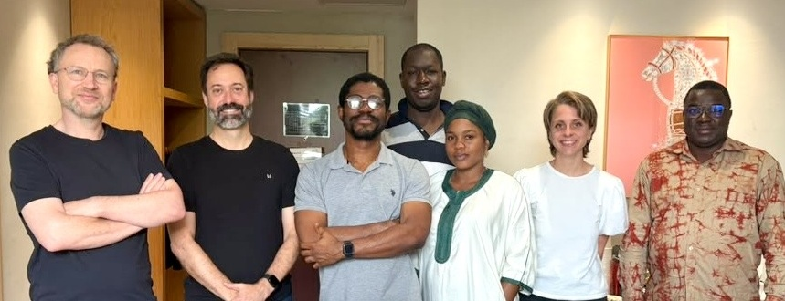

::: {.hero}
{.logo width="150px"}
:::

::: {.panel-tabset}

## Slides

# Slides for Abidjan Learning Days 2026

Bilingual teaching slides (En / Fr) for the [EGAP](https://egap.org/) Learning Days in Abidjan, 2026.

```{r deck-grid, results='asis'}
html_escape <- function(x) {
  x <- gsub("&", "&amp;", x, fixed = TRUE)
  x <- gsub("<", "&lt;", x, fixed = TRUE)
  x <- gsub(">", "&gt;", x, fixed = TRUE)
  x <- gsub('"', "&quot;", x, fixed = TRUE)
  x
}

decks <- read.csv(
  "index.csv",
  stringsAsFactors = FALSE,
  na.strings = c("", "NA"),
  comment.char = ""
)
decks <- decks[order(decks$sort_order), , drop = FALSE]
decks$placeholder <- tolower(as.character(decks$placeholder)) %in%
  c("true", "t", "1", "yes")

cat('<div class="deck-grid">\n')
for (i in seq_len(nrow(decks))) {
  row <- decks[i, ]
  title <- html_escape(row$title)
  blurb <- html_escape(row$blurb)

  if (isTRUE(row$placeholder)) {
    cat('  <div class="deck-card deck-card--placeholder">\n')
    cat('    <span class="deck-num">&middot;</span>\n')
    cat('    <span class="deck-body">\n')
    cat(sprintf('      <span class="deck-title">%s</span>\n', title))
    cat(sprintf('      <span class="deck-blurb">%s</span>\n', blurb))
    cat('    </span>\n')
    cat('  </div>\n')
  } else {
    label <- html_escape(row$label)
    href <- html_escape(row$href)
    cat(sprintf('  <a class="deck-card" href="%s">\n', href))
    cat(sprintf('    <span class="deck-num">%s</span>\n', label))
    cat('    <span class="deck-body">\n')
    cat(sprintf('      <span class="deck-title">%s</span>\n', title))
    cat(sprintf('      <span class="deck-blurb">%s</span>\n', blurb))
    cat('    </span>\n')
    cat('  </a>\n')
  }
}
cat('</div>\n')
```

## Resources | *Ressources*

::: {.columns}
::: {.column .lang-en width="50%"}

- The book is available in both English and French:

- [Theory and Practice of Field Experiments](https://egap.github.io/theory_and_practice_of_field_experiments/)

- [English glossary](https://egap.github.io/theory_and_practice_of_field_experiments/glossary-of-terms.html)

- EGAP Methods Guide on Randomization
  (<https://egap.org/resource/10-things-to-know-about-randomization/>)

- [EGAP's Metaketa Initiative](https://egap.org/our-work/the-metaketa-initiative/)
  works to accumulate knowledge by pre-planning a meta-analysis of
  multiple studies that have high internal validity due to randomization.

:::
::: {.column .lang-fr width="50%"}

- Le livre est disponible en anglais et en français :

- [Théorie et pratique des expériences de terrain](https://egap.github.io/theory_and_practice_of_field_experiments_french/)

- [Glossaire français](https://egap.github.io/theory_and_practice_of_field_experiments_french/glossaire-des-termes.html)

- Guide des méthodes EGAP sur la randomisation
  (<https://egap.org/fr/resource/10-choses-a-savoir-sur-la-randomisation/>)

- [L'initiative Metaketa d'EGAP](https://egap.org/our-work/the-metaketa-initiative/)
  vise à accumuler des connaissances en pré-planifiant une méta-analyse de
  plusieurs études qui ont une validité interne élevée en raison de la
  randomisation.

:::
:::

## Schedule | *Programme*

::: {.schedule-panel}

```{r schedule-table}
library(DT)
schedule <- read.csv("schedule.csv", stringsAsFactors = FALSE)
datatable(
  schedule[, 1:4],
  rownames = FALSE,
  class = "schedule-table",
  width = "100%",
  options = list(
    dom = "t",
    paging = FALSE,
    ordering = FALSE,
    autoWidth = FALSE,
    scrollX = FALSE,
    columnDefs = list(
      list(width = "9%", targets = 0),
      list(width = "14%", targets = 1),
      list(width = "52%", targets = 2),
      list(width = "25%", targets = 3)
    )
  )
)
```

:::

## Instructors | *Instructeurs*

{width="95%" fig-align="center"}


Adikath, Alyssa, Brice, Macartan, Vin, Vincent, Yannick  

:::

```{r render-all-decks, eval=FALSE, include=FALSE}
# Batch-render every deck on the index page. To use:
#   1. Set eval=true in the chunk header (or run this chunk in the IDE), then
#   2. Render index.qmd — or run the chunk alone from RStudio / Positron.
decks <- read.csv(
  "index.csv",
  stringsAsFactors = FALSE,
  na.strings = c("", "NA"),
  comment.char = ""
)
decks <- decks[order(decks$sort_order), , drop = FALSE]
decks$placeholder <- tolower(as.character(decks$placeholder)) %in%
  c("true", "t", "1", "yes")

qmd_files <- sub("\\.html$", ".qmd", decks$href[!isTRUE(decks$placeholder)])

quarto <- Sys.which("quarto")
if (quarto == "") {
  stop("quarto not found on PATH")
}

failed <- character(0)
for (f in qmd_files) {
  if (!file.exists(f)) {
    warning("Missing: ", f)
    failed <- c(failed, f)
    next
  }
  message("Rendering ", f, " ...")
  out <- system2(quarto, c("render", f), stdout = TRUE, stderr = TRUE)
  status <- attr(out, "status")
  if (!is.null(status) && status != 0L) {
    warning("Failed: ", f, "\n", paste(out, collapse = "\n"))
    failed <- c(failed, f)
  }
}

if (length(failed)) {
  stop("Render failed for: ", paste(failed, collapse = ", "))
}
message("All ", length(qmd_files), " decks rendered OK.")
```
