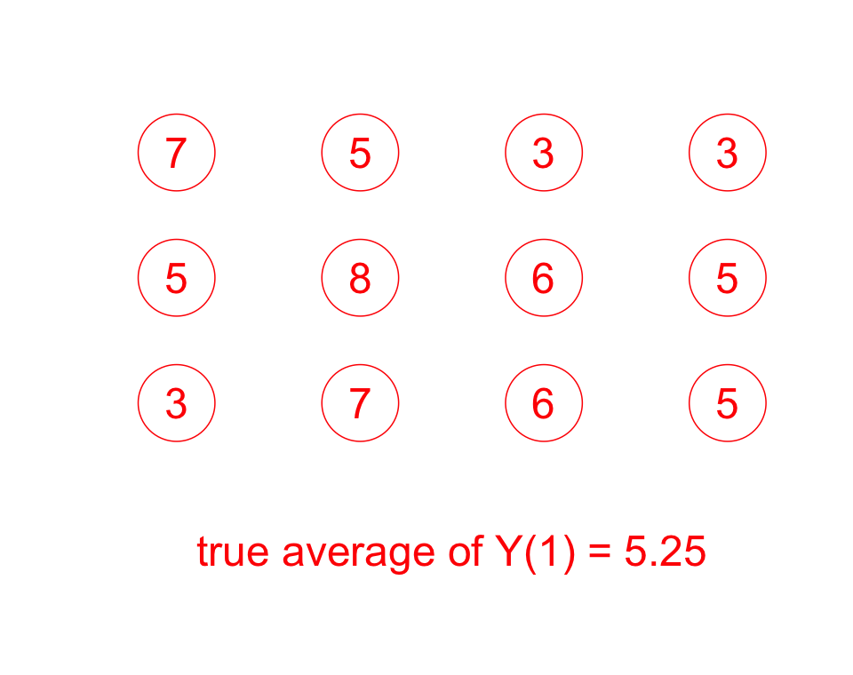
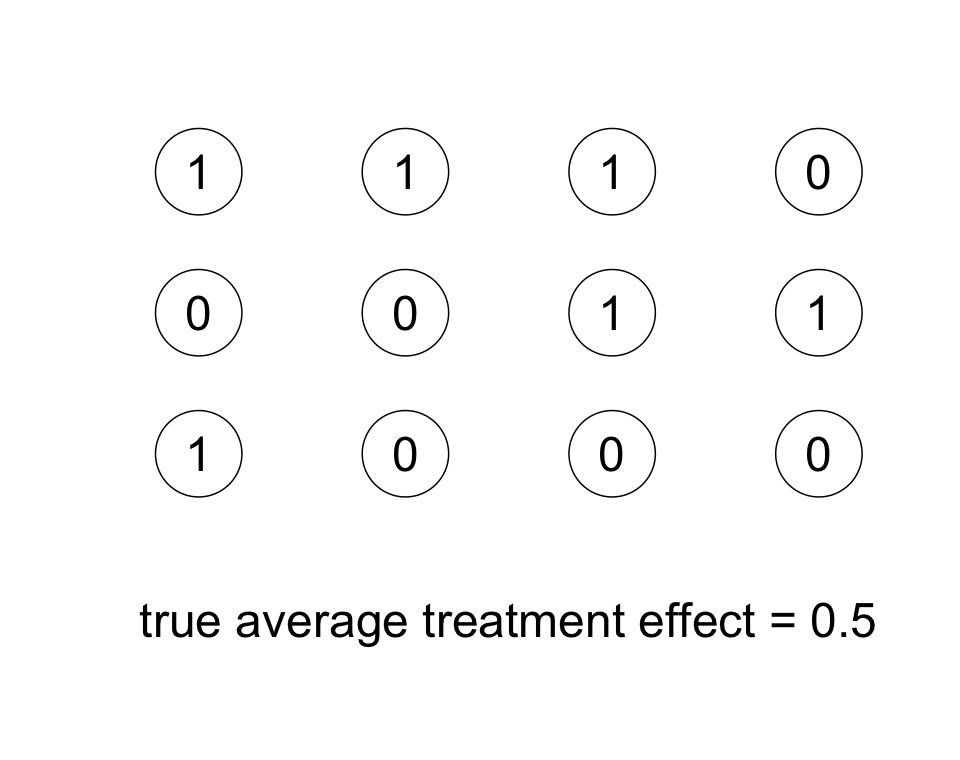
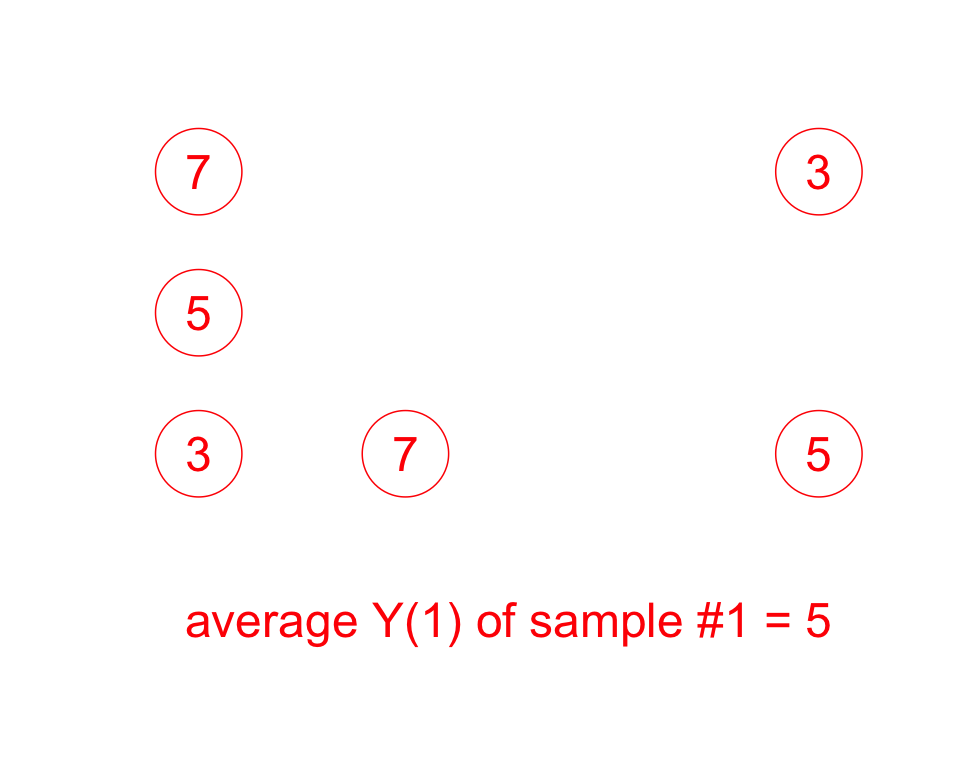
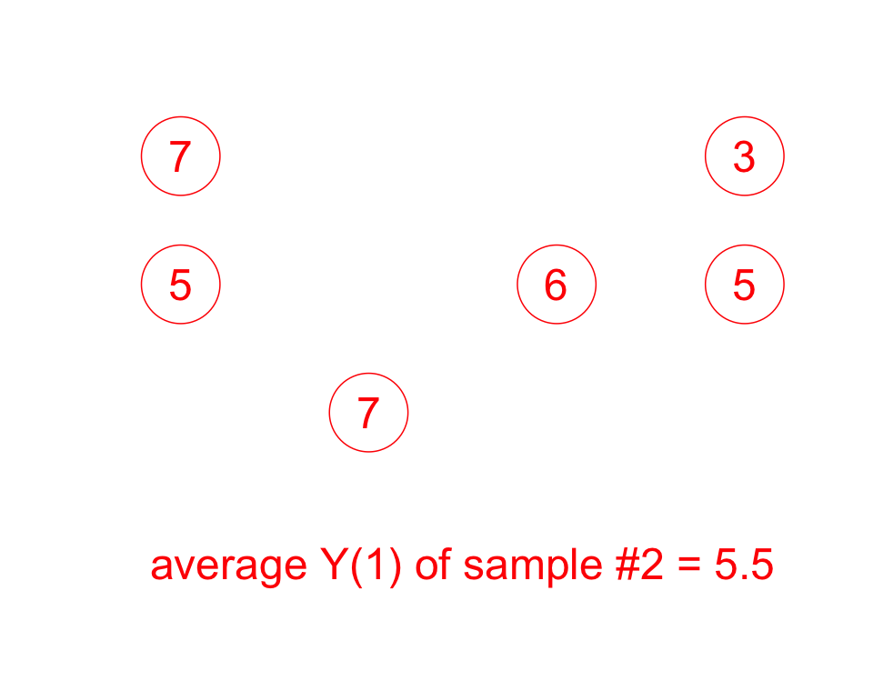
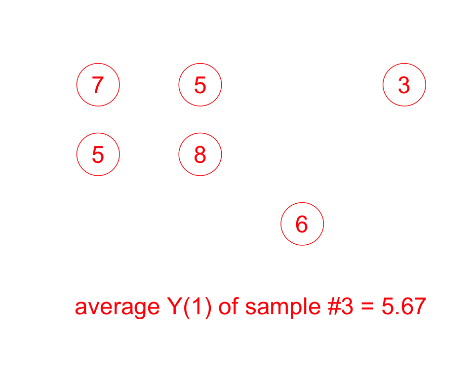
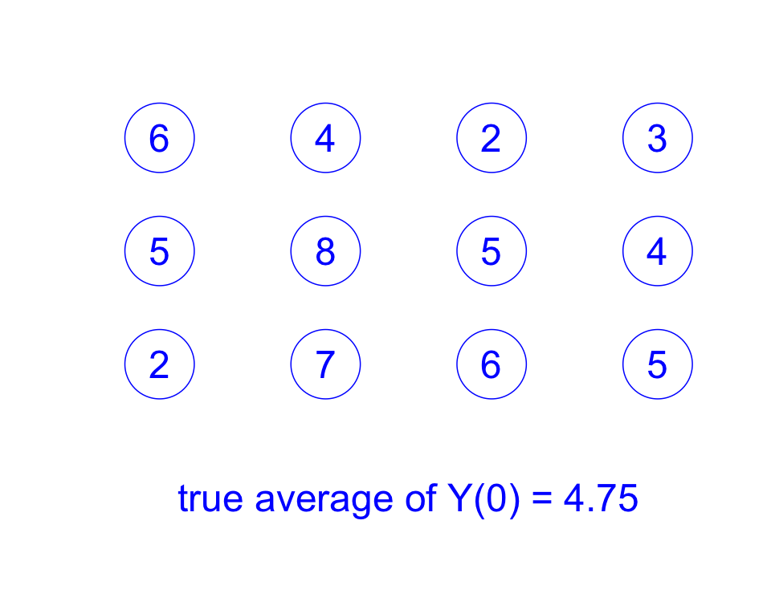
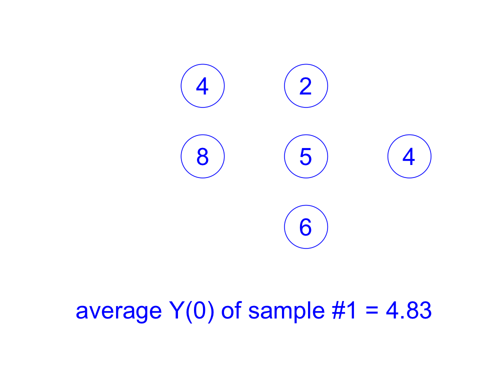
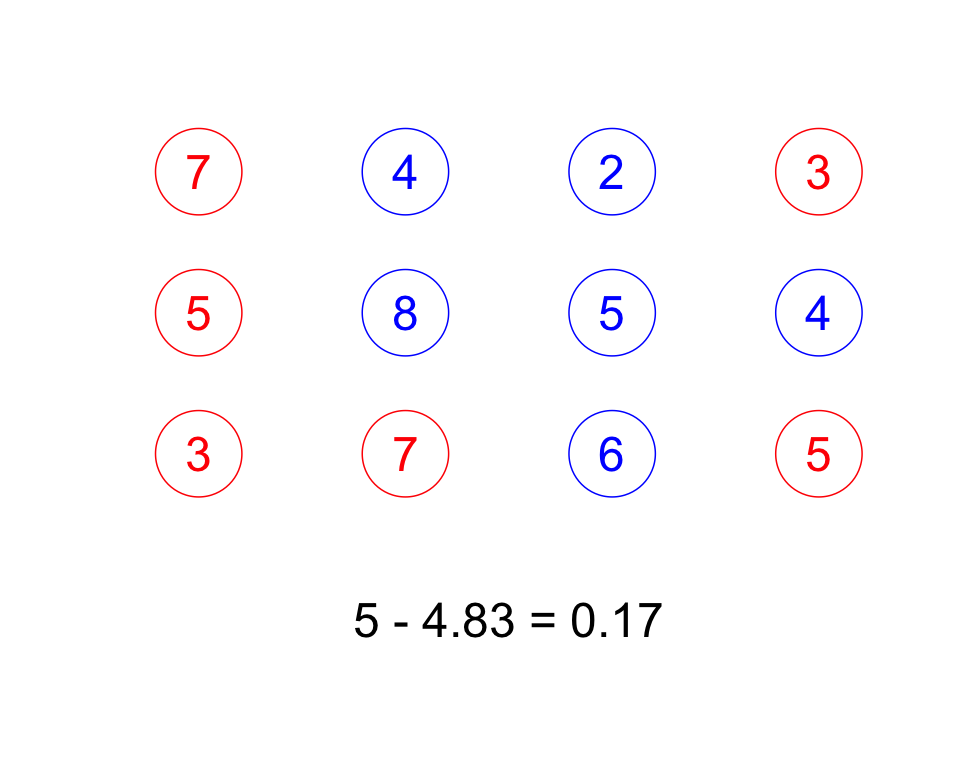
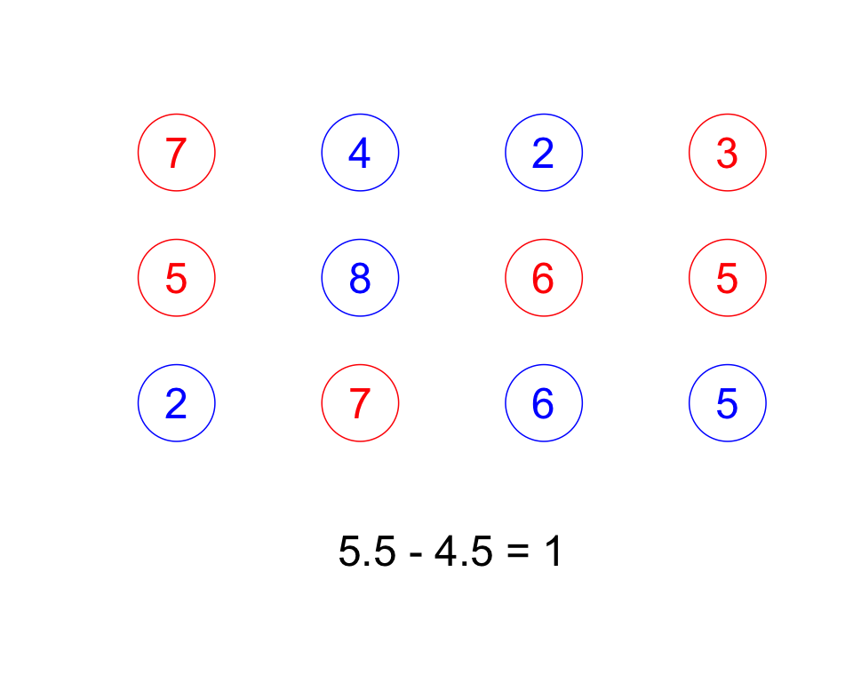

```{r setup, include=FALSE}
# source("rmd_setup.R")
# Load all the libraries we need
# library(here)
# library(tidyverse)
# library(kableExtra)
# library(DeclareDesign)
# library(estimatr)
# library(styler)
# library(coin)
# library(multcomp)
# library(devtools)
# library(randomizr)
# library(rcompanion) ## for pairwisePermutationTest()
```

## Key points for this lecture \| *Points clés du cours*

::: {.cols data-latex=""}
::: {.col data-latex="{0.48\\textwidth}"}

-   Potential outcomes

-   A causal effect is a difference between potential outcomes

-   Core assumptions for causal inference

-   The difference between randomized and observational studies
:::

::: {.col data-latex="{0.04\\textwidth}"}
  <!-- an empty Div (with a white space), serving as
a column separator -->
:::

::: {.col data-latex="{0.48\\textwidth}"}
-   Les résultats potentiels

-   L'effet causal est une différence entre des résultats potentiels

-   Les hypothèses clés pour l'inférence causale

-   Les différences entre les études aléatoires et les études observationelles
   
:::
:::

# Randomized experiments \| *Les expériences aléatoires*

## Review: Core elements of a randomized experiment \| *Les expériences aléatoires*

::: {.cols data-latex=""}
::: {.col data-latex="{0.48\\textwidth}"}
-   You have a treatment.

-   *You randomly assign treatment to units.*

-   You compare the outcomes for the units that were assigned to
    treatment to outcomes for those that were not.
:::

::: {.col data-latex="{0.04\\textwidth}"}
  <!-- an empty Div (with a white space), serving as
a column separator -->
:::

::: {.col data-latex="{0.48\\textwidth}"}
-   Vous avez un traitement.

-   *Vous assignez de manière aléatoire des sujets aux conditions de
    traitement et de contrôle.*

-   Vous comparez les résultats des unités qui sont assignées au groupe de
    traitement et de celles qui sont assignées au groupe de contrôle.
:::
:::

## What can you learn from an experiment? \| *Qu'apprendre d'une expérience?*

::: {.cols data-latex=""}
::: {.col data-latex="{0.48\\textwidth}"}
The *average causal effect* of the treatment $T$ on an outcome $Y$ for
the units that you have in your study.

-   You have to define what the treatment means and what it means to not
    have the treatment.

-   The units in your study might or might not be representative of a
    larger population.
:::

::: {.col data-latex="{0.04\\textwidth}"}
  <!-- an empty Div (with a white space), serving as
a column separator -->
:::

::: {.col data-latex="{0.48\\textwidth}"}
*L'effet causal moyen* du traitement $T$ sur un résultat $Y$ pour
pour les unités de votre étude.

-   Vous devez définir la condition de traitement et de contrôle pour définir un effet
    causal.

-   Les unités de votre étude peuvent ou non être représentatives d'une
    population plus large.
:::
:::

## What do we mean by "$T$ causes $Y$"? \| *Comment interpréter "X cause Y"?*

::: {.cols data-latex=""}
::: {.col data-latex="{0.48\\textwidth}"}
-   We're going to take the counterfactual approach.

-   "$T$ causes $Y$" is a claim about what didn't happen.

    -   "If $T$ had not occurred, then $Y$ would not have occurred."

    -   "With $T$, the probability of $Y$ is higher than would be
        without $T$."
:::

::: {.col data-latex="{0.04\\textwidth}"}
  <!-- an empty Div (with a white space), serving as
a column separator -->
:::

::: {.col data-latex="{0.48\\textwidth}"}
-   Nous utiliserons l'approche contrefactuelle.

-   "$T$ cause $Y$" est une affirmation sur ce qui n'a pas eu lieu.

    -   "Si $T$ n'avait pas été donné, il n'y aurait pas de $Y$."

    -   "Avec $T$, la probabilité de $Y$ est plus élevée qu'elle ne le
        serait sans $T$."
:::
:::

## What do we mean by "$T$ causes $Y$"? \| *Comment interpréter "X cause Y"?*

::: {.cols data-latex=""}
::: {.col data-latex="{0.48\\textwidth}"}
-   "$T$ causes $Y$" requires a *context*.

    -   Small classrooms improve test scores but require experienced
        teachers and funding.

-   "$T$ causes $Y$" doesn't mean "$W$ does not cause $Y$."
:::

::: {.col data-latex="{0.04\\textwidth}"}
  <!-- an empty Div (with a white space), serving as
a column separator -->
:::

::: {.col data-latex="{0.48\\textwidth}"}
-   "$T$ cause $Y$" nécessite un *contexte*.

    -   Les petites salles de classe améliorent les résultats des examens mais
        nécessitent des enseignants expérimentés et un financement
        adapté.

-   "$T$ cause $Y$" n'implique pas nécessairement que $W$ ne cause pas Y.
:::
:::

# Learning the average causal effect from an experiment \| *Comment apprendre l'effet causal moyen d'une expérience aléatoire*

## We have 12 units \| *Nous avons 12 unités*

\centering

{width="320"}

## $Y_i(1)$, the outcome each unit would have if treated \| $Y_i(1)$, le résultat qu'on obtiendrait si l'unité recevait le traitement

\centering

{width="320"}

## $Y_i(0)$, the outcome each unit would have if not treated \| $Y_i(0)$, le résultat qu'on obtiendrait si l'unité recevait le contrôle

\centering

{width="320"}

## Each unit has both $Y_i(1)$ and $Y_i(0)$ \| *Chaque unité a à la fois $Y_i(1)$ et $Y_i(0)$*

\centering

{width="220"}{width="220"}

## So each unit has a treatment effect $\tau_i = Y_i(1) - Y_i(0)$ \| *Alors, pour chaque unité, il y a un effet de traitement* $\tau_i = Y_i(1) - Y_i(0)$

\centering

{width="320"}

## Potential outcomes \| *Résultats potentiels*

::: {.cols data-latex=""}
::: {.col data-latex="{0.48\\textwidth}"}
-   For each unit we assume that there are two *post-treatment*
    outcomes: $Y_i(1)$ and $Y_i(0)$.

-   $Y_i(1)$ is the outcome that *would* obtain *if* the unit received
    the treatment ($T_i=1$).

-   $Y_i(0)$ is the outcome that *would* obtain *if* the unit received
    the control ($T_i=0$).
:::

::: {.col data-latex="{0.04\\textwidth}"}
  <!-- an empty Div (with a white space), serving as
a column separator -->
:::

::: {.col data-latex="{0.48\\textwidth}"}
-   Pour chaque unité, nous supposons qu'il y a deux résultats
    *post-traitement* : $Y_i(1)$ et $Y_i(0)$.

-   $Y_i(1)$ est le résultat qu'on *obtiendrait si* l'unité recevait le
    traitement ($T_i=1$).

-   $Y_i(0)$ est le résultat qu'on *obtiendrait si* l'unité recevait le
    contrôle ($T_i=0$).
:::
:::

## Fundamental problem of causal inference \| *Le problème fondamental de l'inférence causale*

::: {.cols data-latex=""}
::: {.col data-latex="{0.48\\textwidth}"}
-   We can't measure the individual-level causal effect, because we
    can't observe both $Y_i(1)$ and $Y_i(0)$ at the same time.

-   But not all is lost.

-   We can estimate the **average treatment effect** with a randomized
    experiment.
:::

::: {.col data-latex="{0.04\\textwidth}"}
  <!-- an empty Div (with a white space), serving as
a column separator -->
:::

::: {.col data-latex="{0.48\\textwidth}"}
-   Nous ne pouvons pas mesurer l'effet causal au niveau individuel, car
    nous ne pouvons pas observer à la fois $Y_i(1)$ et $Y_i(0)$ pour un même individu.

-   Mais tout n'est pas perdu.

-   Nous pouvons estimer **l'effet moyen du traitement** avec une
    expérience aléatoire.
:::
:::

<!-- $$ATE = \overline{\tau_i}= \overline{Y_i(1)-Y_i(0)} = \overline{Y_i(1)}-\overline{Y_i(0)}$$ -->

## Let's go back to the $Y_i(1)$ \| *Revenons à* $Y_i(1)$

\centering

{width="320"}

## We can take a random sample of these $Y_i(1)$ \| *Sélectionnons un échantillon aléatoire de* $Y_i(1)$

\centering

{width="320"}

## We can take another random sample of these $Y_i(1)$ \| *Sélectionnons un autre échantillon aléatoire de* $Y_i(1)$

\centering

{width="320"}

## And another! \| *Et un autre!*

\centering

{width="320"}

## Let's get back to the $Y_i(0)$ \| *Revenons à* $Y_i(0)$

\centering

{width="320"}

## And we can take a random sample of these $Y_i(0)$ \| *Sélectionnons un autre échantillon aléatoire de* $Y_i(0)$

\centering

{width="320"}

## A random assignment \| *Une assignation aléatoire*

\centering

{width="220"}{width="220"}

## Put them together \| *Assemblons-les*

\centering

{width="320"}

## A different random assignment \| *Une autre assignation aléatoire*

\centering

{width="320"}

## Randomization is powerful \| *Randomiser est puissant*

Average treatment effect / l'effet moyen du traitement (ATE):

$$ATE = \overline{\tau_i}= \overline{Y_i(1)-Y_i(0)} = \overline{Y_i(1)}-\overline{Y_i(0)}$$

::: {.cols data-latex=""}
::: {.col data-latex="{0.48\\textwidth}"}
We use two facts:

1.  The average of a difference equals the difference of averages.
:::

::: {.col data-latex="{0.04\\textwidth}"}
  <!-- an empty Div (with a white space), serving as
a column separator -->
:::

::: {.col data-latex="{0.48\\textwidth}"}
Nous appuyons sur deux faits:

1.  La moyenne des différences est égale à la différence des moyennes.
:::
:::

## Randomization is powerful \| *Randomiser est puissant*

$$Y_i = T_iY_i(1) + (1-T_i)Y_i(0)$$
$$E_R[\overline{Y_i}|T_i=1]=\overline{Y_i(1)}$$
$$E_R[\overline{Y_i}|T_i=0]=\overline{Y_i(0)}$$

::: {.cols data-latex=""}
::: {.col data-latex="{0.48\\textwidth}"}
2.  Because the units were randomly assigned to treatment, $Y_i=Y_i(1)$
    for the treated units represent the $Y_i(1)$ for all the units.
    (What we observe is $Y_i$.)

    The same logic applies to the units assigned to control.
:::

::: {.col data-latex="{0.04\\textwidth}"}
  <!-- an empty Div (with a white space), serving as
a column separator -->
:::

::: {.col data-latex="{0.48\\textwidth}"}
2.  Parce que les unités ont été assignées de manière aléatoire au
    traitement, $Y_i=Y_i(1)$ pour les unités traitées représentent les
    $Y_i(1)$ pour toutes nos unités. (Ce que nous observons est $Y_i$.)

    La même logique s'applique pour les unités assignées aléatoirement
    au contrôle.
:::
:::

## Randomization is powerful \| *Randomiser est puissant*

$$ATE = \overline{\tau_i}= \overline{Y_i(1)-Y_i(0)} = \overline{Y_i(1)}-\overline{Y_i(0)}$$
$$E_R[\overline{Y_i}|T_i=1]=\overline{Y_i(1)}$$
$$E_R[\overline{Y_i}|T_i=0]=\overline{Y_i(0)}$$

::: {.cols data-latex=""}
::: {.col data-latex="{0.48\\textwidth}"}
-   $\overline{Y}$ means the average over a set of observations.

-   $E_R[]$ means the average over repeated operations.

-   We may not get exactly $\overline{Y_i(1)}$ from a particular
    randomization, but we can expect to get $\overline{Y_i(1)}$ over
    repeated experiments.
:::

::: {.col data-latex="{0.04\\textwidth}"}
  <!-- an empty Div (with a white space), serving as
a column separator -->
:::

::: {.col data-latex="{0.48\\textwidth}"}
-   $\overline{Y}$ signifie "moyenne sur un ensemble d'observations".

-   $E_R[]$ signifie "moyenne sur des opérations répétées".

-   Nous n'obtenons pas exactement $\overline{Y_i(1)}$ d'une assignation
    aléatoire particulière, mais nous pouvons nous attendre à
    $\overline{Y_i(1)}$ au cours d'expériences répétées.
:::
:::

## Randomization is powerful \| *Randomiser est puissant*

::: {.cols data-latex=""}
::: {.col data-latex="{0.48\\textwidth}"}
-   Randomization creates two groups that are similar except that one will
    receive the treatment and the other will not. Differences before
    receiving treatment are only due to chance.

-   Differences after treatment can be attributed to the treatment
    instead of other factors.
:::

::: {.col data-latex="{0.04\\textwidth}"}
  <!-- an empty Div (with a white space), serving as
a column separator -->
:::

::: {.col data-latex="{0.48\\textwidth}"}
-   L'assignation aléatoire crée deux groupes d'unités qui sont similaires
    excepté qu'un recevra le traitement et l'autre non. Les différences entre les groupes avant
    de recevoir le traitement ne sont dues qu'au hasard.

-  Les différences entre les groupes après le traitement peuvent étre attribuées au traitement
    plutôt qu'à d'autres facteurs.
:::
:::

# Core assumptions \| *Hypothèses clés*

## Core assumptions \| *Hypothèses clés*

::: {.cols data-latex=""}
::: {.col data-latex="{0.48\\textwidth}"}
We need two core assumptions for randomized experiments:

1.  Random assignment of treatment.

2.  SUTVA (Stable unit treatment value assumption).

3.  Excludability.
:::

::: {.col data-latex="{0.04\\textwidth}"}
  <!-- an empty Div (with a white space), serving as
a column separator -->
:::

::: {.col data-latex="{0.48\\textwidth}"}
Nous avons besoin de deux hypothèses clés pour les experiences
aléatoires:

1.  L'assignation aléatoire du traitement.

2.  L'hypothèse SUTVA (Hypothèse stable de la valeur de traitement d'une
    unité).

3.  La restriction d'exclusion.
:::
:::

## Core assumption 1: Random assignment of treatment \| *Hypothèse clé 1: L'assignation aléatoire du traitement*

::: {.cols data-latex=""}
::: {.col data-latex="{0.48\\textwidth}"}
-   Each observation has a *known* probability of assignment to
    experimental conditions *between* 0 and 1.

    -   No unit in the experimental sample is assigned to treatment with
        certainty (probability = 1) or to control with certainty
        (probability = 0).

-   It doesn't mean haphazard or uncontrolled!
:::

::: {.col data-latex="{0.04\\textwidth}"}
  <!-- an empty Div (with a white space), serving as
a column separator -->
:::

::: {.col data-latex="{0.48\\textwidth}"}
-   Chaque observation a une probabilité *connue* d'assignation au
    traitement comprise entre 0 et 1.

    -   Aucune unité de l'échantillon expérimental n'est assignée au
        traitement ou au contrôle avec certitude.

-   Cela ne signifie ni désordonné ni incontrôlé!
:::
:::

## Core assumption 2: SUTVA, part 1 \| *Hypothèse clé 2: SUTVA, partie 1*

::: {.cols data-latex=""}
::: {.col data-latex="{0.48\\textwidth}"}
2.1 No interference -- A subject's potential outcome reflects only
whether that subject receives the treatment himself/herself. It is not
affected by how treatments happen to be allocated to other subjects.

- A classic violation is the case of vaccines and their spillover effects.
:::

::: {.col data-latex="{0.04\\textwidth}"}
  <!-- an empty Div (with a white space), serving as
a column separator -->
:::

::: {.col data-latex="{0.48\\textwidth}"}
2.1 La non-interférence -- Le résultat potentiel d'un sujet reflète
uniquement la réception du traitement par ce sujet. Il n'est pas affecté
par le statut du traitement des autres sujets.

-   Une violation classique est le cas des vaccins et de leurs effets de
    contamination.
:::
:::

## Core assumption 2: SUTVA, part 2 \| *Hypothèse clé 2: SUTVA, partie 2*

::: {.cols data-latex=""}
::: {.col data-latex="{0.48\\textwidth}"}
2.2 No hidden variations of the treatment
       
-   Say treatment is taking a vaccine, but there are two kinds of vaccines and they have different ingredients.

<!-- -   An example of a violation is when whether I get sick when I take the vaccine ($Y_i(1)$) depends on which vaccine I take. We would have two different $Y_i(1)$! -->

:::

::: {.col data-latex="{0.04\\textwidth}"}
  <!-- an empty Div (with a white space), serving as
a column separator -->
:::

::: {.col data-latex="{0.48\\textwidth}"}
2.2 Pas de variations cachées du traitement

-   Disons que le traitement consiste à prendre un vaccin, mais il
    existe deux types de vaccins et ils ont des compositions
    différentes.
:::
:::

## Core assumption 3: Excludability \| *Hypothèse clé 3: La restriction d'exclusion*

::: {.cols data-latex=""}
::: {.col data-latex="{0.48\\textwidth}"}
3.   Treatment assignment has no effect on outcomes except through its
    effect on whether treatment was received.

-   Treatment and control groups should be treated the same, except
        for the actual treatment.
:::

::: {.col data-latex="{0.04\\textwidth}"}
  <!-- an empty Div (with a white space), serving as
a column separator -->
:::

::: {.col data-latex="{0.48\\textwidth}"}
3.   L'assignation au traitement n'a aucun effet sur les résultats, sauf
    à travers l'effet de recevoir ou non le traitement.

-   Important de maintenir la symétrie entre les groupes de
        traitement et de contrôle, excepté le statut du traitement.
:::
:::

# Randomized experiments vs observational studies \| *Études aléatoires vs. études  observationnelles*

## Different types of studies \| *Les différents types d'études*
::: {.cols data-latex=""}
::: {.col data-latex="{0.48\\textwidth}"}
-   Randomized studies

-   Observational studies

:::

::: {.col data-latex="{0.04\\textwidth}"}
  <!-- an empty Div (with a white space), serving as
a column separator -->
:::

::: {.col data-latex="{0.48\\textwidth}"}
- Études aléatoires

- Études observationnelles


:::
:::


## Randomized studies \| *Études aléatoires*

::: {.cols data-latex=""}
::: {.col data-latex="{0.48\\textwidth}"}
-   Randomize treatment, then go measure outcomes.

-   We can attribute differences in outcomes to the treatment (plus
        chance).
:::

::: {.col data-latex="{0.04\\textwidth}"}
  <!-- an empty Div (with a white space), serving as
a column separator -->
:::

::: {.col data-latex="{0.48\\textwidth}"}
- Le traitement est assigné de manière aléatoire, ensuite on mesure les résultats.

- Nous pouvons attribuer les différences de résultats au traitement (en plus
        du hasard).
:::
:::

## Observational studies \| *Études observationnelles*

::: {.cols data-latex=""}
::: {.col data-latex="{0.48\\textwidth}"}
-   Treatment is not randomly assigned. It is observed, but not
        manipulated.

-   Differences might be due to underlying differences (selection
        bias) or the treatment (plus noise). It's often very hard to
        tell.
:::

::: {.col data-latex="{0.04\\textwidth}"}
  <!-- an empty Div (with a white space), serving as
a column separator -->
:::

::: {.col data-latex="{0.48\\textwidth}"}
- Le traitement n'est pas assigné de manière aléatoire. Il est observé, mais pas manipulé.
   
- Les différences peuvent être dues à des différences sous-jacentes (biais de sélection)
    ou au traitement (plus le bruit).  C'est souvent très difficile à dire.
  
:::
:::


## Internal validity \| *La validité interne*

::: {.cols data-latex=""}
::: {.col data-latex="{0.48\\textwidth}"}
-   Randomized studies have high internal validity -- confidence that we
    have learned the causal effect of a treatment on an outcome.

-   Observational studies have to invoke additional
    strong assumptions to make the same claim of a causal effect.


:::

::: {.col data-latex="{0.04\\textwidth}"}
  <!-- an empty Div (with a white space), serving as
a column separator -->
:::

::: {.col data-latex="{0.48\\textwidth}"}
- La randomisation apporte une validité interne élevée à une étude
    -- nous avons appris l'effet causal du traitement sur le résultat avec un certain niveau de confiance.

- Les études observationelles doivent invoquer d'autres hypothèses fortes pour faire la même affirmation à propos d'un effet causal.

:::
:::

## Generalizability (external validity) \| *Généralisabilité (la validité externe)*

::: {.cols data-latex=""}
::: {.col data-latex="{0.48\\textwidth}"}
-   The finding from a particular study in one particular place and at
    one particular time may not hold in other settings (i.e., not have
    external validity).

-   This is a general concern for observational studies as well, not
    just a concern for randomized studies.
:::

::: {.col data-latex="{0.04\\textwidth}"}
  <!-- an empty Div (with a white space), serving as
a column separator -->
:::

::: {.col data-latex="{0.48\\textwidth}"}
 
- Le résultat d'une étude spécifique à un endroit et moment particuliers peut ne pas être valable dans d'autres contextes (i.e. la validité externe).

- C'est une préoccupation générale, pas seulement une préoccupation pour les études aléatoires.


:::
:::

## Resources \| *Ressources supplémentaires*

-   EGAP Methods Guide on Randomization
    (<https://egap.org/resource/10-things-to-know-about-randomization/>)

-   Guide des méthodes EGAP sur la randomisation
    (<https://egap.org/fr/resource/10-choses-a-savoir-sur-la-randomisation/>)

-   [EGAP's Metaketa
    Initiative](https://egap.org/our-work/the-metaketa-initiative/)
    works to accumulate knowledge by pre-planning a meta-analysis of
    multiple studies that have high internal validity due to
    randomization.
