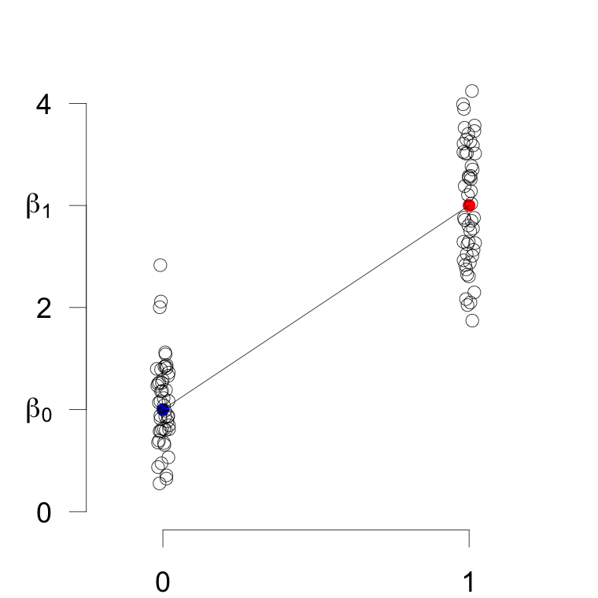
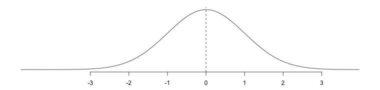
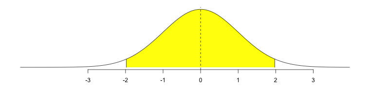
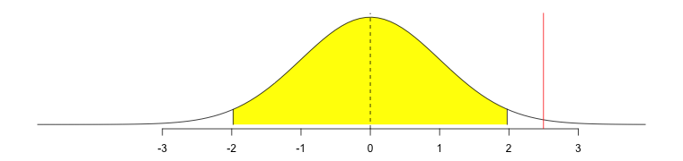
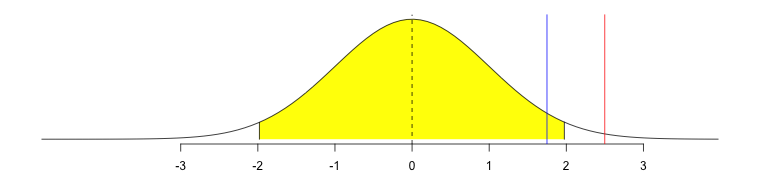
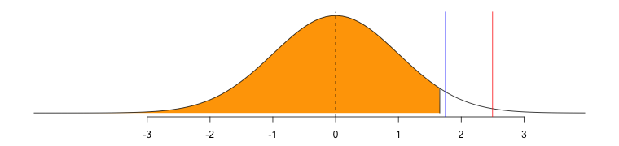
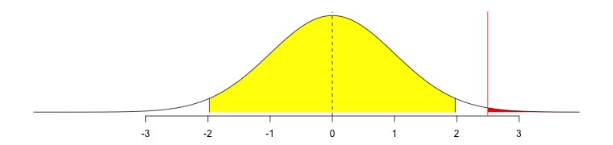
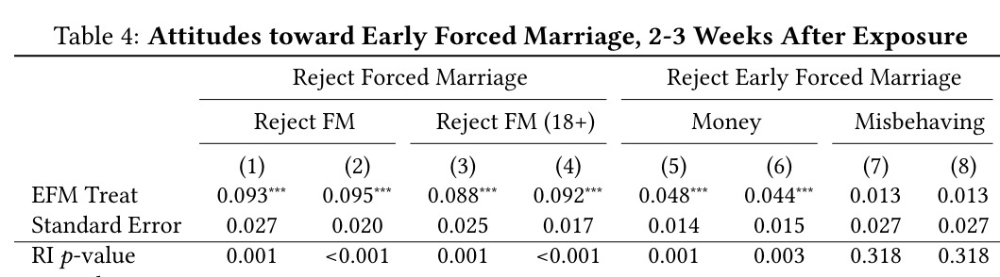

```{r setup, include=FALSE}
# Load all the libraries we need
# library(here)
# library(tidyverse)
# library(kableExtra)
# library(DeclareDesign)
# library(estimatr)
# library(styler)
# library(coin)
# library(multcomp)
# library(devtools)
# library(randomizr)
# library(rcompanion) ## for pairwisePermutationTest()
experiment_data <- read.csv("experiment-data-2024.csv")
```

## Estimation and Hypothesis Testing \| *L'estimation et tests d'hypothèses*

::: {.cols data-latex=""}
::: {.col data-latex="{0.48\\textwidth}"}
-   We have randomly assigned treatment and collected our outcome data.

-   Now we use that data for:

    -   Estimation: produce an estimate of the true treatment effect

    -   Hypothesis testing: assess how consistent the results are with
        there being no effect.
:::

::: {.col data-latex="{0.04\\textwidth}"}
  <!-- an empty Div (with a white space), serving as
a column separator -->
:::

::: {.col data-latex="{0.48\\textwidth}"}
-   Le traitement a été assigné en façon aléatoire et nous avons mésuré
    les résultats.\

-   Nous utilisons maintenant ces données pour:

    -   Estimation : produire une estimation du véritable effet du
        traitement.

    -   Test d'hypothèse : évaluer la cohérence des résultats sans aucun
        effet.
:::
:::

# Estimation \| *L'estimation*

## Estimation \| *L'estimation*

::: {.cols data-latex=""}
::: {.col data-latex="{0.48\\textwidth}"}
-   Remember that there is a *true* ATE but we can't observe it because
    of the fundamental problem of causal inference. This is our target,
    our **estimand**.

    -   For example, the ATE.

-   We use our data to make an educated guess, our **estimate**.

    -   $\widehat{ATE}$

-   If we run the experiment again, different units may be assigned to
    treatment, and our estimate will likely be different.
:::

::: {.col data-latex="{0.04\\textwidth}"}
  <!-- an empty Div (with a white space), serving as
a column separator -->
:::

::: {.col data-latex="{0.48\\textwidth}"}
-   Rapellez qu'il y a un *vrai* ATE, mais nous ne pouvons pas
    l'obsérver à cause de problème fondamentale d'inférence causale.
    C'est notre cible, notre **paramètre**.

    -   Par exemple, l'ATE.

-   Nous utilisons nos données pour faire une supposition éclairée,
    notre **estimation**.

    -   $\widehat{ATE}$

-   Si nous renouvelons l'éxpérience, diffèrentes unités peuvent être
    assigné au traitement, et notre estimation sera probablement
    différente.
:::
:::

## Estimators \| *Estimateurs*

::: {.cols data-latex=""}
::: {.col data-latex="{0.48\\textwidth}"}
-   The procedure we apply to our data to produce this estimate is our
    **estimator**.\

-   There are many possible estimators for the same estimand.

-   We will introduce several estimators that are commonly used to
    analyze experiments.
:::

::: {.col data-latex="{0.04\\textwidth}"}
  <!-- an empty Div (with a white space), serving as
a column separator -->
:::

::: {.col data-latex="{0.48\\textwidth}"}
-   *L'estimateur* est comment on devine la valeur du paramètre à partir
    des données dont on dispose (les données observées).

-   Il y a plusiers estimateurs possibles pour le même paramètre.

-   Nous présenterons plusiers estimateurs courrament utilisés.
:::
:::

## Estimators \| *Estimateurs*

::: {.cols data-latex=""}
::: {.col data-latex="{0.48\\textwidth}"}
-   In general, we prefer estimators that are:

    -   Unbiased: If we run the experiment many times, each estimate
        might be a little too high or low, but it will be correct on
        average.

    -   Precise: The estimates do not vary much from one run of the experiment to another.
    
-   The best: unbiased and precise.    
:::

::: {.col data-latex="{0.04\\textwidth}"}
  <!-- an empty Div (with a white space), serving as
a column separator -->
:::

::: {.col data-latex="{0.48\\textwidth}"}
-   En général, nous préférons les estimateurs qui sont:

    -   Non biaisé: Cela signifie que si vous deviez exécuter
        l’expérience plusieurs fois, l'estimation peut parfois être trop
        élevée ou trop faible, mais elle sera correcte en moyenne.

    -   Précis : Les estimations ne varient pas beaucoup d'une expérience à l'autre.
    
-   Le meilleur: non biaisé et précis.     
:::
:::

## General Principle: Analyze as you randomize \| *Un principe général : Analysez comme vous randomisez*

::: {.cols data-latex=""}
::: {.col data-latex="{0.48\\textwidth}"}
-   This means follow the design of the experiment.

-   Compare groups that are created by random assignment.
:::

::: {.col data-latex="{0.04\\textwidth}"}
  <!-- an empty Div (with a white space), serving as
a column separator -->
:::

::: {.col data-latex="{0.48\\textwidth}"}
-   Cela signifie suivre la concéption de l'éxpérience.

-   Comparez les groupes qui sont crées par l'assignation aléatoire.
:::
:::

## Estimator 1: difference-in-means \| *Estimateur 1 : la différence des moyennes*

::: {.cols data-latex=""}
::: {.col data-latex="{0.48\\textwidth}"}

-   We have a simple experiment:

    -   Random assignment to treatment or control.

    -   All units have the same probability of treatment assignment.

    -   Our *estimand* is the ATE.

-   The simplest *estimator* for the ATE is the **difference-in-means**:
    take the average outcome for the treatment group and subtract the
    average outcome for the control group.
:::

::: {.col data-latex="{0.04\\textwidth}"}
  <!-- an empty Div (with a white space), serving as
a column separator -->
:::

::: {.col data-latex="{0.48\\textwidth}"}

-   Nous avons une expérience simple:

    -   L'assignation aléatoire à traitement ou contrôle.

    -   Toutes les unités ont la même probabilité de recevoir le traitement.

    -   Notre *paramètre* est l'ATE.

-   L'estimateur de l'ATE le plus simple est **la différence des
    moyennes** : soutraitez le moyen des unités assigné au contrôle du
    moyen des unités assigné au traitement.
:::
:::

## Estimator 1: Difference-in-means \| *Estimateur 1 : La différence des moyennes*

\centering

{width="260"}

## Estimator 1: Difference-in-means \| *Estimateur 1 : La différence des moyennes*

| Unit | $Z_i$ | $Y_i$ | $Y_i(1)$ | $Y_i(0)$ |
|:----:|:-----:|:-----:|:--------:|:--------:|
|  a   |   1   |   5   |    5     |          |
|  b   |   1   |   4   |    4     |          |
|  c   |   1   |   2   |    2     |          |
|  d   |   1   |   1   |    1     |          |
|  e   |   0   |   1   |          |    1     |
|  f   |   0   |   1   |          |    1     |
|  g   |   0   |   0   |          |    0     |
|  h   |   0   |   2   |          |    2     |

\pause

$$\frac{5+4+2+1}{4} - \frac{1+1+0+2}{4} = 3 - 1 = 2$$

## Estimator 1: Difference-in-means \| *Estimateur 1 : La différence des moyennes*

```{r, result='hide'}
# mean(Y[treatment==1]) - mean(Y[treatment==0])

# library(estimatr)
# difference_in_means(Y ~ treatment)

```

## Estimator 2: Linear Regression \| *Estimateur 2 : La régression linéaire*

$$Y_i = \hat{\beta_0} + \hat{\beta_1} Z_i + e_i$$

::: {.cols data-latex=""}
::: {.col data-latex="{0.48\\textwidth}"}
-   With this simple experiment, we can also use a linear regression. It
    will produce exactly the same estimate ($\hat{\beta_1}$) of the ATE
    ($\beta_1$) as the difference-in-means estimator.

-   $\hat{\beta_0}$ is the average outcome in the control group.
:::

::: {.col data-latex="{0.04\\textwidth}"}
  <!-- an empty Div (with a white space), serving as
a column separator -->
:::

::: {.col data-latex="{0.48\\textwidth}"}
-   Pour cet éxpérience simple, nous pouvon également utiliser la
    régression linéaire. Ça produira exactement le même estimation
    ($\hat{\beta_1}$) du ATE ($\beta_1$) que l'estimateur de la
    différence de moyennes.

-   $\hat{\beta_0}$ est le résultat moyen des unités assignéss au
    contrôle.
:::
:::


## Estimator 2: Linear Regression \| *Estimateur 2 : La régression linéaire*

::: {.cols data-latex=""}
::: {.col data-latex="{0.68\\textwidth}"}
{width="360"}
:::

::: {.col data-latex="{0.04\\textwidth}"}
  <!-- an empty Div (with a white space), serving as
a column separator -->
:::

::: {.col data-latex="{0.28\\textwidth}"}
$$Y_i = \beta_0 + \beta_1 Z_i + \epsilon_i$$
$$Y_i = \hat{\beta_0} + \hat{\beta_1} Z_i + e_i$$
:::
:::


## Estimator 2: Linear Regression \| *Estimateur 2 : La régression linéaire*

```{r}
# lm(Y ~ treatment)

```

# Hypothesis Testing \| *Les tests d’hypothèses*

## Hypothesis Testing \| *Les tests d’hypothèses*

::: {.cols data-latex=""}
::: {.col data-latex="{0.48\\textwidth}"}
-   Let's say that the truth is that a medicine has no effect on height.
    But all the short people were assigned to the medicine and all the
    tall people to control. 
    
-   If we apply the difference in means, it looks like the medicine made people shorter!


:::

::: {.col data-latex="{0.04\\textwidth}"}
  <!-- an empty Div (with a white space), serving as
a column separator -->
:::

::: {.col data-latex="{0.48\\textwidth}"}
-   Supposons qu'un médicament n'ait aucun effet sur la taille. Mais
    toutes les personnes de petite taille ont été assignées le
    médicament et les personnes de grande taille ont été assignées au
    contrôle. 
    
-   Si on utilise la différence de moyennes, on dirait que les médicaments ont rendu les gens plus petits!


:::
:::


## Hypothesis Testing \| *Les tests d’hypothèses*

::: {.cols data-latex=""}
::: {.col data-latex="{0.48\\textwidth}"}

-   Warning: We can get an estimate that is not zero even when there is
    no effect!
    
-   Are we confident that our non-zero estimate reflects a truly
    non-zero estimand (truth)?    
:::

::: {.col data-latex="{0.04\\textwidth}"}
  <!-- an empty Div (with a white space), serving as
a column separator -->
:::

::: {.col data-latex="{0.48\\textwidth}"}


-   Avertissement : On peut obtenir une estimation que n'est pas nulle
    même s'il n'y a aucun effet!
    
-   Sommes-nous convaincus que notre estimation non nulle reflète un
    paramètre véritablement non nulle (la vérité) ?    
:::
:::

## Hypothesis Testing \| *Les tests d'hypothèses*

::: {.cols data-latex=""}
::: {.col data-latex="{0.48\\textwidth}"}

-   Hypothesis: a claim about the world that we will evaluate with data.

    -   A good hypothesis is specific and falsifiable.


-   Start with a null hypothesis, a claim we might reject when we examine the data. We will use the null hypothesis that the true ATE is 0.

-   But remember that we can get $\widehat{ATE}$ that is not 0, just by
    chance.
:::

::: {.col data-latex="{0.04\\textwidth}"}
  <!-- an empty Div (with a white space), serving as
a column separator -->
:::

::: {.col data-latex="{0.48\\textwidth}"}

-   Hypothèse : une affirmation sur le monde que nous évaluerons à l'aide de données.

    -   Une bonne hypothèse est spécifique et falsifiable.

-   Commencer par une hypothèse nulle, une affirmation que nous pourrions rejeter lorsque nous examinons les données. On utilisera l'hypothèse nulle que le vrai ATE est 0.
    
-   Mais rappelez-vous que nous pouvons obtenir un $\widehat{ATE}$
    différent de 0, juste par hasard.
:::
:::

## Hypothesis Testing \| *Les tests d'hypothèses*

\centering



-   Distribution of possible $\widehat{ATE}$ if the null hypothesis is
    true

-   *Distribution des* $\widehat{ATE}$ possibles si l'hypothèse nulle
    est vraie

## Hypothesis Testing \| *Les tests d'hypothèses*

\centering



-   Rejection and non-rejection regions for a two-sided alternative
    hypothesis at $\alpha=0.05%$

-   Régions de rejet et de non-rejet pour une hypothèse alternative
    bilatérale à $\alpha=0,05%$

## Hypothesis Testing \| *Les tests d'hypothèses*

\centering



-   \textcolor{red}{$\widehat{ATE}$} falls in the rejection region
    $\rightarrow$ reject the null hypothesis

-   \textcolor{red}{$\widehat{ATE}$} se situe dans la région de rejet
    $\rightarrow$ rejetez l'hypothèse nulle

## Hypothesis Testing \| *Les tests d'hypothèses*

\centering



-   \textcolor{blue}{$\widehat{ATE}$} falls outside the rejection region
    $\rightarrow$ do not reject the null hypothesis

-   \textcolor{blue}{$\widehat{ATE}$} se situe en dehors de la région de
    rejet $\rightarrow$ ne rejetez pas l'hypothèse nulle

## Hypothesis Testing \| *Les tests d'hypothèses*

\centering



-   Rejection and non-rejection regions for a one-sided alternative
    hypothesis at $\alpha=0.05%$

-   Régions de rejet et de non-rejet pour une hypothèse alternative
    unilatérale à $\alpha=0,05%$

## $p$-value \| $p$-valeur

\centering



::: {.cols data-latex=""}
::: {.col data-latex="{0.48\\textwidth}"}
-   $p$-value: For a one-sided test, the probability of seeing a *test statistic* as large as or larger than the test statistic calculated from
    observed data when the null hypothesis is true.

-   We use the $\widehat{ATE}$ as our test statistic, but we don't need
    to.
    
:::

::: {.col data-latex="{0.04\\textwidth}"}
  <!-- an empty Div (with a white space), serving as
a column separator -->
:::

::: {.col data-latex="{0.48\\textwidth}"}
-   $p$-valeur : Pour un test d'hypothèse unilateral, la probabilité de voir une *statistique de test* aussi
    grande ou plus grande que la statistique de test
    calculée à partir des données observées lorsque l'hypothèse nulle
    est vraie.
    
-   Nous utilisons $\widehat{ATE}$ comme statistique de test, mais ce
    n'est pas nécessaire.
    
:::
:::


## Hypothesis Testing with Linear Regression \| *Les tests d'hypothèses avec la régression linéaire*

::: {.cols data-latex=""}
::: {.col data-latex="{0.48\\textwidth}"}
-   There are many ways to do hypothesis testing. We are going to take
    the simplest and most popular approach that uses regression.

-   Use linear regression to calculate a $p$-value (two-sided test): the probability that
    we could have obtained a particular test statistic (or greater in absolute
    value) by chance when the null hypothesis is true.
:::

::: {.col data-latex="{0.04\\textwidth}"}
  <!-- an empty Div (with a white space), serving as
a column separator -->
:::

::: {.col data-latex="{0.48\\textwidth}"}
-   Il existe de nombreuses façons de tester des hypothèses. Nous allons
    faire l'apprôche la plus simple et la plus populaire: la régression.
-   Utiliser la régression linéaire pour calculer une $p$-valeur (test bilateral) : la
    probabilité de voir une statistique de test (ou une plus grande en valeur
    absolue) par hasard ou l'hypothèse nulle est vrai.
:::
:::

## Hypothesis Testing with Linear Regression \| *Les tests d'hypothèses avec la régression linéaire*

::: {.cols data-latex=""}
::: {.col data-latex="{0.48\\textwidth}"}
-   Compare this $p$-value to a standard we have set in advance (an
    $\alpha$ level).

-   If the $p$-value is smaller than or equal to the $\alpha$ level, we
    reject the null hypothesis of no effect.

-   If the $p$-value is greater than the $\alpha$ level, we fail to
    reject the null hypothesis of no effect.
:::

::: {.col data-latex="{0.04\\textwidth}"}
  <!-- an empty Div (with a white space), serving as
a column separator -->
:::

::: {.col data-latex="{0.48\\textwidth}"}
-   Comparez cette $p$-valeur à une norme que nous avons fixée à
    l'avance (un niveau $\alpha$).

-   Si la $p$-valeur est plus petite ou égale au niveau $\alpha$, nous
    rejetons l'hypothèse nulle d'aucun effet.

-   Si la $p$-valeur est plus grande que le niveau $\alpha$, nous ne
    parvenons pas à rejeter l'hypothèse nulle d'aucun effet.
:::
:::

## Hypothesis Testing with Linear Regression \| *Les tests d'hypothèses avec la régression linéaire*



<!-- @article{green_radio_2023, -->
<!--   title = {A {{Radio Drama}}'s {{Effects}} on {{Attitudes Toward Early}} and {{Forced Marriage}}: {{Results From}} a {{Field Experiment}} in {{Rural Tanzania}}}, -->
<!--   shorttitle = {A {{Radio Drama}}'s {{Effects}} on {{Attitudes Toward Early}} and {{Forced Marriage}}}, -->
<!--   author = {Green, Donald P. and Groves, Dylan W. and Manda, Constantine and Montano, Beatrice and Rahmani, Bardia}, -->
<!--   year = {2023}, -->
<!--   month = jul, -->
<!--   journal = {Comparative Political Studies}, -->
<!--   volume = {56}, -->
<!--   number = {8}, -->
<!--   pages = {1115--1155}, -->
<!--   issn = {0010-4140}, -->
<!--   doi = {10.1177/00104140221139385} -->
<!-- } -->

# Block Randomization \| *Randomisation par bloc (ou stratifiée)*

## Block Randomization \| *Randomisation par bloc*

::: {.cols data-latex=""}
::: {.col data-latex="{0.48\\textwidth}"}
-   Block randomization is like doing a separate experiment in each
    block.

-   We present 2 estimators for block randomization. Others are also
    available.
:::

::: {.col data-latex="{0.04\\textwidth}"}
  <!-- an empty Div (with a white space), serving as
a column separator -->
:::

::: {.col data-latex="{0.48\\textwidth}"}
-   Randomisation par bloc est comme faire une expérience distincte dans
    chaque bloc.

-   Nous presentons 2 estimateurs pour randomisation par bloc. D'autres
    sont également disponsibles.
:::
:::

## Estimator 1: Blocked Difference-in-Means \| *Estimateur 1 : La différence des moyennes par bloc*

::: {.cols data-latex=""}
::: {.col data-latex="{0.48\\textwidth}"}
-   Calculate the $\widehat{ATE_j}$ for each block using difference in
    means. $j$ indicates which block.

-   The $\widehat{ATE}$ is the average of the block-level
    $\widehat{ATE_j}$ weighted by block size $N_j / N$.

-   You can use this estimator even when the probability of treatment
    assignment is different by blocks.
:::

::: {.col data-latex="{0.04\\textwidth}"}
  <!-- an empty Div (with a white space), serving as
a column separator -->
:::

::: {.col data-latex="{0.48\\textwidth}"}
-   Calculez $\widehat{ATE_j}$ pour chaque bloc en utilisant la
    différence des moyennes.

-   $\widehat{ATE}$ est la moyenne pondérée de $\widehat{ATE_j}$
    pondérée par la taille du bloc $N_j / N$.

-   Nous pouvons utiliser cette estimateur sinon la probabilité
    d'assignation du traitement diffère selon les blocs.
:::
:::

## Estimator 1 : Blocked Difference-in-Means \| *Estimateur 1 : La différence des moyennes par bloc*

::: {.cols data-latex=""}
::: {.col data-latex="{0.48\\textwidth}"}
| Unit | Block | $Z_i$ | $Y_i$ | $Y_i(1)$ | $Y_i(0)$ |
|:----:|:-----:|:-----:|:-----:|:--------:|:--------:|
|  a   |   Q   |   0   |   4   |          |    4     |
|  b   |   Q   |   1   |   3   |    3     |          |
|  c   |   Q   |   0   |   2   |          |    2     |
|  d   |   R   |   1   |   3   |    3     |          |
|  e   |   R   |   0   |   0   |          |    0     |
|  f   |   R   |   0   |   2   |          |    2     |
|  g   |   S   |   1   |   4   |    4     |          |
|  h   |   S   |   0   |   0   |          |    0     |
|  i   |   S   |   0   |   2   |          |    2     |
:::

::: {.col data-latex="{0.04\\textwidth}"}
  <!-- an empty Div (with a white space), serving as
a column separator -->
:::

::: {.col data-latex="{0.48\\textwidth}"}
```{=tex}
\begin{align*}
\widehat{ATE}_Q &= 3-\frac{4+2}{2}= 0\\
\widehat{ATE}_R &= 3-\frac{0+2}{2}= 2\\
\widehat{ATE}_S &= 4-\frac{0+2}{2}= 3\\
\\
\widehat{ATE} &=  \frac{N_Q}{N}\widehat{ATE}_Q + \frac{N_R}{N}\widehat{ATE}_R + \frac{N_S}{N}\widehat{ATE}_S  \\
&= \frac{3}{9}*0 + \frac{3}{9}*2 + \frac{3}{9}*3 = \frac{5}{3}
\end{align*}
```
:::
:::

## Estimator 1: Blocked Difference-in-Means \| *Estimateur 1 : La différence des moyennes par bloc*

\footnotesize
```{r}
library(estimatr)
# difference_in_means(Y ~ t, blocks = block_variable)
Y <- experiment_data$State.of.the.world
t <- experiment_data$treatment_received
difference_in_means(Y ~ t, blocks = experiment_data$Female)

```

## Estimator 2: Linear Regression with Block Fixed Effects \| *Estimateur 2 : La régression linéaire avec effets fixes par bloc*

$$Y_{ij} = \beta_0 + \beta_1 Z_{ij} + \gamma_A BlockA_{ij} + \gamma_B BlockB_{ij} + ... + \epsilon_{ij}$$

::: {.cols data-latex=""}
::: {.col data-latex="{0.48\\textwidth}"}
-   You can use linear regression with block fixed effects, applying weights to each observation.
    
-   The weight is the inverse of the proportion of subjects in the same block who were assigned to the same condition.    
:::

::: {.col data-latex="{0.04\\textwidth}"}
  <!-- an empty Div (with a white space), serving as
a column separator -->
:::

::: {.col data-latex="{0.48\\textwidth}"}
-   Nous pouvons ensuite utiliser la régression linéaire avec des effets fixes en bloc,  en appliquant des pondérations à chaque observation.

-   Le poids est l'inverse de la proportion de sujets d'un même bloc qui ont été assignés à la même condition.
:::
:::

$$w_{ij} = \frac{d_i}{p_{ij}} + \frac{1-d_i}{1-p_{ij}} \text{,  where } p_{ij}\equiv\frac{m_j}{N_j}$$

## Block Randomization \| *Randomisation par bloc*

```{r, echo=FALSE}
blocks <- c("J","J","J","K","K","K","L","L","L") 
z <- c(0,1,0,1,0,0,1,0,0) 
y <- c(4,3,2,3,0,2,4,0,2)
# round(summary(lm(y~z+as.factor(blocks)))$coef,3)
```

```{r, echo=TRUE}
# library(estimatr)
# lm_robust(Y ~ treatment + as.factor(block_variable), 
#                  weights=weight_variable)


```
