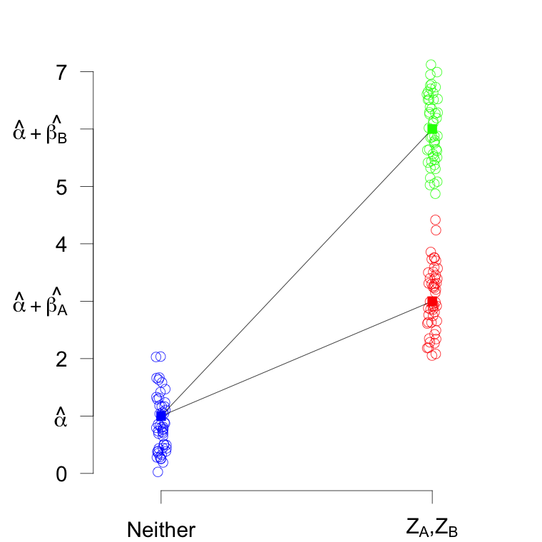
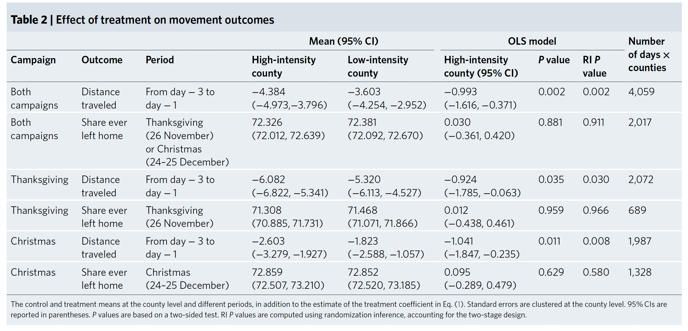
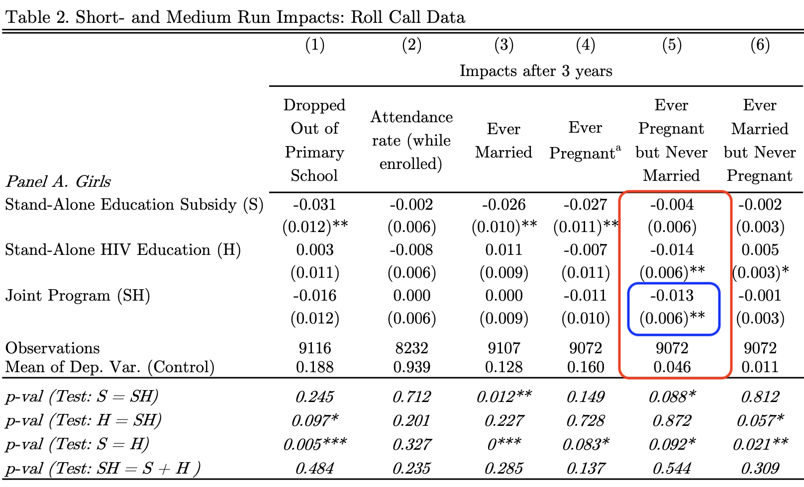
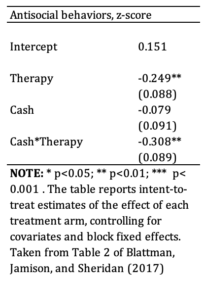

```{r setup, include=FALSE}
# Load all the libraries we need
# library(here)
# library(tidyverse)
# library(kableExtra)
# library(DeclareDesign)
# library(estimatr)
# library(styler)
# library(coin)
# library(multcomp)
# library(devtools)
# library(randomizr)
# library(rcompanion) ## for pairwisePermutationTest()
```

## A Quick Reminder \| *Un pétit rappel*

::: {.cols data-latex=""}
::: {.col data-latex="{0.48\\textwidth}"}
-   Remember: Analyze as you randomize

\medskip

-   We prefer estimators that are unbiased and have greater precision

\medskip

-   Hypothesis testing can be simple with linear regression
:::

::: {.col data-latex="{0.04\\textwidth}"}
  <!-- an empty Div (with a white space), serving as
a column separator -->
:::

::: {.col data-latex="{0.48\\textwidth}"}
-   N'oubliez pas : Analysez comme vous randomisez

\medskip

-   Nous préférons les estimateurs non biaisés et plus précis

\medskip

-   Test d'hypothèse peut être simple avec la régression linéaire
:::
:::

# Multiple Arm Experiments \| *Les éxperiences avec plusieurs bras*

## Estimator 1: Difference-in-Means \| *Estimateur 1 : La différence en moyennes*

\begin{table}[]
\begin{tabular}{|p{1.5in}|p{1.5in}|p{1.5in}|}
 \cline{1-3}
&& \\
\textcolor{red}{$Z_A$ only}  &  \textcolor{teal}{$Z_B$ only} & \textcolor{blue}{Neither (control)} \\
&& \\
 \cline{1-3}
\end{tabular}
\end{table}

\bigskip

::: {.cols data-latex=""}
::: {.col data-latex="{0.48\\textwidth}"}
-   We can always take the difference-in-means between any two groups.

<!-- -   But hypothesis testing is simpler with regression. -->
:::

::: {.col data-latex="{0.04\\textwidth}"}
  <!-- an empty Div (with a white space), serving as
a column separator -->
:::

::: {.col data-latex="{0.48\\textwidth}"}
-   Nous pouvons toujours tenir compte de la différence de moyens entre
    deux groupes.

<!-- -   Mais le test d'hypothèse est plus simple avec la régression. -->
:::
:::

## Estimator 2: Linear regression \| *Estimateur 2 : La régression linéaire*

$$Y_i = \hat{\alpha} + \hat{\beta_A} Z_{Ai} + \hat{\beta_B} Z_{Bi} + e_i$$
$$Y_i = \hat{\alpha} + \hat{\beta_A} Z_{Ai} + \hat{\beta_B} Z_{Bi} + \hat{\gamma} X_i + e_i$$


\bigskip


::: {.cols data-latex=""}
::: {.col data-latex="{0.48\\textwidth}"}
-   Regression with an indicator variable for each of the two treatment
    arms.
    
    -   $Z_{Ai}=1$ if unit $i$ has treatment $Z_A$, 0 otherwise
    
    -   $Z_{Bi}=1$ if unit $i$ has treatment $Z_B$, 0 otherwise

-   We can also do covariate adjustment at the same time.
:::

::: {.col data-latex="{0.04\\textwidth}"}
  <!-- an empty Div (with a white space), serving as
a column separator -->
:::

::: {.col data-latex="{0.48\\textwidth}"}
-   Régression avec une variable indicatrice pour chacun des deux bras
    de traitement.

    -   $Z_{Ai}=1$ si unité $i$ a traitement $Z_A$, sinon 0 
    
    -   $Z_{Bi}=1$ si unité $i$ a traitement $Z_B$, sinon 0 

-   Nous pouvons également effectuer un ajustement covariable en même
    temps.
:::
:::

## Estimator 2: Linear regression \| *Estimateur 2 : La régression linéaire*

$$Y_i = \hat{\alpha} + \hat{\beta_A} Z_{Ai} + \hat{\beta_B} Z_{Bi} + e_i$$


\bigskip


::: {.cols data-latex=""}
::: {.col data-latex="{0.48\\textwidth}"}
-   $\hat{\beta_A}$ is the $\widehat{ATE}$ of $Z_A$ (compared with control).

-   $\hat{\beta_B}$ is the $\widehat{ATE}$ of $Z_B$ (compared with control).

-   How do we estimate the effect of $Z_B$ compared to $Z_A$?
:::

::: {.col data-latex="{0.04\\textwidth}"}
  <!-- an empty Div (with a white space), serving as
a column separator -->
:::

::: {.col data-latex="{0.48\\textwidth}"}
-   $\hat{\beta_A}$ est $\widehat{ATE}$ de $Z_A$ (par rapport au contrôle).

-   $\hat{\beta_B}$ est $\widehat{ATE}$ de $Z_B$ (par rapport au contrôle).

-   Comment estimer l'effet de $Z_B$ par rapport à $Z_A$ ?
:::
:::

## Estimator 2: Linear regression \| *Estimateur 2 : La régression linéaire*

::: {.cols data-latex=""}
::: {.col data-latex="{0.58\\textwidth}"}
```{r, echo=FALSE, fig.align='center', out.width=220}

```

:::

::: {.col data-latex="{0.04\\textwidth}"}
  <!-- an empty Div (with a white space), serving as
a column separator -->
:::

::: {.col data-latex="{0.38\\textwidth}"}

\textcolor{red}{$Z_A$ only}

\textcolor{teal}{$Z_B$ only}

\textcolor{blue}{Neither (control)}

$Y_i = \hat{\alpha} + \hat{\beta_A} Z_{Ai} + \hat{\beta_B} Z_{Bi} + e_i$


:::
:::

## Estimators for Multi-arm Designs \| *Les estimateurs pour les éxperiences avec plusiers bras*

```{r}
# library(estimatr)
# difference_in_means(Y ~ treatment, 
#         condition1="T1", 
#         condition2="T2")
# 
# 
# library(car)
# M <- lm_robust(Y ~ as.factor(treatment))
# linearHypothesis(M, "T1=T2") 

```


# Block Randomization \| *Randomisation par bloc (ou stratifiée)*

## Block Randomization \| *Randomisation par bloc*

::: {.cols data-latex=""}
::: {.col data-latex="{0.48\\textwidth}"}
-   Block randomization is like doing a separate experiment in each
    block.

-   We present 2 estimators for block randomization. Others are also
    available.
:::

::: {.col data-latex="{0.04\\textwidth}"}
  <!-- an empty Div (with a white space), serving as
a column separator -->
:::

::: {.col data-latex="{0.48\\textwidth}"}
-   Randomisation par bloc est comme faire une expérience distincte dans
    chaque bloc.

-   Nous presentons 2 estimateurs pour randomisation par bloc. D'autres
    sont également disponsibles.
:::
:::

## Estimator 1: Blocked Difference-in-Means \| *Estimateur 1 : La différence des moyennes par bloc*

::: {.cols data-latex=""}
::: {.col data-latex="{0.48\\textwidth}"}
-   Calculate the $\widehat{ATE_j}$ for each block using difference in
    means. $j$ indicates which block.

-   The $\widehat{ATE}$ is the average of the block-level
    $\widehat{ATE_j}$ weighted by block size $N_j / N$.

-   You can use this estimator even when the probability of treatment
    assignment is different by blocks.
:::

::: {.col data-latex="{0.04\\textwidth}"}
  <!-- an empty Div (with a white space), serving as
a column separator -->
:::

::: {.col data-latex="{0.48\\textwidth}"}
-   Calculez $\widehat{ATE_j}$ pour chaque bloc en utilisant la
    différence des moyennes.

-   $\widehat{ATE}$ est la moyenne pondérée de $\widehat{ATE_j}$
    pondérée par la taille du bloc $N_j / N$.

-   Nous pouvons utiliser cette estimateur sinon la probabilité
    d'assignation du traitement diffère selon les blocs.
:::
:::

## Estimator 1 : Blocked Difference-in-Means \| *Estimateur 1 : La différence des moyennes par bloc*

::: {.cols data-latex=""}
::: {.col data-latex="{0.48\\textwidth}"}
| Unit | Block | $Z_i$ | $Y_i$ | 
|:----:|:-----:|:-----:|:-----:|
|  a   |   Q   |   0   |   4   |
|  b   |   Q   |   1   |   3   |
|  c   |   Q   |   0   |   2   |
|  d   |   R   |   1   |   3   |
|  e   |   R   |   0   |   0   |
|  f   |   R   |   0   |   2   |
|  g   |   S   |   1   |   4   |
|  h   |   S   |   0   |   0   |
|  i   |   S   |   0   |   2   |
|  j   |   S   |   1   |   4   |

<!-- | Unit | Block | $Z_i$ | $Y_i$ | $Y_i(1)$ | $Y_i(0)$ | -->
<!-- |:----:|:-----:|:-----:|:-----:|:--------:|:--------:| -->
<!-- |  a   |   Q   |   0   |   4   |          |    4     | -->
<!-- |  b   |   Q   |   1   |   3   |    3     |          | -->
<!-- |  c   |   Q   |   0   |   2   |          |    2     | -->
<!-- |  d   |   R   |   1   |   3   |    3     |          | -->
<!-- |  e   |   R   |   0   |   0   |          |    0     | -->
<!-- |  f   |   R   |   0   |   2   |          |    2     | -->
<!-- |  g   |   S   |   1   |   4   |    4     |          | -->
<!-- |  h   |   S   |   0   |   0   |          |    0     | -->
<!-- |  i   |   S   |   0   |   2   |          |    2     | -->
:::

::: {.col data-latex="{0.04\\textwidth}"}
  <!-- an empty Div (with a white space), serving as
a column separator -->
:::

::: {.col data-latex="{0.48\\textwidth}"}
```{=tex}
\begin{align*}
\widehat{ATE}_Q &= \frac{3}{1}-\frac{4+2}{2}= 0\\
\widehat{ATE}_R &= \frac{3}{1}-\frac{0+2}{2}= 2\\
\widehat{ATE}_S &= \frac{4+4}{2}-\frac{0+2}{2}= 3\\
\\
\widehat{ATE} &=  \frac{N_Q}{N}\widehat{ATE}_Q + \frac{N_R}{N}\widehat{ATE}_R + \frac{N_S}{N}\widehat{ATE}_S  \\
&= \frac{3}{10}*0 + \frac{3}{10}*2 + \frac{4}{10}*3 \\
&= \frac{0+6+12}{10} = \frac{9}{5}
\end{align*}
```
:::
:::

## Estimator 1: Blocked Difference-in-Means \| *Estimateur 1 : La différence des moyennes par bloc*

\footnotesize
```{r}
# library(estimatr)
# difference_in_means(Y ~ t, blocks = block_variable)

```
<!-- Y <- experiment_data$State.of.the.world -->
<!-- t <- experiment_data$treatment_received -->
<!-- difference_in_means(Y ~ t, blocks = experiment_data$Female) -->

## Estimator 2: Linear Regression with Block Fixed Effects \| *Estimateur 2 : La régression linéaire avec effets fixes par bloc*

$$Y_{ij} = \beta_0 + \beta_1 Z_{ij} + \gamma_A BlockA_{ij} + \gamma_B BlockB_{ij} + ... + \epsilon_{ij}$$

::: {.cols data-latex=""}
::: {.col data-latex="{0.48\\textwidth}"}
-   You can use linear regression with block fixed effects, applying weights to each observation.
    
-   The weight is the inverse of the proportion of subjects in the same block who were assigned to the same condition.    
:::

::: {.col data-latex="{0.04\\textwidth}"}
  <!-- an empty Div (with a white space), serving as
a column separator -->
:::

::: {.col data-latex="{0.48\\textwidth}"}
-   Nous pouvons ensuite utiliser la régression linéaire avec des effets fixes en bloc,  en appliquant des pondérations à chaque observation.

-   Le poids est l'inverse de la proportion de sujets d'un même bloc qui ont été assignés à la même condition.
:::
:::

$$w_{ij} = \frac{d_i}{p_{ij}} + \frac{1-d_i}{1-p_{ij}} \text{,  where } p_{ij}\equiv\frac{m_j}{N_j}$$

## Block Randomization \| *Randomisation par bloc*

```{r, echo=FALSE}
blocks <- c("J","J","J","K","K","K","L","L","L") 
z <- c(0,1,0,1,0,0,1,0,0) 
y <- c(4,3,2,3,0,2,4,0,2)
# round(summary(lm(y~z+as.factor(blocks)))$coef,3)
```

```{r, echo=TRUE}
# library(estimatr)
# lm_robust(Y ~ treatment + as.factor(block_variable), 
#                  weights=weight_variable)


```

# Cluster Randomization \| *Randomisation par grappe*

## Estimator: Regression with cluster-robust standard errors \| *Estimateur : La régression avec des erreurs types robustes au niveau du cluster*

$$Y_{ic} = \hat{\beta_0} + \hat{\beta_1} Z_{c} + e_{ic}$$
$$Y_{ic} = \hat{\beta_0} + \hat{\beta_1} Z_{c} + \hat{\gamma} X_{ic} +e_{ic}$$

\bigskip


::: {.cols data-latex=""}
::: {.col data-latex="{0.48\\textwidth}"}
-   Our analysis has to take into account the fact that treatment is
    assigned at the cluster level with *cluster-robust standard errors*.

-   $\hat{\beta_1}$ is the $\widehat{ATE}$ of the treatment on individual units.

-   We can also do covariate adjustment at the same time.
:::

::: {.col data-latex="{0.04\\textwidth}"}
  <!-- an empty Div (with a white space), serving as
a column separator -->
:::

::: {.col data-latex="{0.48\\textwidth}"}
-   Notre analyse doit prendre en compte le fait que le traitement est
    attribué au niveau du cluster avec des *erreurs types robustes au
    niveau du cluster*.

-   $\hat{\beta_1}$ est $\widehat{ATE}$  du traitement sur les unités individuelles.

-   Nous pouvons également effectuer un ajustement covariable en même
    temps.
:::
:::

<!-- ## Cluster Randomization \| *Randomisation par grappe* -->

<!-- ::: {.cols data-latex=""} -->
<!-- ::: {.col data-latex="{0.48\\textwidth}"} -->
<!-- -   Remember: we have assumed non-interference (part of SUTVA). -->

<!-- -   If we are concerned about interference within clusters (but can -->
<!--     assume non-interference across clusters), we can shift the analysis -->
<!--     to the cluster level by using the average or other summary measure -->
<!--     at the cluster level as our outcome variable. -->
<!-- ::: -->

<!-- ::: {.col data-latex="{0.04\\textwidth}"} -->
<!--   <!-- an empty Div (with a white space), serving as -->
<!-- a column separator --> 
<!-- ::: -->

<!-- ::: {.col data-latex="{0.48\\textwidth}"} -->
<!-- -   N'oubliez pas : nous avons supposé la non-contamination (qui fait -->
<!--     partie de la SUTVA). -->

<!-- -   Si nous sommes préoccupés par la contamination au sein des clusters -->
<!--     (mais pouvons supposer qu'il n'y a pas de contamination entre les -->
<!--     clusters), nous pouvons déplacer l'analyse au niveau du cluster en -->
<!--     utilisant la moyenne ou une autre mesure récapitulative au niveau du -->
<!--     cluster comme variable de résultat. -->
<!-- ::: -->
<!-- ::: -->

## Cluster Randomization \| *Randomisation par grappe*

```{r, echo=FALSE, fig.align='center', out.width=400}
# 
```

```{r}
library(estimatr)

# lm_robust(Y ~ treatment, clusters=cluster_variable)

# lm_robust(Y ~ treatment + covariate, clusters=cluster_variable)
```


# Factorial Design \| *La conception factorielle*

## Estimator 1: Difference-in-Means \| *Estimateur 1 : La différence en moyennes*


\begin{table}[]
\begin{tabular}{llp{1.2in}p{1.2in}}
&  & \multicolumn{2}{c}{\textbf{$Z_2$}}  \\
&  & \multicolumn{1}{c}{1} & \multicolumn{1}{c}{0}\\ \cline{3-4} 
\multicolumn{1}{c}{\multirow{2}{*}{\textbf{$Z_1$}}} & \multicolumn{1}{l|}{1} & \multicolumn{1}{p{1.2in}|}{Both $Z_1$ and $Z_2$} & \multicolumn{1}{p{1.2in}|}{$Z_1$ only} \\
&\multicolumn{1}{l|}{}&\multicolumn{1}{p{1.2in}|}{}&\multicolumn{1}{p{1.2in}|}{} \\
\cline{3-4} 
\multicolumn{1}{c}{} & \multicolumn{1}{l|}{0} & \multicolumn{1}{l|}{$Z_2$ only}           & \multicolumn{1}{l|}{Neither}    \\
&\multicolumn{1}{l|}{}&\multicolumn{1}{p{1.2in}|}{}&\multicolumn{1}{p{1.2in}|}{} \\
\cline{3-4} 
\end{tabular}
\end{table}
\bigskip

::: {.cols data-latex=""}
::: {.col data-latex="{0.48\\textwidth}"}
-   We use factorial design, when we are interested in interaction effects.

-   If we have a 2\*2 factorial design, we have four groups.

-   We can always take the difference-in- means between any two groups.

:::

::: {.col data-latex="{0.04\\textwidth}"}
<!-- an empty Div (with a white space), serving as
a column separator -->
:::

::: {.col data-latex="{0.48\\textwidth}"}
-   Nous utilisons un plan factoriel quand nous nous intéressons aux effets d'interaction.

-   Si nous avons une conception factorielle 2\*2, nous avons 4 groupes.

-   Nous pouvons toujours tenir compte de la différence de moyens entre deux groupes.
:::
:::

<!-- ## Estimator 2: Linear Regression \| *Estimateur 2 : La régression linéaire* -->

<!-- $$Y_i = \gamma_0 + \gamma_1 Z_{1only,i} + \gamma_2 Z_{2only,i} + \gamma_3 Z_{both1\&2,i} + e_i$$ -->

<!-- ::: {.cols data-latex=""} -->
<!-- ::: {.col data-latex="{0.48\\textwidth}"} -->
<!-- -   Regression makes it easier to do hypothesis testing. -->

<!-- -   An indicator variable for each of the three treatment conditions. -->

<!-- -   We can also do covariate adjustment at the same time. -->
<!-- ::: -->

<!-- ::: {.col data-latex="{0.04\\textwidth}"} -->
<!--   <!-- an empty Div (with a white space), serving as -->
<!-- a column separator --> 
<!-- ::: -->

<!-- ::: {.col data-latex="{0.48\\textwidth}"} -->
<!-- -   La régression facilite les tests d'hypothèses. -->

<!-- -   Régression avec une variable indicatrice pour chacun des trois bras -->
<!--     de traitement. -->

<!-- -   Nous pouvons également effectuer un ajustement covariable en même -->
<!--     temps. -->
<!-- ::: -->
<!-- ::: -->

<!-- ## Estimator 2: Linear Regression \| *Estimateur 2 : La régression linéaire* -->

<!-- $$Y_i = \gamma_0 + \gamma_1 Z_{1only,i} + \gamma_2 Z_{2only,i} + \gamma_3 Z_{both1\&2,i} + e_i$$ -->

<!-- -   $\gamma_1$: ATE of $Z_{1}$ conditional on $Z_{2}=0$ \| *l'ATE de* -->
<!--     $Z_{1}$ conditionnel à $Z_{2}=0$, ($E[Y(Z_1=1)- Y(Z_1=0) | Z_2=0]$) -->

<!-- -   $\gamma_2$: ATE of $Z_{2}$ conditional on $Z_{1}=0$ \| *l'ATE de* -->
<!--     $Z_{2}$ conditionnel à $Z_{1}=0$, ($E[Y(Z_2=1)- Y(Z_2=0) | Z_1=0]$) -->

<!-- -   $\gamma_3$: ATE of having both $Z_1$ and $Z_2$ compared with having -->
<!--     neither \| *l'ATE d'avoir à la fois* $Z_1$ et $Z_2$ par rapport à -->
<!--     n'avoir ni l'un ni l'autre -->

<!-- ## Estimator 2: Linear Regression \| *Estimateur 2 : La régression linéaire* -->

<!-- ```{r, echo=FALSE, fig.align='center', out.width=350} -->
<!--  -->
<!-- ``` -->

## Estimator 2: Linear Regression with an Interaction Term \| *Estimateur 2 : La régression linéaire avec un terme d'interaction*

<!-- ## Estimator 3: Linear Regression with an Interaction Term \| *Estimateur 3 : La régression linéaire avec un terme d'interaction* -->

$$Y_i = \hat{\beta_0} + \hat{\beta_1} Z_{1i} + \hat{\beta_2} Z_{2i} + \hat{\beta_3} Z_{1i}*Z_{2i} + e_i$$
$$Y_i = \hat{\beta_0} + \hat{\beta_1} Z_{1i} + \hat{\beta_2} Z_{2i} + \hat{\beta_3} Z_{1i}*Z_{2i} + \hat{\gamma} X_i + e_i$$

\bigskip

::: {.cols data-latex=""}
::: {.col data-latex="{0.48\\textwidth}"}
-   Indicator variables for $Z_1$ and $Z_2$.

-   We can also do covariate adjustment at the same time.
:::

::: {.col data-latex="{0.04\\textwidth}"}
  <!-- an empty Div (with a white space), serving as
a column separator -->
:::

::: {.col data-latex="{0.48\\textwidth}"}
-   Variables indicatrices pour $Z_1$ et $Z_2$.

-   Nous pouvons également effectuer un ajustement covariable en même
    temps.
:::
:::

<!-- ## Estimator 3: Linear Regression with an Interaction Term \| *Estimateur 3 : La régression linéaire avec un terme d'interaction* -->
## Estimator 2: Linear Regression with an Interaction Term \| *Estimateur 2 : La régression linéaire avec un terme d'interaction*

\begin{table}[]
\begin{tabular}{lp{1.2in}p{1.2in}}
& \multicolumn{1}{c}{$Z_2=1$} & \multicolumn{1}{c}{$Z_2=0$}\\ 
\cline{2-3} 
\multicolumn{1}{l|}{$Z_1=1$} & \multicolumn{1}{p{1.2in}|}{Both $Z_1$ and $Z_2$} & \multicolumn{1}{p{1.2in}|}{\cellcolor{red!20}\textcolor{red}{$Z_1$ only}} \\
\multicolumn{1}{l|}{}&\multicolumn{1}{p{1.2in}|}{}&\multicolumn{1}{p{1.2in}|}{\cellcolor{red!20}} \\
\cline{2-3} 
\multicolumn{1}{l|}{$Z_1=0$} & \multicolumn{1}{l|}{$Z_2$ only}  & \multicolumn{1}{l|}{\cellcolor{blue!20}\textcolor{blue}{Neither}} \\
\multicolumn{1}{l|}{}&\multicolumn{1}{p{1.2in}|}{}&\multicolumn{1}{p{1.2in}|}{\cellcolor{blue!20}} \\
\cline{2-3} 
\end{tabular}
\end{table}


\bigskip

$$Y_i = \hat{\beta_0} + \hat{\beta_1} Z_{1i} + \hat{\beta_2} Z_{2i} + \hat{\beta_3} Z_{1i}*Z_{2i} + e_i$$

-   Estimand \| Paramètre: ${\color{red}E[Y(Z_1=1)| Z_2=0]} - {\color{blue}E[Y(Z_1=0) | Z_2=0]}$

    -   $\hat{\beta_1}$ is the $\widehat{ATE}$ of $Z_{1}$ conditional on $Z_{2}=0$ \| $\widehat{ATE}$ de $Z_{1}$ conditionnel à $Z_{2}=0$.  

<!-- -   Estimand \| Paramètre: $E[Y(Z_2=1)- Y(Z_2=0) | Z_1=0]$ -->

<!--     -   $\hat{\beta_2}$ is the $\widehat{ATE}$ of $Z_{2}$ conditional on $Z_{1}=0$ \| $\widehat{ATE}$ de $Z_{2}$ conditionnel à $Z_{1}=0$.   -->

## Estimator 2: Linear Regression with an Interaction Term \| *Estimateur 2 : La régression linéaire avec un terme d'interaction*


\begin{table}[]
\begin{tabular}{lp{1.2in}p{1.2in}}
& \multicolumn{1}{c}{$Z_2=1$} & \multicolumn{1}{c}{$Z_2=0$}\\ 
\cline{2-3} 
\multicolumn{1}{l|}{$Z_1=1$} & \multicolumn{1}{p{1.2in}|}{\cellcolor{green!40!black!50}Both $Z_1$ and $Z_2$} & \multicolumn{1}{p{1.2in}|}{$Z_1$ only} \\
\multicolumn{1}{l|}{}&\multicolumn{1}{p{1.2in}|}{\cellcolor{green!40!black!50}}&\multicolumn{1}{p{1.2in}|}{} \\
\cline{2-3} 
\multicolumn{1}{l|}{$Z_1=0$} & \multicolumn{1}{l|}{\cellcolor{orange!40}$Z_2$ only}  & \multicolumn{1}{l|}{Neither} \\
\multicolumn{1}{l|}{}&\multicolumn{1}{p{1.2in}|}{\cellcolor{orange!40}}&\multicolumn{1}{p{1.2in}|}{} \\
\cline{2-3} 
\end{tabular}
\end{table}

\bigskip

$$Y_i = \hat{\beta_0} + \hat{\beta_1} Z_{1i} + \hat{\beta_2} Z_{2i} + \hat{\beta_3} Z_{1i}*Z_{2i} + e_i$$

\bigskip

-   Estimand \| Paramètre: ${\color{ForestGreen}{E[Y(Z_1=1) | Z_2=1]}} - {\color{orange}{E[Y(Z_1=0) | Z_2=1]}}$

    -   $\hat{\beta_1} + \hat{\beta_3}$ = $\widehat{ATE}$ of $Z_{1}$ conditional on $Z_{2}=1$ \| $\widehat{ATE}$ de $Z_{1}$ conditionnel à $Z_{2}=1$
    

<!-- -   Estimand \| Paramètre: $E[Y(Z_2=1)- Y(Z_2=0) | Z_1=1]$ -->

<!--     -   $\hat{\beta_2} + \hat{\beta_3}$ = $\widehat{ATE}$ of $Z_{2}$ conditional on $Z_{1}=1$ \| $\widehat{ATE}$ de $Z_{2}$ conditionnel à $Z_{1}=1$ -->

-   $\beta_3$ is called the interaction effect. $\beta_3$ est appelé
    l'effet d'interaction.

## Estimator 2: Linear Regression with an Interaction Term \| *Estimateur 2 : La régression linéaire avec un terme d'interaction*

```{r, echo=FALSE, fig.align='center', out.width=120}

```

$$\hat{Y} = \hat{\alpha} - 0.249 Therapy - 0.079 Cash - 0.308 Therapy*Cash $$

<!-- @article{duflo_nudging_2011, -->
<!--   title = {Nudging {{Farmers}} to {{Use Fertilizer}}: {{Theory}} and {{Experimental Evidence}} from {{Kenya}}}, -->
<!--   shorttitle = {Nudging {{Farmers}} to {{Use Fertilizer}}}, -->
<!--   author = {Duflo, Esther and Kremer, Michael and Robinson, Jonathan}, -->
<!--   year = {2011}, -->
<!--   journal = {American Economic Review}, -->
<!--   volume = {101}, -->
<!--   number = {6}, -->
<!--   pages = {2350--90}, -->
<!--   doi = {10.1257/aer.101.6.2350} -->
<!-- } -->

## Estimator 2: Linear Regression with an Interaction Term \| *Estimateur 2 : La régression linéaire avec un terme d'interaction*

$\hat{Y} = \hat{\alpha} - 0.249 Therapy - 0.079 Cash - 0.308 Therapy*Cash$

\bigskip
Neither: $\hat{Y} = \hat{\alpha}$

Cash only: $\hat{Y} = \hat{\alpha} - 0.079$

Therapy only: $\hat{Y} = \hat{\alpha} - 0.249$

Therapy and Cash: $\hat{Y} = \hat{\alpha} - 0.249 - 0.079 - 0.308$

\bigskip

$\widehat{ATE}$ of Cash conditional on No Therapy = $\hat{\alpha}-0.079-\hat{\alpha} = -0.079$

$\widehat{ATE}$ of Cash conditional on Therapy = $\hat{\alpha} - 0.249 - 0.079 - 0.308 - (\hat{\alpha} - 0.249) = -0.079-0.308 = - 0.387$

Interaction effect = $-0.079-0.308-(-0.079) = -0.308$
    
## Estimator 2: Linear Regression with an Interaction Term \| *Estimateur 2 : La régression linéaire avec un terme d'interaction*

```{r}
library(estimatr)
# lm_robust(Y ~ Z1 + Z2 + Z1*Z2)

# lm_robust(Y ~ Z1*Z2)

# lm_robust(Y ~ Z1*Z2 + covariate)

```
