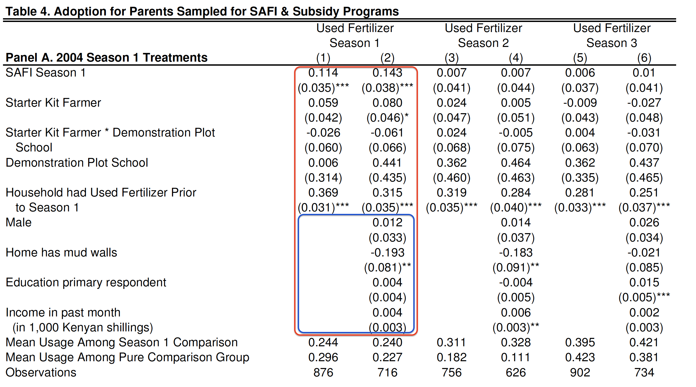

```{r setup, include=FALSE}
# Load all the libraries we need
# library(here)
# library(tidyverse)
# library(kableExtra)
# library(DeclareDesign)
# library(estimatr)
# library(styler)
# library(coin)
# library(multcomp)
# library(devtools)
# library(randomizr)
# library(rcompanion) ## for pairwisePermutationTest()
```

## A Quick Reminder \| *Un pétit rappel*

::: {.cols data-latex=""}
::: {.col data-latex="{0.48\\textwidth}"}
-   Remember: Analyze as you randomize

-   We prefer estimators that are unbiased and have greater precision
:::

::: {.col data-latex="{0.04\\textwidth}"}
  <!-- an empty Div (with a white space), serving as
a column separator -->
:::

::: {.col data-latex="{0.48\\textwidth}"}
-   N'oubliez pas : Analysez comme vous randomisez

-   Nous préférons les estimateurs non biaisés et plus précis.
:::
:::

# Covariate Adjustment \| *Ajustement des covariables*

## Estimator: Linear regression with covariates \| \newline Estimateur : La régression linéaire avec des covariables

$$Y_i = \beta_0 + \beta_1 Z_i + \gamma X_i + e_i$$

::: {.cols data-latex=""}
::: {.col data-latex="{0.48\\textwidth}"}
-   Including a **pre-treatment covariate** $X$ that is *predictive of*
    the outcome variable in our regression model is called *covariate
    adjustment*.

-   For example: pre-treatment measure of the outcome.

-   This can bias our estimates, but improve their precision.
:::

::: {.col data-latex="{0.04\\textwidth}"}
  <!-- an empty Div (with a white space), serving as
a column separator -->
:::

::: {.col data-latex="{0.48\\textwidth}"}
-   L'inclusion d'une **covariable pré-traitement** $X$ qui est
    *prédictive* de la variable de résultat dans notre modèle de
    régression est appelée *ajustement des covariables*.

-   Par exemple: un mesure du résultat avant le traitement.

-   Cela peut biaiser nos estimations, mais améliorer leur précision.
:::
:::

## Estimator: Linear regression with covariates \| *Estimateur : La régression linéaire avec des covariables*

$$Y_i = \beta_0 + \beta_1 Z_i + \gamma X_i + e_i$$

\bigskip

::: {.cols data-latex=""}
::: {.col data-latex="{0.48\\textwidth}"}
-   The coefficient on the treatment variable ($\beta_1$) is again our
    estimate of the ATE.

-   The coefficient on the covariate ($\gamma$) is *not* an estimate of
    the causal effect of that variable.\
:::

::: {.col data-latex="{0.04\\textwidth}"}
  <!-- an empty Div (with a white space), serving as
a column separator -->
:::

::: {.col data-latex="{0.48\\textwidth}"}
-   Le coefficient sur la variable de traitement ($\beta_1$) est encore
    notre estimation de l'ATE.

-   Le coefficient de la covariable ($\gamma$) n'est *pas* une
    estimation de l'effet causal de cette variable.
:::
:::

## Estimator: Linear regression with covariates \| *Estimateur : La régression linéaire avec des covariables*

Example reading a table

```{r, echo=FALSE, fig.align='center', out.width=300}

```

# Cluster Randomization \| *Randomisation par grappe*

## Estimator: Regression with cluster-robust standard errors \| *Estimateur : La régression avec des erreurs types robustes au niveau du cluster*

$$Y_{ic} = \beta_0 + \beta_1 Z_{c} + e_{ic}$$


\bigskip


::: {.cols data-latex=""}
::: {.col data-latex="{0.48\\textwidth}"}
-   Our analysis has to take into account the fact that treatment is
    assigned at the cluster level with *cluster-robust standard errors*.

-   $\beta_1$ is the ATE of the treatment at the individual level.

-   We can also do covariate adjustment at the same time.
:::

::: {.col data-latex="{0.04\\textwidth}"}
  <!-- an empty Div (with a white space), serving as
a column separator -->
:::

::: {.col data-latex="{0.48\\textwidth}"}
-   Notre analyse doit prendre en compte le fait que le traitement est
    attribué au niveau du cluster avec des *erreurs types robustes au
    niveau du cluster*.

-   $\beta_1$ est l'ATE du traitement au niveau individuel.

-   Nous pouvons également effectuer un ajustement covariable en même
    temps.
:::
:::

## Cluster Randomization \| *Randomisation par grappe*

::: {.cols data-latex=""}
::: {.col data-latex="{0.48\\textwidth}"}
-   Remember: we have assumed non-interference (part of SUTVA).

-   If we are concerned about interference within clusters (but can
    assume non-interference across clusters), we can shift the analysis
    to the cluster level by using the average or other summary measure
    at the cluster level as our outcome variable.
:::

::: {.col data-latex="{0.04\\textwidth}"}
  <!-- an empty Div (with a white space), serving as
a column separator -->
:::

::: {.col data-latex="{0.48\\textwidth}"}
-   N'oubliez pas : nous avons supposé la non-contamination (qui fait
    partie de la SUTVA).

-   Si nous sommes préoccupés par la contamination au sein des clusters
    (mais pouvons supposer qu'il n'y a pas de contamination entre les
    clusters), nous pouvons déplacer l'analyse au niveau du cluster en
    utilisant la moyenne ou une autre mesure récapitulative au niveau du
    cluster comme variable de résultat.
:::
:::

## Cluster Randomization \| *Randomisation par grappe*

Example table

# Experiments with Multiple Arms \| *Les éxperiences avec plusiers bras*

## Estimator 1: Difference-in-Means \| *Estimateur 1 : La différence en moyennes*

\begin{table}[]
\begin{tabular}{|p{1.5in}|p{1.5in}|p{1.5in}|}
 \cline{1-3}
&& \\
$Z_A$ only  &  $Z_B$ only & Neither (control) \\
&& \\
 \cline{1-3}
\end{tabular}
\end{table}

\bigskip

::: {.cols data-latex=""}
::: {.col data-latex="{0.48\\textwidth}"}
-   We can always take the difference-in-means between any two groups.

-   But hypothesis testing is simpler with regression.
:::

::: {.col data-latex="{0.04\\textwidth}"}
  <!-- an empty Div (with a white space), serving as
a column separator -->
:::

::: {.col data-latex="{0.48\\textwidth}"}
-   Nous pouvons toujours tenir compte de la différence de moyens entre
    deux groupes.

-   Mais le test d'hypothèse est plus simple avec la régression.
:::
:::

## Estimator 2: Linear regression \| *Estimateur 2 : La régression linéaire*

$$Y_i = \alpha + \beta_A Z_{Ai} + \beta_B Z_{Bi} + e_i$$


\bigskip


::: {.cols data-latex=""}
::: {.col data-latex="{0.48\\textwidth}"}
-   Regression with an indicator variable for each of the two treatment
    arms.

-   We can also do covariate adjustment at the same time.
:::

::: {.col data-latex="{0.04\\textwidth}"}
  <!-- an empty Div (with a white space), serving as
a column separator -->
:::

::: {.col data-latex="{0.48\\textwidth}"}
-   Régression avec une variable indicatrice pour chacun des deux bras
    de traitement.

-   Nous pouvons également effectuer un ajustement covariable en même
    temps.
:::
:::

## Estimator 2: Linear regression \| *Estimateur 2 : La régression linéaire*

$$Y_i = \alpha + \beta_A Z_{Ai} + \beta_B Z_{Bi} + e_i$$


\bigskip


::: {.cols data-latex=""}
::: {.col data-latex="{0.48\\textwidth}"}
-   $\beta_A$ is the ATE of $Z_A$ (compared with control).

-   $\beta_B$ is the ATE of $Z_B$ (compared with control).
:::

::: {.col data-latex="{0.04\\textwidth}"}
  <!-- an empty Div (with a white space), serving as
a column separator -->
:::

::: {.col data-latex="{0.48\\textwidth}"}
-   $\beta_A$ est l'ATE de $Z_A$ (par rapport au contrôle).

-   $\beta_B$ est l'ATE de $Z_B$ (par rapport au contrôle).
:::
:::

# Factorial Design \| *La concéption factorielle*

## Estimator 1: Difference-in-Means \| *Estimateur 1 : La différence en moyennes*

\begin{table}[]
\begin{tabular}{|p{1in}|p{1in}|}
\cline{1-2}
Neither  &  $Z_2$ only \\
 & \\ \cline{1-2}
$Z_1$ only  & Both $Z_1$ and $Z_2$ \\
& \\ \cline{1-2}
\end{tabular}
\end{table}

\bigskip

::: {.cols data-latex=""}
::: {.col data-latex="{0.48\\textwidth}"}
-   If we have a 2\*2 factorial design, we have four groups.

-   We can always take the difference-in-means between any two groups.
:::

::: {.col data-latex="{0.04\\textwidth}"}
  <!-- an empty Div (with a white space), serving as
a column separator -->
:::

::: {.col data-latex="{0.48\\textwidth}"}
-   Si nous avons une concéption factorielle 2\*2, nous avons 4 groupes.

-   Nous pouvons toujours tenir compte de la différence de moyens entre
    deux groupes.
:::
:::

## Estimator 2: Linear Regression \| *Estimateur 2 : La régression linéaire*

$$Y_i = \gamma_0 + \gamma_1 Z_{1only,i} + \gamma_2 Z_{2only,i} + \gamma_3 Z_{both1\&2,i} + e_i$$

::: {.cols data-latex=""}
::: {.col data-latex="{0.48\\textwidth}"}
-   Regression makes it easier to do hypothesis testing.

-   An indicator variable for each of the three treatment conditions.

-   We can also do covariate adjustment at the same time.
:::

::: {.col data-latex="{0.04\\textwidth}"}
  <!-- an empty Div (with a white space), serving as
a column separator -->
:::

::: {.col data-latex="{0.48\\textwidth}"}
-   La régression facilite les tests d'hypothèses.

-   Régression avec une variable indicatrice pour chacun des trois bras
    de traitement.

-   Nous pouvons également effectuer un ajustement covariable en même
    temps.
:::
:::

## Estimator 2: Linear Regression \| *Estimateur 2 : La régression linéaire*

$$Y_i = \gamma_0 + \gamma_1 Z_{1only,i} + \gamma_2 Z_{2only,i} + \gamma_3 Z_{both1\&2,i} + e_i$$

-   $\gamma_1$: ATE of $Z_{1}$ conditional on $Z_{2}=0$ \| *l'ATE de*
    $Z_{1}$ conditionnel à $Z_{2}=0$, ($E[Y(Z_1=1)- Y(Z_1=0) | Z_2=0]$)

-   $\gamma_2$: ATE of $Z_{2}$ conditional on $Z_{1}=0$ \| *l'ATE de*
    $Z_{2}$ conditionnel à $Z_{1}=0$, ($E[Y(Z_2=1)- Y(Z_2=0) | Z_1=0]$)

-   $\gamma_3$: ATE of having both $Z_1$ and $Z_2$ compared with having
    neither \| *l'ATE d'avoir à la fois* $Z_1$ et $Z_2$ par rapport à
    n'avoir ni l'un ni l'autre

## Estimator 2: Linear Regression \| *Estimateur 2 : La régression linéaire*

Example of reading a table

## Estimator 3: Linear Regression with an Interaction Term \| *Estimateur 3 : La régression linéaire avec un terme d'interaction*

$$Y_i = \beta_0 + \beta_1 Z_{1i} + \beta_2 Z_{2i} + \beta_3 Z_{1i}*Z_{2i} + e_i$$

\bigskip

::: {.cols data-latex=""}
::: {.col data-latex="{0.48\\textwidth}"}
-   Indicator variables for $Z_1$ and $Z_2$.

-   We can also do covariate adjustment at the same time.
:::

::: {.col data-latex="{0.04\\textwidth}"}
  <!-- an empty Div (with a white space), serving as
a column separator -->
:::

::: {.col data-latex="{0.48\\textwidth}"}
-   Variables indicatrices pour $Z_1$ et $Z_2$.

-   Nous pouvons également effectuer un ajustement covariable en même
    temps.
:::
:::

## Estimator 3: Linear Regression with an Interaction Term \| *Estimateur 3 : La régression linéaire avec un terme d'interaction*

$$Y_i = \beta_0 + \beta_1 Z_{1i} + \beta_2 Z_{2i} + \beta_3 Z_{1i}Z_{2i} + e_i$$

-   $\beta_1$ is the ATE of $Z_{1}$ conditional on $Z_{2}=0$ \| *l'ATE
    de* $Z_{1}$ conditionnel à $Z_{2}=0$,
    ($E[Y(Z_1=1)- Y(Z_1=0) | Z_2=0]$)

-   $\beta_2$ is the ATE of $Z_{2}$ conditional on $Z_{1}=0$ \| *l'ATE
    de* $Z_{2}$ conditionnel à $Z_{1}=0$,
    ($E[Y(Z_2=1)- Y(Z_2=0) | Z_1=0]$)

## Estimator 3: Linear Regression with an Interaction Term \| *Estimateur 3 : La régression linéaire avec un terme d'interaction*

$$Y_i = \beta_0 + \beta_1 Z_{1i} + \beta_2 Z_{2i} + \beta_3 Z_{1i}Z_{2i} + e_i$$

\bigskip

-   $\beta_1 + \beta_3$ = ATE of $Z_{1}$ conditional on $Z_{2}=1$ \|
    *l'ATE de* $Z_{1}$ conditionnel à $Z_{2}=1$,
    ($E[Y(Z_1=1)- Y(Z_1=0) | Z_2=1]$)

-   $\beta_2 + \beta_3$ = ATE of $Z_{2}$ conditional on $Z_{1}=1$ \|
    *l'ATE de* $Z_{2}$ conditionnel à $Z_{1}=1$,
    ($E[Y(Z_2=1)- Y(Z_2=0) | Z_1=0]$)

-   $\beta_3$ is called the interaction effect. $\beta_3$ est appelé
    l'effet d'interaction.

## Estimator 3: Linear Regression with an Interaction Term \| *Estimateur 3 : La régression linéaire avec un terme d'interaction*

Example reading a table
