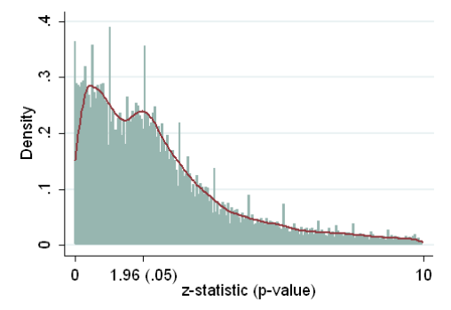

## Key points for this lecture \| *Points clés du cours*

::: {.cols data-latex=""}
::: {.col data-latex="{0.48\\textwidth}"}

- Find a design that is scientifically sound, cost-effective, ethical, and that is (maximimally) informative for decisionmakers 
- Build credibility in your design by registering a detailed plan first
- Things will happen that are not expected!  
- Report on what happened honestly, enable future researchers to confirm what you found and build on it

:::

::: {.col data-latex="{0.04\\textwidth}"}
  <!-- an empty Div (with a white space), serving as
a column separator -->
:::

::: {.col data-latex="{0.48\\textwidth}"}

- Trouvez un design qui soit scientifiquement solide (juste), rentable, éthique et qui soit (au maximum) informatif pour les décideurs.
- Renforcez la crédibilité de votre design en enregistrant (soumettant) d'abord un plan détaillé.
- Des événements imprévus se produiront !
- Rendez compte de ce qui s'est passé honnêtement, permettez aux futurs chercheurs de confirmer vos découvertes et de les développer.

:::
:::

## 14 Steps \| *Les étapes clés du cours*

::: {.cols data-latex=""}
::: {.col data-latex="{0.48\\textwidth}"}

1. Where to start
2. Finding an implementer
3. Working with partners
4. Define your design
5. Assess your design
6. Funding
7. Scoping and piloting
8. Feedback
9. Preanalysis plans
10. Pivoting
11. Populated analysis plans
12. Analysis and reconciliation 
13. Communicating
14. Archiving

:::

::: {.col data-latex="{0.04\\textwidth}"}
  <!-- an empty Div (with a white space), serving as
a column separator -->
:::

::: {.col data-latex="{0.48\\textwidth}"}

1. Par où commencer
2. Trouver un exécutant
3. Travailler avec des partenaires
4. Définir votre design
5. Évaluer votre design
6. Financement
7. Champ d'application et pilotage
8. Retours d'information
9. Plans de préanalyse
10. Pivoter
11. Plans d'analyse peuplés
12. Analyse et conciliation
13. Communication
14. Archivage

:::
:::

## Where to start \| *Par où commencer ?*

::: {.cols data-latex=""}
::: {.col data-latex="{0.48\\textwidth}"}

Who finds the idea:

- You
- Partner organization
- Funding sources 

\bigskip

Where the idea comes from:
 
- Reading literature (create gap map, replication)
- Interviews/participant observation with beneficiaries or partners
- Identify evidence gaps in practice 

:::

::: {.col data-latex="{0.04\\textwidth}"}
  <!-- an empty Div (with a white space), serving as
a column separator -->
:::

::: {.col data-latex="{0.48\\textwidth}"}

Qui trouve l'idée: 

- Vous
- Organisation partenaire
- Sources de financement

\bigskip

D'où vient l'idée:

- Lecture de la littérature (création de cartes des lacunes, réplication)
- Entretiens/observation participante avec les bénéficiaires ou les partenaires
- Identification des lacunes de preuves dans la pratique
   
:::
:::

## Finding an implementer \| *Trouver un exécutant*

::: {.cols data-latex=""}
::: {.col data-latex="{0.48\\textwidth}"}

A good implementing partner:

\bigskip

- Shares your learning goals
- Can work at the scale needed for power
- Has buy-in from relevant internal and external decisionmakers
- Ideally, has funds for implementation (and even measurement) or can help raise them

:::

::: {.col data-latex="{0.04\\textwidth}"}
  <!-- an empty Div (with a white space), serving as
a column separator -->
:::

::: {.col data-latex="{0.48\\textwidth}"}

Un bon partenaire de mise en œuvre :

\bigskip

- Partage vos objectifs d'apprentissage
- Peut travailler à l'échelle nécessaire pour le pouvoir
- A l'appui des décideurs internes et externes concernés
- Dispose idéalement de fonds pour la mise en œuvre (et même pour l'évaluation) ou peut aider à les réunir.
   
:::
:::

## Working with partners \| *Travailler avec des partemaires*

::: {.cols data-latex=""}
::: {.col data-latex="{0.48\\textwidth}"}

- What to do when partner goals conflict with scientific goals?
- Publication rights 
- Contribute to partner's decision making 

:::

::: {.col data-latex="{0.04\\textwidth}"}
  <!-- an empty Div (with a white space), serving as
a column separator -->
:::

::: {.col data-latex="{0.48\\textwidth}"}

- Que faire lorsque les objectifs des partenaires entrent en conflit avec les objectifs scientifiques ?
- Droits de publication
- Contribuer à la prise de décision du partenaire
   
:::
:::

<!-- ## Working with partners \| *Travailler avec des partenaires* -->

<!-- {height=100%} -->

## Define your design \| *Définir votre design*

::: {.cols data-latex=""}
::: {.col data-latex="{0.48\\textwidth}"}

Research design form!

:::

::: {.col data-latex="{0.04\\textwidth}"}
  <!-- an empty Div (with a white space), serving as
a column separator -->
:::

::: {.col data-latex="{0.48\\textwidth}"}

Formulaire de conception de recherche !
   
:::
:::

## Assess your design \| *Évaluer votre design*

::: {.cols data-latex=""}
::: {.col data-latex="{0.48\\textwidth}"}

- It it powered?
- Is your analysis procedure biased? (Analyze as your randomize!)
- Can you quantify uncertainty?
- Is it cost effective?
- Do benefits outweigh costs to participants?
- What are risks to participants, communities, research staff?

:::

::: {.col data-latex="{0.04\\textwidth}"}
  <!-- an empty Div (with a white space), serving as
a column separator -->
:::

::: {.col data-latex="{0.48\\textwidth}"}

- Le design a-t-il une (bonne) puissance?
- Est-ce que votre procédure d'analyse est biaisée? (Analysez comme vous randomisez!)
- Pouvez-vous quantifier l'incertitude?
- Est-ce rentable?
- Les avantages surpassent-ils les coûts (les inconvenients) pour les participants?
- Quels sont les risques pour les participants, les communautés et le personnel de recherche?
   
:::
:::

## Funding \| *Financement*

::: {.cols data-latex=""}
::: {.col data-latex="{0.48\\textwidth}"}

Types of funding

- Pilot funding
- Implementation funding
- Research funding 

Funders

- National research agencies 
- National development agencies 
- JPAL, IPA, EGAP small grants
- Bilateral/multilateral donors (USAID, UK FCDO, French AFD)
- Foundations (Hewlett, Carnegie, Rockefeller, Gates, Ford, Mellon, Macarthur, Open Society, Sloan, large companies like Tiffany's)
- Implementer
- Afridemics.com scholarship database

:::

::: {.col data-latex="{0.04\\textwidth}"}
  <!-- an empty Div (with a white space), serving as
a column separator -->
:::

::: {.col data-latex="{0.48\\textwidth}"}

- Financement pilote
- Financement de la mise en œuvre
- Financement de la recherche
  - Agences nationales de recherche
  - Agences nationales de développement
  - JPAL, IPA
  - Organismes philanthropiques
  - Mise en œuvre
   
:::
:::

## Scoping and piloting \| *Champ d'application et pilotage*

::: {.cols data-latex=""}
::: {.col data-latex="{0.48\\textwidth}"}

- Is the intervention feasible?
- Is your measurement strategy feasible?
- What information/data do you need to carry out your experiment?
- Cannot learn much about the effect size! 
- Large pilots not worth it -- except as proof of concept

:::

::: {.col data-latex="{0.04\\textwidth}"}
  <!-- an empty Div (with a white space), serving as
a column separator -->
:::

::: {.col data-latex="{0.48\\textwidth}"}

- L'intervention est-elle réalisable?
- Votre stratégie de mesure est-elle réalisable?
- De quelles informations/données avez-vous besoin pour mener votre expérimentation?
- On ne peut pas apprendre grand-chose sur la taille de l'effet!
- Les grandes expérimentations pilotes ne valent pas la peine, sauf en tant que preuve de concept.
   
:::
:::

## Feedback \| *Retours d'information*

::: {.cols data-latex=""}
::: {.col data-latex="{0.48\\textwidth}"}

- Who: researchers, implementers, policymakers, and participants/beneficiaries 
- What: will the research provide (maximally) useful evidence? Is the study worth running?
- When: before scoping, before preanalysis plan, before analysis

:::

::: {.col data-latex="{0.04\\textwidth}"}
  <!-- an empty Div (with a white space), serving as
a column separator -->
:::

::: {.col data-latex="{0.48\\textwidth}"}

- Qui : chercheurs, exécutants, décideurs politiques et participants/bénéficiaires
- Quoi : est-ce que la recherche fournira des preuves (au maximum) utiles ? Est-ce que l'étude vaut la peine d'être réalisée ?
- Quand : avant le cadrage, avant le plan de pré-analyse, avant l'analyse.
   
:::
:::

## Preanalysis plans \| *Plans de préanalyse*

::: {.cols data-latex=""}
::: {.col data-latex="{0.48\\textwidth}"}

Two risks to science: "p-hacking" and the "file drawer problem" 

\bigskip

Partial solution: register your study and how you plan to analyze it in advance

:::

::: {.col data-latex="{0.04\\textwidth}"}
  <!-- an empty Div (with a white space), serving as
a column separator -->
:::

::: {.col data-latex="{0.48\\textwidth}"}

Deux risques pour la science : le "piratage-p" (la manipulation des valeurs p ou des seuils de significativité) et le "problème de l'effet tiroir".

\bigskip

Solution partielle : enregistrez (soumettez) votre étude et comment vous prévoyez l'analyser à l'avance.
   
:::
:::

## p-hacking \| *Piratage p*

## File drawer problem \| *Problème de l'effet tiroir*

## What to include in a PAP \| *Que faut-il inclure dans un PAP?*

::: {.cols data-latex=""}
::: {.col data-latex="{0.48\\textwidth}"}

- Describe randomization, measurement, and analysis plans
- Use mock data to create mock tables and figures
- Power analysis 

:::

::: {.col data-latex="{0.04\\textwidth}"}
  <!-- an empty Div (with a white space), serving as
a column separator -->
:::

::: {.col data-latex="{0.48\\textwidth}"}

- Décrivez les plans de randomisation, de mesure et d'analyse.
- Utilisez des données fictives pour créer des tableaux et des figures fictifs.
- Analysez de puissance.
   
:::
:::

## Pivoting \| *Pivoter*

::: {.cols data-latex=""}
::: {.col data-latex="{0.48\\textwidth}"}

- Things often don't go according to plan! 
- Go/no go decision
- Pivot to other questions, imperfect design for same questions

:::

::: {.col data-latex="{0.04\\textwidth}"}
  <!-- an empty Div (with a white space), serving as
a column separator -->
:::

::: {.col data-latex="{0.48\\textwidth}"}

- Souvent, les choses ne se passent pas comme prévu !
- Décision d'aller ou de ne pas aller
- Pivot vers d'autres questions, conception imparfaite pour les mêmes questions
   
:::
:::

## Populated preanalysis plan \| *Plans d'analyse peuplés*

::: {.cols data-latex=""}
::: {.col data-latex="{0.48\\textwidth}"}

Dutifully follow the PAP 

\bigskip

Post on your website or public archive

:::

::: {.col data-latex="{0.04\\textwidth}"}
  <!-- an empty Div (with a white space), serving as
a column separator -->
:::

::: {.col data-latex="{0.48\\textwidth}"}

Suivre consciencieusement le PAP 

\bigskip

Publier sur votre site web ou dans les archives publiques
   
:::
:::

## Analysis and reconciliation \| *Analyse et conciliation*

::: {.cols data-latex=""}
::: {.col data-latex="{0.48\\textwidth}"}

Analyze as you randomize (including changes)

\bigskip

Reconcile PAP to final analysis

:::

::: {.col data-latex="{0.04\\textwidth}"}
  <!-- an empty Div (with a white space), serving as
a column separator -->
:::

::: {.col data-latex="{0.48\\textwidth}"}

Analyser (comme) au fur et à mesure que vous randomisez (y compris les changements)

\bigskip

Concilier le PAP avec l'analyse finale
   
:::
:::

## Communicating \| *Communication*

::: {.cols data-latex=""}
::: {.col data-latex="{0.48\\textwidth}"}

What you found, why it should be believed (design), and to whom/where the evidence applies

\bigskip 

Who are the consumers of your evidence, who might change their decisions based on it? Are you reaching them?

:::

::: {.col data-latex="{0.04\\textwidth}"}
  <!-- an empty Div (with a white space), serving as
a column separator -->
:::

::: {.col data-latex="{0.48\\textwidth}"}

Ce que vous avez decouvert, pourquoi cela devrait être pris en compte (conception), et à qui/où (dans quel domaine) les preuves s'appliquent.

\bigskip 

Qui sont les consommateurs de vos preuves, ceux qui pourraient changer leurs décisions en fonction de celles-ci ? Les atteignez-vous?
   
:::
:::

## Archiving \| *Archivage*

::: {.cols data-latex=""}
::: {.col data-latex="{0.48\\textwidth}"}

- Share data, code to enable reproduction of results
- Share materials to enable replicating study (intervention details, survey questionnaires, etc.)

:::

::: {.col data-latex="{0.04\\textwidth}"}
  <!-- an empty Div (with a white space), serving as
a column separator -->
:::

::: {.col data-latex="{0.48\\textwidth}"}

- Partager les données et les codes pour permettre la réplication des résultats
- Partager le matériel permettant de reproduire l'étude (détails de l'intervention, questionnaires d'enquête, etc.)

:::
:::

 

