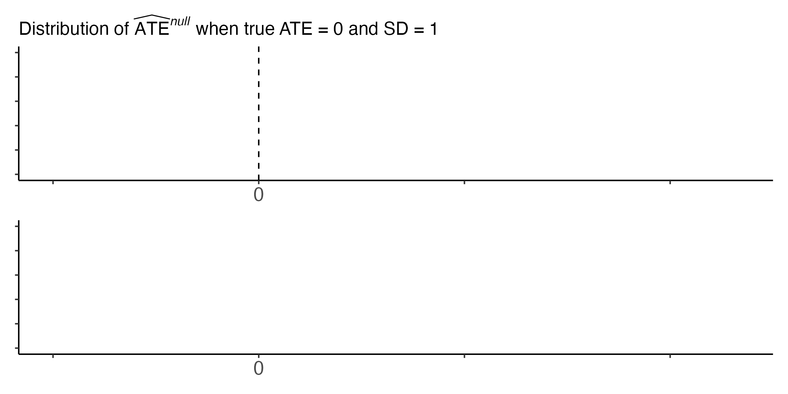
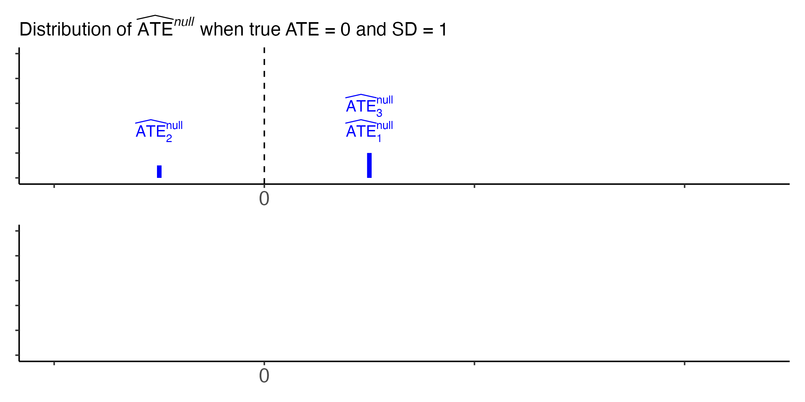
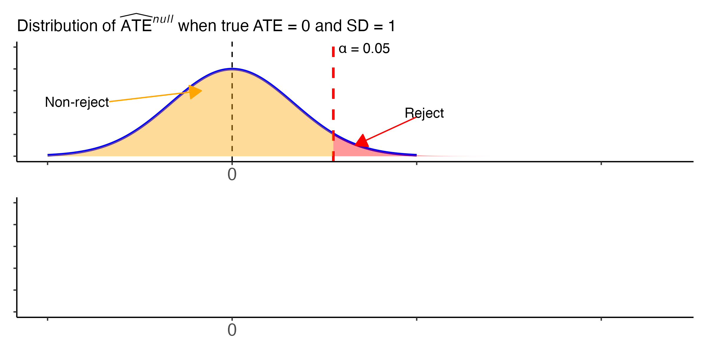
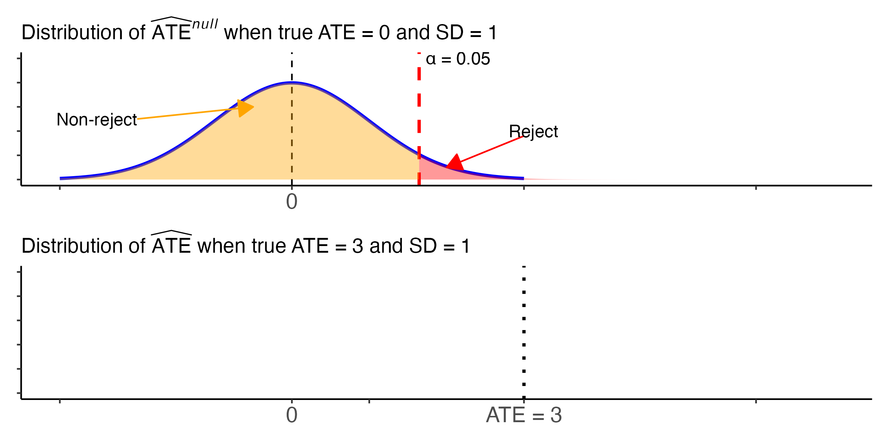
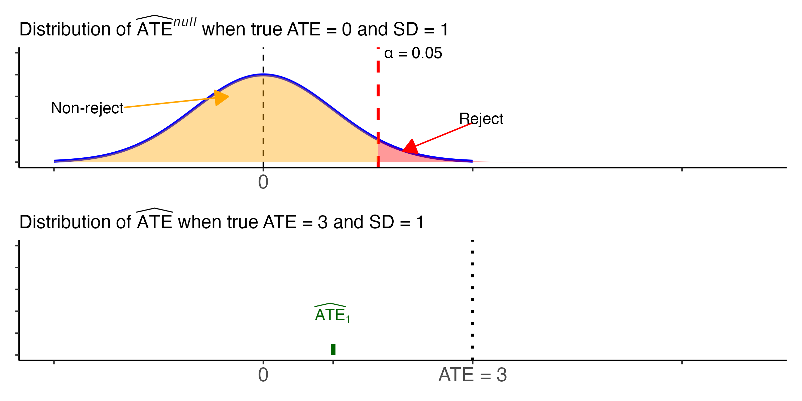
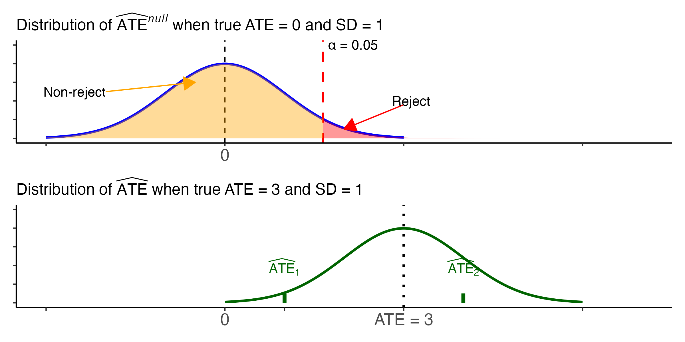
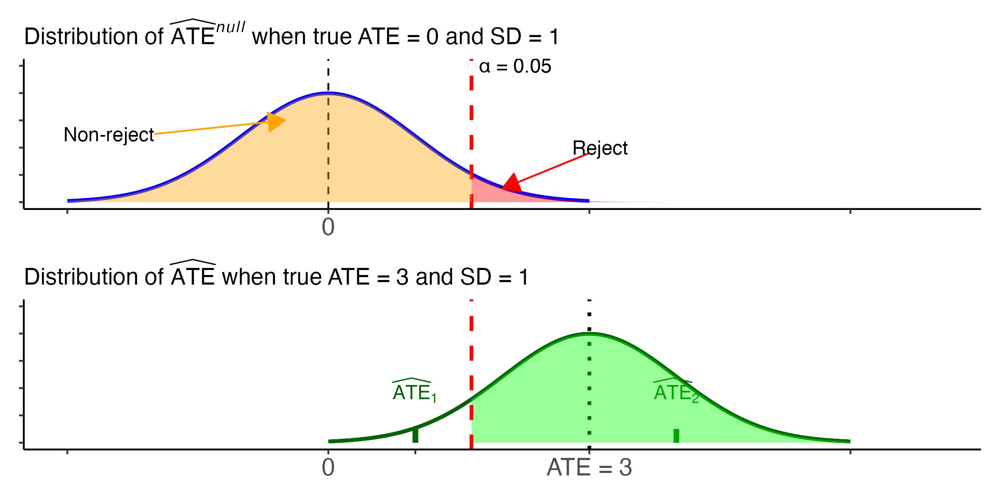
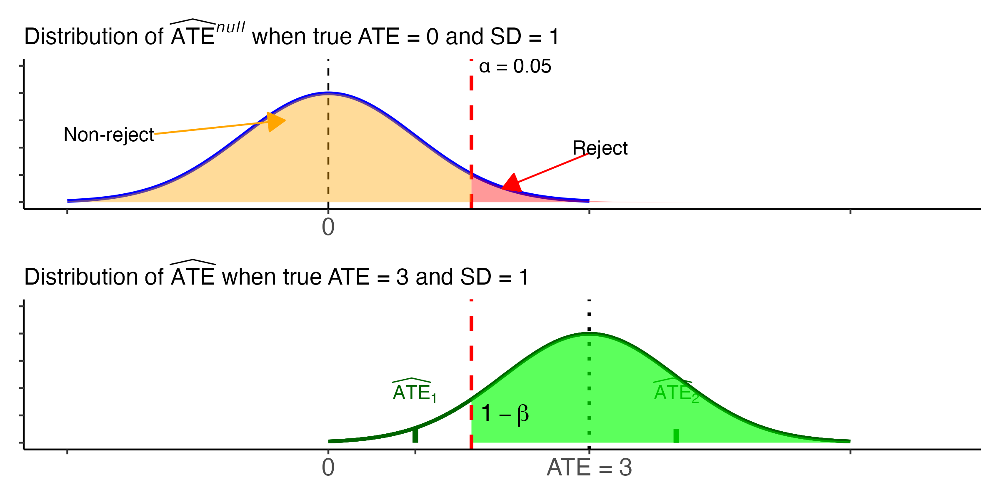

```{r, echo=FALSE, eval=TRUE}
options(repos = "https://cran.rstudio.com/")
#Effacer tous les objets présents dans l'espace de travail
# Set the CRAN mirror
rm(list = ls())
```

```{r installation des librairies, echo=FALSE, eval=TRUE}
#Vérifier et installer les packages manquants
list.of.packages <- c("knitr", "DeclareDesign", "tidyverse", "patchwork")
new.packages <- list.of.packages[!(list.of.packages %in% installed.packages()[,"Package"])]
if(length(new.packages)) install.packages(new.packages)
```

```{r, echo = FALSE, warning = FALSE, message = FALSE}
library(knitr)
library(DeclareDesign)
library(tidyverse)
library(patchwork)
opts_chunk$set(warning = FALSE, message = FALSE)

```

## Key points for this lecture \| *Points clés du cours*

::: {.cols data-latex=""}
::: {.col data-latex="{0.48\\textwidth}"}
-   Informally: Power is the ability of our experiment to detect treatment effects, if they in fact exist
    
\medskip

-   Power matters: for practical reasons and for interpretation

\medskip

-   You can increase power by strengthening the intervention, reducing noise, and
    increasing sample size
:::

::: {.col data-latex="{0.04\\textwidth}"}
```{=html}
<!-- an empty Div (with a white space), serving as
a column separator -->
```
:::

::: {.col data-latex="{0.48\\textwidth}"}
-   De manière informelle: La puissance est la capacité de notre expérience à détecter des
    effets de traitement, s'ils existent
    réellement

\medskip

-   La puissance est importante : pour des raisons pratiques et pour
    l'interprétation

\medskip

-   Vous pouvez augmenter la puissance en renforçant l'intervention, en réduisant le bruit et en augmentant la taille de l'échantillon
:::
:::


# Power \| *La puissance*


## Power \| *La puissance*

\vspace{.03in}

::: {.cols data-latex=""}
::: {.col data-latex="{0.48\\textwidth}"}
-   Main idea: The ability of the experiment to detect statistically significant treatment effects, if the effect really exists.  

\medskip

-   More specifically: The probability of correctly rejecting a null hypothesis when the alternative is true.  (The probability of avoiding a Type II error.)

\medskip

-   Power is a probability between $0$ and $1$.  We generally prefer more power.  


:::

::: {.col data-latex="{0.04\\textwidth}"}
  <!-- an empty Div (with a white space), serving as
a column separator -->
:::

::: {.col data-latex="{0.48\\textwidth}"}
-   L'idée principale : La capacité de notre expérience à détecter des effets de traitement
    statistiquement significatifs, s'ils existent réellement.

\medskip

-   Plus précisément: La probabilité de rejeter correctement une hypothèse nulle lorsque l'alternative est vraie.  (La probabilité de l'expérience à éviter de commettre une erreur de type II.) 

\medskip

-   La puissance est une probabilité, un nombre compris entre $0$ et $1$.  Nous préférons généralement plus de puissance.


:::
:::


## Power Analysis \| *L'analyse de la puissance*

\vspace{.03in}

::: {.cols data-latex=""}
::: {.col data-latex="{0.48\\textwidth}"}
-   We do a power analysis *before* we run a study.  It is part of the *design* stage.

\bigskip

-   Goal: To discover whether our planned design has enough power to
    detect effects if they exist.  Then improve the design or drop the study.
:::

::: {.col data-latex="{0.04\\textwidth}"}
  <!-- an empty Div (with a white space), serving as
a column separator -->
:::

::: {.col data-latex="{0.48\\textwidth}"}
-   Nous faisons l'analyse de puissance *avant* de
    mener une étude. Cela fait partie de la phase de *conception*.

\bigskip

-   Objectif : Déterminer si la conception de l'étude a suffisamment de
    puissance pour détecter les effets s'ils existent.  Puis améliorer ou abandonner la conception.
:::
:::


## Review: Hypothesis testing \| *Rappel : les tests d'hypothèse*

\centering
{width="500"}

## Review: Hypothesis testing \| *Rappel : les tests d'hypothèse*

\centering
{width="500"}

## Review: Hypothesis testing \| *Rappel : les tests d'hypothèse*

\centering
{width="500"}

## Review: Hypothesis testing \| *Rappel : les tests d'hypothèse*

\centering
{width="500"}

## Review: Hypothesis testing \| *Rappel : les tests d'hypothèse*

\centering
{width="500"}

## Review: Hypothesis testing \| *Rappel : les tests d'hypothèse*

\centering
{width="500"}

## Power \| *La puissance*

\centering
{width="500"}

## Power \| *La puissance*

\centering
{width="500"}

## Power \| *La puissance*

\centering
{width="500"}

## Power \| *La puissance*

\centering
{width="500"}

## Power \| *La puissance*

\centering
{width="500"}


## Power \| *La puissance*

\centering
{width="500"}

## Power with a smaller ATE \| *La puissance avec un ATE plus petit*

\centering
{width="500"}

## Power with less noise \| *La puissance avec moins de bruit*

\centering
{width="500"}

## Power with less noise \| *La puissance avec moins de bruit*

\centering
{width="500"}


## Power with less noise \| *La puissance avec moins de bruit*

\centering
{width="250"}
{width="250"}


## Under-powered studies \| *Les études de faible puissance*

::: {.cols data-latex=""}
::: {.col data-latex="{0.48\\textwidth}"}
-   With a study that does not have enough power, we can't determine
    a null finding (no statistically significant effect) means: 
      
    -   There is no effect, or 
    -   We just can't detect an effect that exists.
:::

::: {.col data-latex="{0.04\\textwidth}"}
  <!-- an empty Div (with a white space), serving as
a column separator -->
:::

::: {.col data-latex="{0.48\\textwidth}"}
-   Dans le cas d'une étude dont la puissance est insuffisante, il est
    impossible de dire si un résultat nul (pas d'effet statistiquement
    significatif) signifie:
    
    -   Qu'il n'y a pas d'effet, ou 
    -   Si nous ne pouvons tout simplement pas détecter un effet existant.
:::
:::

## Under-powered studies \| *Les études de faible puissance*

::: {.cols data-latex=""}
::: {.col data-latex="{0.48\\textwidth}"}
-   We don't know whether we should adopt this treatment because we
    don't know whether it's effective.

\bigskip

-   Perhaps running this study is not a good use of our resources.
:::

::: {.col data-latex="{0.04\\textwidth}"}
  <!-- an empty Div (with a white space), serving as
a column separator -->
:::

::: {.col data-latex="{0.48\\textwidth}"}
-   Nous ne savons pas si nous devons adopter ce traitement car nous ne
    savons pas s'il est efficace.

\bigskip

-   Peut-être que la réalisation de cette étude n'est pas une bonne
    utilisation de nos ressources.
:::
:::


## Compare with hypothesis testing \| *La comparaison avec les tests d'hypothèse*
\vspace{.03in}

\begin{table}[]
\begin{tabular}{p{2.15in}p{2.15in}}
\toprule
\textbf{Power Analysis} & \textbf{Hypothesis Test} \\ 
\midrule
1. Do before the experiment & 1. Do after the experiment \\
\textit{Faire avant l'expérience} & \textit{Faire après l'expérience} \\
\midrule
2. No data yet & 2. Use data from experiment \\
\textit{Pas encore de données} & \textit{Utiliser les données de l'expérience} \\
\midrule
\multicolumn{2}{l}{3. Need assumptions about a world in which:}      \\
\multicolumn{2}{l}{\textit{Besoin d’hypothèses sur un monde dans lequel:}} \\
a. there is no treatment effect & a. there is no treatment effect \\
\textit{il n'y a pas d'effet de traitement} & \textit{il n'y a pas d'effet de traitement} \\
b. there is a treatment effect &  \\
\textit{il existe un effet de traitement} & \\
\bottomrule                       
\end{tabular}
\end{table}


## What are the three main inputs into statistical power? \| *Quels sont les trois principaux éléments de la puissance statistique ?*

::: {.cols data-latex=""}
::: {.col data-latex="{0.48\\textwidth}"}
-   Treatment-effect size

\bigskip

-   Noisiness of the outcome variable ($\sigma$)

\bigskip

-   Sample size

:::

::: {.col data-latex="{0.04\\textwidth}"}
  <!-- an empty Div (with a white space), serving as
a column separator -->
:::

::: {.col data-latex="{0.48\\textwidth}"}
-   Taille de l'effet du traitement.

\bigskip

-   La dispersion de la variable de résultat ($\sigma$)

\bigskip

-   Taille de l'échantillon


:::
:::

## The Power Formula \| *The Power Formula (1)*

```{=tex}
\begin{equation}
\label{equation_1}
   Power = \Phi(\frac{|\tau|\sqrt{N}}{\sqrt{2}\sigma} - \Phi^{-1}(1 - \alpha )
\end{equation}
```
::: {.cols data-latex=""}
::: {.col data-latex="{0.48\\textwidth}"}

-   Standard 2-arm experiment

-   2 equal sized groups with known, equal variances

-   One-sided alternative hypothesis

-   Normal distribution of the outcome


:::

::: {.col data-latex="{0.04\\textwidth}"}
  <!-- an empty Div (with a white space), serving as
a column separator -->
:::

::: {.col data-latex="{0.48\\textwidth}"}
-   Expérience standard à 2 bras

-   2 groupes de taille égale avec des variances connues et égales

-   Hypothèse alternative unilatérale

-   Distribution normale du résultat


:::
:::

## The Power Formula \| *The Power Formula (2)*

::: {.cols data-latex=""}
::: {.col data-latex="{0.48\\textwidth}"}
-   $\Phi$ is the cumulative density function of the normal
    distribution (FIXED)
\medskip
-   $\tau$ is the effect size
\medskip
-   $N$ is the sample size
\medskip
-   $\sigma$ is the standard deviation of the outcome
\medskip
-   $\alpha$ is the significance level (FIXED by convention)
:::

::: {.col data-latex="{0.04\\textwidth}"}
  <!-- an empty Div (with a white space), serving as
a column separator -->
:::

::: {.col data-latex="{0.48\\textwidth}"}
-   $\Phi$ est la fonction de densité cummulative de la distribution
    normale (FIXE)
\medskip    
-   $\tau$ est la taille de l'effet
\medskip
-   $N$ est la taille de l'échantillon
\medskip
-   $\sigma$ est l'écart-type du résultat
\medskip
-   $\alpha$ est le niveau de signification (FIXE par convention)
:::
:::

<!-- Standard deviation of $Y$ / *L’écart-type de $Y$*: -->

<!-- $$\sigma_{Y} = \sqrt{\frac{1}{n} \sum_{i=1}^{n} (Y_i - \overline{Y})^2 }$$ -->


## Three main inputs into statistical power 1: Sample size \| *Trois éléments principaux de la puissance statistique 1 : La taille de l'échantillon*

::: {.cols data-latex=""}
::: {.col data-latex="{0.48\\textwidth}"}
-   More observations $\rightarrow$ more power
\medskip
-   Add observations!
\medskip
-   Problems?
:::

::: {.col data-latex="{0.04\\textwidth}"}
  <!-- an empty Div (with a white space), serving as
a column separator -->
:::

::: {.col data-latex="{0.48\\textwidth}"}
-   Plus d'observations $\rightarrow$ plus de puissance
\medskip
-   Ajoutez des observations !
\medskip
-   Problèmes éventuels ?
:::
:::

## Three main inputs into statistical power 2: Noisiness of outcome measure \| *Les trois principaux facteurs de la puissance statistique 2 : La dispersion de la variable dépendante*

::: {.cols data-latex=""}
::: {.col data-latex="{0.48\\textwidth}"}
-   Less noise $\rightarrow$ more power
\medskip
-   Reduce noise. How?
    -   Blocking — conduct experiments among subjects that look more
        similar;
    -   Collect baseline covariates — background information about
        experimental units;
\medskip
-   Problems?
:::

::: {.col data-latex="{0.04\\textwidth}"}
  <!-- an empty Div (with a white space), serving as
a column separator -->
:::

::: {.col data-latex="{0.48\\textwidth}"}
-   Faible dispersion $\rightarrow$ plus de puissance
\medskip
-   Comment réduire la dispersion ?
    -   Stratifier - mener des expériences avec des sujets qui se
        ressemblent le plus.
    -   Recueillir des covariables de base - informations de base sur
        les unités expérimentales;
\medskip
-   Problèmes éventuels ?
:::
:::

## Three Main Inputs into Statistical Power 3: Size of Treatment Effect \| *Trois éléments principaux de la puissance statistique 3 : Taille de l'effet du traitement*

::: {.cols data-latex=""}
::: {.col data-latex="{0.48\\textwidth}"}
-   Bigger effect $\rightarrow$ more power;
\medskip

-   Boost dosage / avoid very weak treatments;
\medskip

-   Problems?
:::

::: {.col data-latex="{0.04\\textwidth}"}
  <!-- an empty Div (with a white space), serving as
a column separator -->
:::

::: {.col data-latex="{0.48\\textwidth}"}
-   Plus d'effet $\rightarrow$ plus de puissance;
\medskip
-   Augmenter le dosage / éviter les traitements très faibles;
\medskip
-   Problèmes éventuels ?
:::
:::

## Power is the Art of Tweaking! \| La puissance est l'art du réglage !

::: {.cols data-latex=""}
::: {.col data-latex="{0.48\\textwidth}"}
We tweak different parts of our design up front to make sure that our
experiment has enough power to detect effects (assuming they exist)
:::

::: {.col data-latex="{0.04\\textwidth}"}
  <!-- an empty Div (with a white space), serving as
a column separator -->
:::

::: {.col data-latex="{0.48\\textwidth}"}
Nous modifions les différentes parties de notre conception dès le départ
afin de nous assurer que notre expérience a suffisamment de puissance
pour détecter les effets (en supposant qu'ils existent).
:::
:::

<!-- ## Tweak Sample Size: How Does Power Respond? \| *Modifier la taille de l'échantillon : comment Power réagit-il* ? -->

<!-- \vspace{.03in} -->
<!-- \centering -->
<!-- {width="400"} -->

<!-- ## Tweak Effect Size: How Does Power Respond? \| *Modifier la taille de l'effet: comment Power réagit-il* ? -->

<!-- \vspace{.03in} -->
<!-- \centering -->
<!-- {width="400"} -->

<!-- ## Tweak SD of Outcome: How Does Power Respond? \| *Modifier l'Ecart type de la variable dépendante: comment la puissance réagit-elle* ? -->

<!-- \vspace{.03in} -->
<!-- \centering -->
<!-- {width="400"} -->

<!-- ## Your Turn! \| *A vous de jouer ! (1)* -->

<!-- ::: {.cols data-latex=""} -->
<!-- ::: {.col data-latex="{0.48\\textwidth}"} -->
<!-- -   Go to <http://egap.org/> -->
<!-- -   Tools -\> Apps -\> EGAP Tool: Power Calculator -->
<!-- -   Set Significance Level at Alpha equal to 0.05 -->
<!-- -   Set Power Target at 0.8 -->
<!-- -   Set Maximum Number of Subjects at 1,000. -->
<!-- ::: -->

<!-- ::: {.col data-latex="{0.04\\textwidth}"} -->
<!--   <!-- an empty Div (with a white space), serving as -->
<!-- a column separator --> 
<!-- ::: -->

<!-- ::: {.col data-latex="{0.48\\textwidth}"} -->
<!-- -   Aller sur <http://egap.org/> -->
<!-- -   Outils -\> Applications -\> Outil EGAP : Calculateur de puissance -->
<!-- -   Fixer le niveau de signification à Alpha egal à 0,05 -->
<!-- -   Fixer l'objectif de puissance à 0,8 -->
<!-- -   Fixer le nombre maximum de sujets à 1000. -->
<!-- ::: -->
<!-- ::: -->

<!-- ## Your Turn! \| *A vous de jouer ! (2)* -->

<!-- ::: {.cols data-latex=""} -->
<!-- ::: {.col data-latex="{0.48\\textwidth}"} -->
<!-- -   Fix Standard Deviation of Outcome Variable at 10. How many subjects -->
<!--     do I need if my Treatment Effect Size is 2 in order for my -->
<!--     experiment to have 80% power? What about Treatment Effect Size 5? -->
<!--     Treatment Effect Size 10? -->
<!-- ::: -->

<!-- ::: {.col data-latex="{0.04\\textwidth}"} -->
<!--   <!-- an empty Div (with a white space), serving as -->
<!-- a column separator --> 
<!-- ::: -->

<!-- ::: {.col data-latex="{0.48\\textwidth}"} -->
<!-- -   Fixez l'écart-type de la variable de résultat à 10. De combien de -->
<!--     sujets ai-je besoin si l'ampleur de l'effet de traitement est de 2 -->
<!--     pour que mon expérience ait une puissance de 80 % ? Qu'en est-il si -->
<!--     l'ampleur de l'effet de traitement est de 5 ou de 10? -->
<!-- ::: -->
<!-- ::: -->

<!-- ## Example \| *Exemple* -->

<!-- \vspace{.03in} -->

<!-- ::: {.cols data-latex=""} -->
<!-- ::: {.col data-latex="{0.48\\textwidth}"} -->
<!-- -   Caleb runs an experiment to see whether giving women cash reduce -->
<!--     Intimate Partner Violence (IPV) their experience. -->

<!-- -   He finds no statistically significant difference between the groups. -->

<!-- -   What does this mean? -->
<!-- ::: -->

<!-- ::: {.col data-latex="{0.04\\textwidth}"} -->
<!--   <!-- an empty Div (with a white space), serving as -->
<!-- a column separator --> 
<!-- ::: -->

<!-- ::: {.col data-latex="{0.48\\textwidth}"} -->
<!-- -   Caleb a mèné une expérience pour déterminer si le fait de donner de -->
<!--     l'argent liquide aux femmes a réduit les violences qu'elles -->
<!--     subissent. -->

<!-- -   Il ne constate pas de différence statistiquement significative entre -->
<!--     les deux groupes. -->

<!-- -   Qu'est-ce que cela signifie ? -->
<!-- ::: -->
<!-- ::: -->


# An Alternative Perspective: Minimum Detectable Effect \| *Une autre perspective : L'effet minimal détectable*

## Difficulty with Power Analysis \|

::: {.cols data-latex=""}
::: {.col data-latex="{0.48\\textwidth}"}
-   Hardest part of power analysis is plugging in treatment effect : how
    can we possibly know before experiment has been run?
:::

::: {.col data-latex="{0.04\\textwidth}"}
  <!-- an empty Div (with a white space), serving as
a column separator -->
:::

::: {.col data-latex="{0.48\\textwidth}"}
-   La partie la plus difficile de l'analyse de puissance consiste à
    introduire l'effet du traitement - comment pouvons-nous le savoir
    avant que l'expérience n'ait été réalisée?
:::
:::

## Ask two questions: \| *Posez deux questions :*

::: {.cols data-latex=""}
::: {.col data-latex="{0.48\\textwidth}"}
1.  For a given set of inputs, what’s the smallest effect that my study
    would be able to detect?

\bigskip

2.  Would this effect-size be “satisfactory”?

    -   Cost-effectiveness

    -   Disciplinary rules of thumb (e.g. 0.2 SD effects in education
        research)

    -   Other studies which had similar goals to yours
:::

::: {.col data-latex="{0.04\\textwidth}"}
  <!-- an empty Div (with a white space), serving as
a column separator -->
:::

::: {.col data-latex="{0.48\\textwidth}"}
1.  Pour un ensemble donné de données, quel est le plus petit effet que
    mon étude pourrait détecter ?

\bigskip

2.  Cette taille d'effet serait-elle "satisfaisante" ?

    -   Coût-efficacité

    -   Règles empiriques disciplinaires (par exemple, effets de 0,2 SD
        dans la recherche sur l'éducation)

    -   Autres études ayant des objectifs similaires aux vôtres
:::
:::

## Minimum Detectable Effect \| *L'effet minimal détectable*

::: {.cols data-latex=""}
::: {.col data-latex="{0.48\\textwidth}"}
-   After we answer these two questions, we design the study that will
    allow us to detect an effect with that size.
:::

::: {.col data-latex="{0.04\\textwidth}"}
  <!-- an empty Div (with a white space), serving as
a column separator -->
:::

::: {.col data-latex="{0.48\\textwidth}"}
-   Après avoir répondu à ces deux questions, nous concevons l'étude qui
 nous permettent de détecter un effet de cet ampleur.
:::
:::

# Special Case: Cluster-Randomized Designs \| *Cas particulier : Designs d'une randomisation par grappe*

## Special Case: Clustered-Randomized Designs \| *Cas particulier : Designs d'une randomisation par grappe*

::: {.cols data-latex=""}
::: {.col data-latex="{0.48\\textwidth}"}
-   Randomize treatment at the cluster level and measure outcome at the unit level.  

-   We often only sample a few people in each cluster.

-   Examples?
:::

::: {.col data-latex="{0.04\\textwidth}"}
  <!-- an empty Div (with a white space), serving as
a column separator -->
:::

::: {.col data-latex="{0.48\\textwidth}"}
-   Randomiser le traitement au niveau des grappes et mesurer le résultat au niveau des unités.  

-   Nous n'échantillonnons souvent que quelques personnes au
    sein de ces grappes.

-   Exemples ?
:::
:::

## Special issues for power \| *Challenges particuliers liés à la puissance*

::: {.cols data-latex=""}
::: {.col data-latex="{0.48\\textwidth}"}
-   Number of individuals sampled per cluster

-   Intra-cluster correlation: how similar are units that are in the
    same cluster as compared with other clusters
:::

::: {.col data-latex="{0.04\\textwidth}"}
  <!-- an empty Div (with a white space), serving as
a column separator -->
:::

::: {.col data-latex="{0.48\\textwidth}"}
-   Nombre d'individus échantillonnés par grappe

-   Correlation intra-grappe: le dégré de similarité des unités qui
    sont dans la même grappe par rapport aux autres grappes
:::
:::

## Example \| *Exemple*

::: {.cols data-latex=""}
::: {.col data-latex="{0.48\\textwidth}"}
-   2,000 bureaucrats, divided into 200 municipalities of 10 workers
    each; 100 municipalities in treatment and 100 municipalities in
    control.

\medskip
-   When the intracluster correlation is 0, bureaucrats within the same
    municipalities are not similar;

-   It’s like assigning 2,000 bureaucrats to treatment or control!
:::

::: {.col data-latex="{0.04\\textwidth}"}
```{=html}
<!-- an empty Div (with a white space), serving as
a column separator -->
```
:::

::: {.col data-latex="{0.48\\textwidth}"}
-   2000 bureaucrates, répartis en 200 communes de 10 bureaucrates par
    communes ; 100 communes dans le groupe de traitement et 100 communes
    dans le groupe de contrôle.
\medskip    
    
-   Lorsque la corrélation intracluster est égale à 0, les bureaucrates
    d'une même municipalités ne sont pas semblables.
    
-   Cela revient à assigner 2000 bureaucrates qui seront répartis dans
    le groupe de traitement et dans le groupe de contrôle!
:::
:::

## Example \| *Exemple*

::: {.cols data-latex=""}
::: {.col data-latex="{0.48\\textwidth}"}
-   When the intracluster correlation is 1, everyone within a
    municipality acts the same, and so you effectively have 200
    independent observations
    
\bigskip

-   Implications for power?
:::

::: {.col data-latex="{0.04\\textwidth}"}
  <!-- an empty Div (with a white space), serving as
a column separator -->
:::

::: {.col data-latex="{0.48\\textwidth}"}
-   Lorsque la corrélation intra grappe est de 1, tous les individus
    d'une même municipalité agissent de la même manière et vous disposez
    donc de 200 observations indépendantes.

\bigskip

-   Implications pour la puissance ?
:::
:::

<!-- ## Special Case: Clustered-Randomized Designs \| *Cas particulier : Plans d'échantillonnage aléatoire en grappes* -->

<!-- \vspace{.03in} -->

<!-- {width="400"} -->

<!-- ## Special Case: Clustered-Randomized Designs \| *Cas particulier : Plans d'échantillonnage aléatoire en grappes* -->

<!-- \vspace{.03in} -->

<!-- {width="400"} -->

<!-- ## Special Case: Clustered-Randomized Designs \| *Cas particulier : Plans d'échantillonnage aléatoire en grappes* -->

<!-- \vspace{.03in} -->

<!-- {width="400"} -->

## Tweak Intra-Cluster Correlation: How Does Power Respond? \| *Modifier la corrélation intra grappe : Comment la puissance réagit-elle ?* (1)

::: {.cols data-latex=""}
::: {.col data-latex="{0.48\\textwidth}"}
-   Number of clusters = 140; 10 sampled per cluster
:::

::: {.col data-latex="{0.04\\textwidth}"}
```{=html}
<!-- an empty Div (with a white space), serving as
a column separator -->
```
:::

::: {.col data-latex="{0.48\\textwidth}"}
-   Nombre de grappes = 140 ; 10 échantillonnées par grappe
:::
:::

\centering

{width="300"}

## Tweak Number of Units Per Cluster: How Does Power Respond? \| *Modifier le nombre d'unités par grappe: Comment la puissance réagit-elle ?* (2)

::: {.cols data-latex=""}
::: {.col data-latex="{0.48\\textwidth}"}
-   Another choice we have to make in cluster designs is how many units
    within clusters to sample
\medskip

-   Surely we want to sample as many as possible, right?

\medskip
-   Hmm..
:::

::: {.col data-latex="{0.04\\textwidth}"}
```{=html}
<!-- an empty Div (with a white space), serving as
a column separator -->
```
:::

::: {.col data-latex="{0.48\\textwidth}"}
-   Un autre choix à faire dans les conceptions par grappe est celui du
    nombre d'unités à échantillonner à l'intérieur des grappes

\medskip

-   Nous voulons certainement en échantillonner le plus possible,
    n'est-ce pas ?
    
\medskip    
-   Hmm...
:::
:::

## Tweak Number of Units Per Cluster: How Does Power Respond? \| Modifier le nombre d'unités par grappe : Comment la puissance réagit-elle ?

\centering

{width="300"}

## Golden Rule of Cluster-Randomized Designs \| *Règle d'or des plans randomisés en grappes*

::: {.cols data-latex=""}
::: {.col data-latex="{0.48\\textwidth}"}
-   Unless intra-cluster correlation is very small, it’s always better
    to add more clusters than to sample more people within the clusters
:::

::: {.col data-latex="{0.04\\textwidth}"}
```{=html}
<!-- an empty Div (with a white space), serving as
a column separator -->
```
:::

::: {.col data-latex="{0.48\\textwidth}"}
-   A moins que la correlation intra-grappe ne soit tres faible, il est
    toujours preferable d'ajouter des grappes plutot que
    d'échantillonner davantage de personnes à l'intérieur des grappes.
:::
:::

## Your Turn! \| *À vous de jouer* !

::: {.cols data-latex=""}
::: {.col data-latex="{0.48\\textwidth}"}
-   Go to <https://egap.org/resource/egap-app-power-calculator/>
-   Click box which says “Clustered Design?”
-   Set Significance Level at Alpha = 0.05
-   Set Treatment Effect Size at 5
-   Standard Deviation of Outcome Variable at 10
-   Set Power Target at 0.8
-   Set Maximum Number of Subjects at 2000
:::

::: {.col data-latex="{0.04\\textwidth}"}
  <!-- an empty Div (with a white space), serving as
a column separator -->
:::

::: {.col data-latex="{0.48\\textwidth}"}
-   Aller sur <https://egap.org/resource/egap-app-power-calculator/>
-   Cliquez sur la case qui dit "Clustered Design ?"
-   Fixez le niveau de signification à Alpha = 0,05
-   Fixez la taille de l'effet de traitement à 5
-   Écart-type de la variable de résultat à 10
-   Fixer l'objectif de puissance à 0,8
-   Fixer le nombre maximum de sujets à 2000
:::
:::

## Your Turn! \| *À vous de jouer !* (1)

::: {.cols data-latex=""}
::: {.col data-latex="{0.48\\textwidth}"}
1.  Fix Number of Clusters per Arm at 40. How many subjects do I need if
    my Intra-cluster Correlation is 0.6 in order for my experiment to
    have 80% power? What about Intra-cluster Correlation of 0.3?  0?
:::

::: {.col data-latex="{0.04\\textwidth}"}
  <!-- an empty Div (with a white space), serving as
a column separator -->
:::

::: {.col data-latex="{0.48\\textwidth}"}
1.  Fixer le nombre de grappes par traitement à 40. De combien de sujets
    ai-je besoin si ma corrélation intra-groupe est de 0,6 pour que mon
    expérience ait une puissance de 80 % ? Qu'en est-il d'une
    correlation intra-groupe de 0,3 ?  0 ?
:::
:::

## Your Turn! \| *À vous de jouer !* (2)

::: {.cols data-latex=""}
::: {.col data-latex="{0.48\\textwidth}"}
2.  Fix Intra-cluster Correlation at 0.5. How many subjects do I need if
    the Number of Clusters per Arm is 100 in order for my experiment to
    have 80% power? What if the Number of Clusters per Arm is 50? 
    20?
:::

::: {.col data-latex="{0.04\\textwidth}"}
  <!-- an empty Div (with a white space), serving as
a column separator -->
:::

::: {.col data-latex="{0.48\\textwidth}"}
2.  Fixer la corrélation intra-grappe à 0,5. De combien de sujets ai-je
    besoin si le nombre de grappes par bras est de 100 pour que mon
    expérience ait une puissance de 80 % ? Quel serait le nombre
    d'individus par grappe à échantilloner si le nombre de grappe par
    traitement est de 50 ? 20 ?
:::
:::

## Summary \| *Résumé* (1)

::: {.cols data-latex=""}
::: {.col data-latex="{0.48\\textwidth}"}
-   Informally: Power is the ability of our experiment to detect treatment effects, if they in fact exist
    
\medskip

-   Power matters: for practical reasons and for interpretation

\medskip

-   You can increase power by strengthening the intervention, reducing noise, and
    increasing sample size
:::

::: {.col data-latex="{0.04\\textwidth}"}
```{=html}
<!-- an empty Div (with a white space), serving as
a column separator -->
```
:::

::: {.col data-latex="{0.48\\textwidth}"}
-   De manière informelle: La puissance est la capacité de notre expérience à détecter des
    effets de traitement, s'ils existent
    réellement

\medskip

-   La puissance est importante : pour des raisons pratiques et pour
    l'interprétation

\medskip

-   Vous pouvez augmenter la puissance en renforçant l'intervention, en réduisant le bruit et en augmentant la taille de l'échantillon
:::
:::

## Summary \| *Résumé* (2)

::: {.cols data-latex=""}
::: {.col data-latex="{0.48\\textwidth}"}
-   In cluster-randomized designs, almost always better to add more
    clusters rather than interview more people within clusters
-   Always run a power analysis before committing to a final design
-   But beware that it involves some guesswork; be skeptical and vary
    assumptions
:::

::: {.col data-latex="{0.04\\textwidth}"}
```{=html}
<!-- an empty Div (with a white space), serving as
a column separator -->
```
:::

::: {.col data-latex="{0.48\\textwidth}"}
-   Dans les expériences randomisées par grappe, il est presque toujours
    preferable d'ajouter des grappes plutot que d'interroger davantage
    de personnes au sein des grappes.
-   Effectuez toujours une analyse de puissance avant de vous engager
    dans une conception finale.
-   Mais attention, cela implique des suppositions ; soyez sceptiques et
    variez les hypothèses.
:::
:::

## References \| *Références*

::: {.cols data-latex=""}
::: {.col data-latex="{0.48\\textwidth}"}
-   Some of these slides are not original. Material is borrowed
    from several sources:

    -   Gareth Nellis, Learning Days slides (on power analysis)
    -   Cyrus Samii, NYU slides (on minimum detectable effects)
    -   Tara Slough, Columbia slides (graphs on the sensitivity of
        effects)
:::

::: {.col data-latex="{0.04\\textwidth}"}
```{=html}
<!-- an empty Div (with a white space), serving as
a column separator -->
```
:::

::: {.col data-latex="{0.48\\textwidth}"}
-   Certaines de ces slides ne sont pas originales. Le matériel
    est extrait de plusieurs sources:

    -   Gareth Nellis, Slides des Journées d'Apprentissages de EGAP
        (Analyse de puissance)
    -   Cyrus Samii, NYU diapositives (sur les effets minimaux
        détectables)
    -   Tara Slough, Columbia diapositives (graphiques sur la
        sensibilité des effets)
:::
:::
