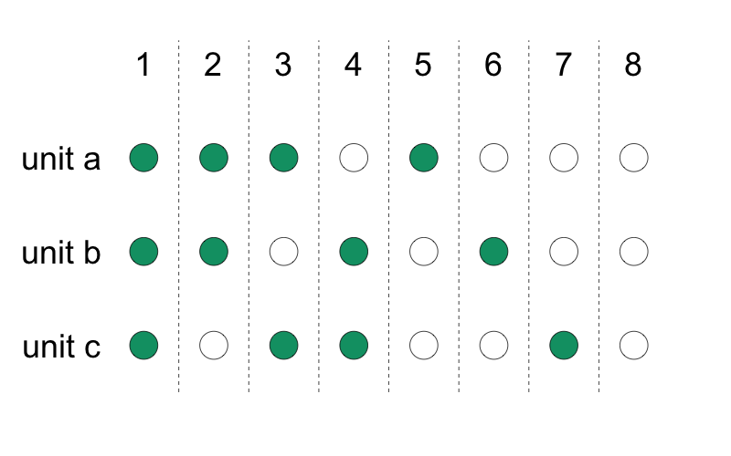
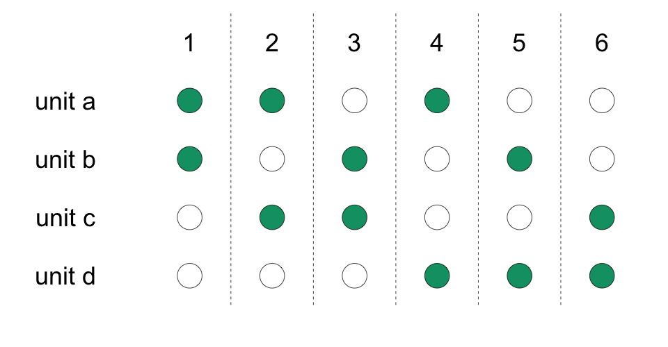
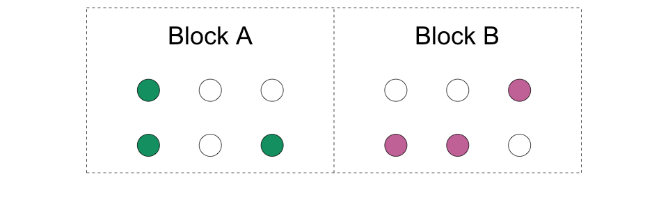
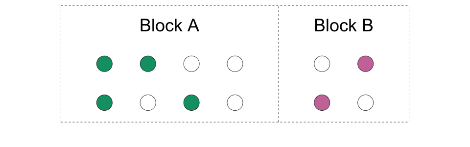
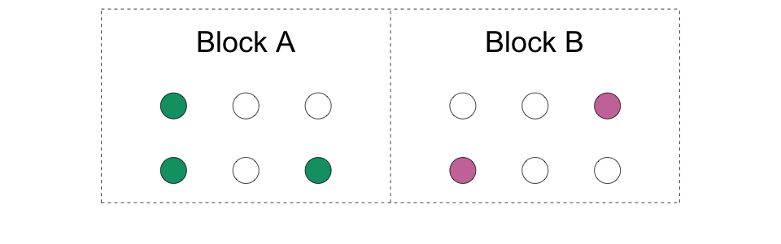
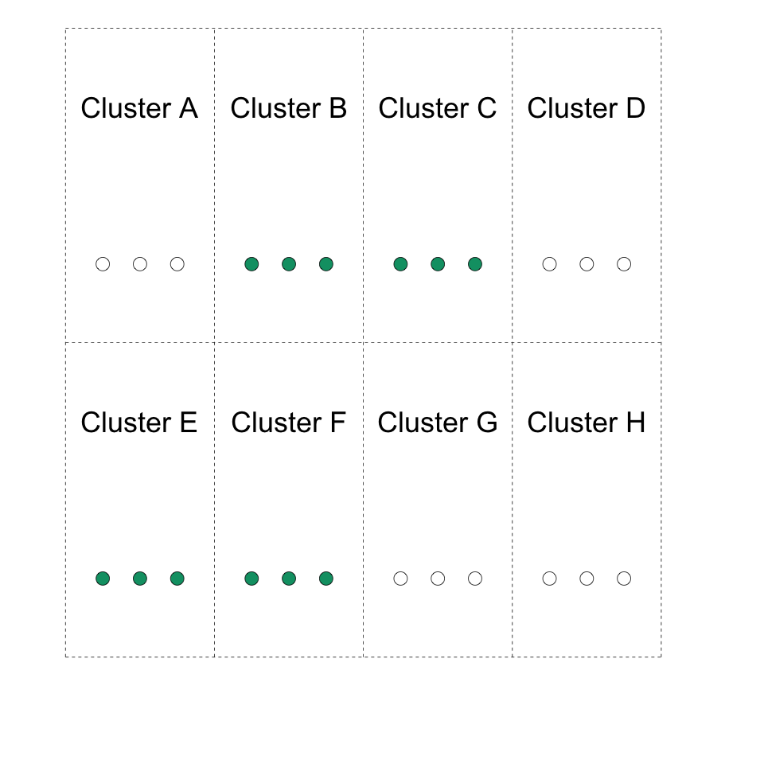
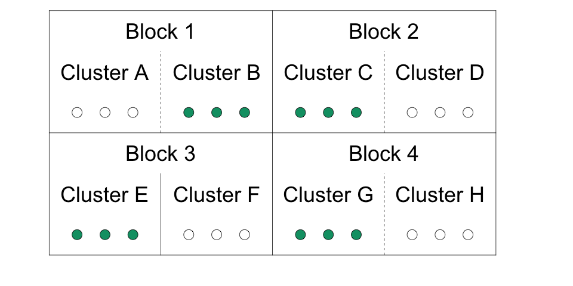
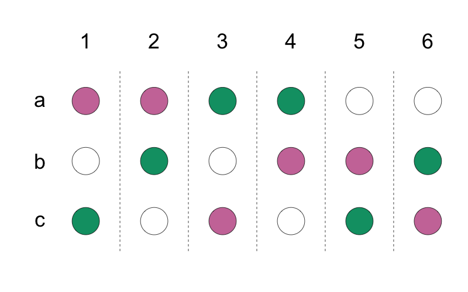

## Some common types of randomization \| *Quelques types courants de randomisation*

```{r setup, include=FALSE}
# source("rmd_setup.R")
# Load all the libraries we need
# library(here)
# library(tidyverse)
# library(kableExtra)
# library(DeclareDesign)
# library(estimatr)
# library(styler)
# library(coin)
# library(multcomp)
# library(devtools)
# library(randomizr)
# library(rcompanion) ## for pairwisePermutationTest()
```


::: {.cols data-latex=""}
::: {.col data-latex="{0.48\\textwidth}"}
1.  Simple

2.  Complete

3.  Block

4.  Cluster

5.  Block-Cluster

6.  Multi-arm Designs
:::

::: {.col data-latex="{0.04\\textwidth}"}
  <!-- an empty Div (with a white space), serving as
a column separator -->
:::

::: {.col data-latex="{0.48\\textwidth}"}
1.  Simple

2.  Complète

3.  Par bloc (ou stratifiée)

4.  Par grappe (cluster)

5.  Combinaison par bloc et par grappe

6.  Les concéptions à plusiers bras
:::
:::

## 1. Simple randomization (coin-flipping) \| *Randomisation simple (tirage au sort)*

::: {.cols data-latex=""}
::: {.col data-latex="{0.48\\textwidth}"}
-   For each unit, flip a coin to see if it will be treated. Then you
    measure outcomes at the same level as the coin.

-   The coins don't have to be fair (50-50), but you have to know the
    probability of treatment assignment.

:::

::: {.col data-latex="{0.04\\textwidth}"}
  <!-- an empty Div (with a white space), serving as
a column separator -->
:::

::: {.col data-latex="{0.48\\textwidth}"}
-   Pour chaque unité, lancez une pièce pour voir si elle sera traitée.
    Ensuite, vous mesurez les résultats au même niveau que la pièce.

-   Les pièces ne doivent pas nécessairement être équitables (50-50),
    mais vous devez connaître la probabilité d'assignation du
    traitement.

:::
:::

## 1. Simple randomization (coin-flipping) \| *Randomisation simple (tirage au sort)*

\vspace{.03in}
```{r, echo=FALSE, fig.align='center', out.width=360}

```


## 1. Simple randomization (coin-flipping) \| *Randomisation simple (tirage au sort)*

::: {.cols data-latex=""}
::: {.col data-latex="{0.48\\textwidth}"}

-   Advantage: Simple randomization can handle not knowing the total size of your sample in advance.

-   Disadvantage: You can't guarantee a specific number of treated units and control
    units.
:::

::: {.col data-latex="{0.04\\textwidth}"}
  <!-- an empty Div (with a white space), serving as
a column separator -->
:::

::: {.col data-latex="{0.48\\textwidth}"}

-   Avantage: La randomisation simple permet de ne pas connaître à l'avance la taille totale de l'échantillon.

-   Désavantage: Vous ne pouvez pas garantir un nombre précis d'unités traitées et
    d'unités de contrôle.
:::
:::
## 2. Complete randomization (drawing from an urn) \| *Randomisation complète (tirage d'une urne)*

::: {.cols data-latex=""}
::: {.col data-latex="{0.48\\textwidth}"}
-   A fixed number $m$ out of $N$ units are assigned to treatment.

-   The probability a unit is assigned to treatment is $m/N$.

-   This is like having an urn or bowl with $N$ balls, of which $m$ are
    marked as treatment and $N-m$ are marked as control. Public
    lotteries use this method.
:::

::: {.col data-latex="{0.04\\textwidth}"}
  <!-- an empty Div (with a white space), serving as
a column separator -->
:::

::: {.col data-latex="{0.48\\textwidth}"}
-   Un nombre fixe de $m$ sur $N$ d'unités est assigné au traitement.

-   La probabilité qu'une unité soit assignée au traitement est de
    $m/N$.

-   C'est comme avoir une urne avec $N$ boules, dont $m$ sont marquées
    comme traitement et $N-m$ sont marquées comme contrôle. La loterie
    publique utilise cette méthode.
:::
:::

## 2. Complete randomization (drawing from an urn) \| *Randomisation complète (tirage d'une urne)*

<!-- \vspace{.03in} -->
```{r, echo=FALSE, fig.align='center', out.width=380}

```

## 2. Complete randomization (drawing from an urn) \| *Randomisation complète (tirage d'une urne)*

::: {.cols data-latex=""}
::: {.col data-latex="{0.48\\textwidth}"}
-   Advantage:  Particularly useful when you have a small number of units.

-   Disadvantage:  You need to know the total number of units in advance.  

:::

::: {.col data-latex="{0.04\\textwidth}"}
  <!-- an empty Div (with a white space), serving as
a column separator -->
:::

::: {.col data-latex="{0.48\\textwidth}"}

- Avantage :  Particulièrement utile lorsque vous disposez d'un petit nombre d'unités.

- Désavantage :  Il faut connaître à l'avance le nombre total d'unités.  


:::
:::
## 3. Block (or stratified) randomization \| *Randomisation par bloc (ou stratifiée)*

::: {.cols data-latex=""}
::: {.col data-latex="{0.48\\textwidth}"}
-   We create groups of units (blocks) and randomize separately within
    each block. 
    
-   We are doing mini-experiments in each block so **we have
    both treated and control units in each block**.

:::

::: {.col data-latex="{0.04\\textwidth}"}
  <!-- an empty Div (with a white space), serving as
a column separator -->
:::

::: {.col data-latex="{0.48\\textwidth}"}
-   Nous créons des blocs d'unités et randomisons séparément dans chaque
    bloc. 
    
-   Nous faisons des mini-expériences dans chaque bloc. De ce
    fait, **nous avons des unités traitées et des unités de contrôle
    dans chaque bloc**.


:::
:::


## 3. Block (or stratified) randomization \| *Randomisation par bloc (ou stratifiée)*

::: {.cols data-latex=""}
::: {.col data-latex="{0.48\\textwidth}"}

-   Advantage: You avoid unlucky randomizations that create treatment and control groups that are different from each other on the variables used to create the blocks.  

-   This is especially useful for rare subgroups.

:::

::: {.col data-latex="{0.04\\textwidth}"}
  <!-- an empty Div (with a white space), serving as
a column separator -->
:::

::: {.col data-latex="{0.48\\textwidth}"}


-   Avantage : Vous évitez les randomisations malheureuses qui créent des groupes de traitement et de contrôle différents l'un de l'autre en fonction de la variable utilisée pour créer les blocs.

-   Particulièrement utile lorsque vous avez un groupe rare.


:::
:::


## 3. Block (or stratified) randomization \| *Randomisation par bloc (ou stratifiée)*

\vspace{.03in}
```{r, echo=FALSE, fig.align='center', out.width=360}

```

::: {.cols data-latex=""}
::: {.col data-latex="{0.48\\textwidth}"}
-   Example: block = region, units = municipalities. We randomize
    treatment at the municipality level **within region** and also
    measure outcomes at the municipality level.
:::

::: {.col data-latex="{0.04\\textwidth}"}
  <!-- an empty Div (with a white space), serving as
a column separator -->
:::

::: {.col data-latex="{0.48\\textwidth}"}
-   Exemple : bloc = région, unités = communautés. Nous randomisons le
    traitement au niveau communautaire **au sein de la région** et
    mesurons également les résultats au niveau communautaire.
:::
:::

## 3. Block (or stratified) randomization \| *Randomisation par bloc (ou stratifiée)*

\vspace{.03in}
```{r, echo=FALSE, fig.align='center', out.width=360}

```


::: {.cols data-latex=""}
::: {.col data-latex="{0.48\\textwidth}"}
-   Blocks can be of different sizes.
:::

::: {.col data-latex="{0.04\\textwidth}"}
  <!-- an empty Div (with a white space), serving as
a column separator -->
:::

::: {.col data-latex="{0.48\\textwidth}"}
-   La taille des blocs peut varier.
:::
:::

## 3. Block (or stratified) randomization \| *Randomisation par bloc (ou stratifiée)*

\vspace{.03in}
```{r, echo=FALSE, fig.align='center', out.width=360}

```

::: {.cols data-latex=""}
::: {.col data-latex="{0.48\\textwidth}"}
-   Blocks can have different probabilities of treatment
    assignment.
:::

::: {.col data-latex="{0.04\\textwidth}"}
  <!-- an empty Div (with a white space), serving as
a column separator -->
:::

::: {.col data-latex="{0.48\\textwidth}"}
-   La probabilité de sélection des individus dans le groupe de
    traitement peut varier d'un bloc à un autre.
:::
:::

## 3. Block (or stratified) randomization \| *Randomisation par bloc (ou stratifiée)*

::: {.cols data-latex=""}
::: {.col data-latex="{0.48\\textwidth}"}
How should you define your blocks?

1.   Create subgroups for which you want to learn the ATE.  The average causal effect for a particular subgroup is known as a Conditional Average Treatment Effect (CATE).  You can use these to learn differences in CATEs for one group as compared with another group.

:::

::: {.col data-latex="{0.04\\textwidth}"}
  <!-- an empty Div (with a white space), serving as
a column separator -->
:::

::: {.col data-latex="{0.48\\textwidth}"}

Comment définir vos blocs ?

1.   Créez des sous-groupes pour lesquels vous souhaitez apprendre l'ATE. Effet Moyen de Traitement pour un sous-groupe est aussi appelé Effet Conditionel Moyen de Traitement (CATE).  Vous pouvez les utiliser pour connaître les différences entre les CATE d'un groupe et d'un autre groupe.


:::
:::

## 3. Block (or stratified) randomization \| *Randomisation par bloc (ou stratifiée)*

::: {.cols data-latex=""}
::: {.col data-latex="{0.48\\textwidth}"}
How should you define your blocks?

2.   By variables that predict the outcome.  This will increase the precision of your estimates.

:::

::: {.col data-latex="{0.04\\textwidth}"}
  <!-- an empty Div (with a white space), serving as
a column separator -->
:::

::: {.col data-latex="{0.48\\textwidth}"}

Comment définir vos blocs ?

2.   Par des variables qui prédisent le résultat. Cela augmentera la précision de vos estimations.

:::
:::


## 4. Cluster randomization \| *Randomisation par grappe (cluster)*
\vspace{.03in}
```{r, echo=FALSE, fig.align='center', out.width=360}

```
<!-- {width="400"} -->

::: {.cols data-latex=""}
::: {.col data-latex="{0.48\\textwidth}"}
-   In a cluster-randomized study, all units in a group of units (the
    cluster) are assigned to the **same** treatment status.
:::

::: {.col data-latex="{0.04\\textwidth}"}
  <!-- an empty Div (with a white space), serving as
a column separator -->
:::

::: {.col data-latex="{0.48\\textwidth}"}
-   Dans une étude randomisée par grappe, toutes les unités de la grappe
    sont assignées au **même** statut de traitement.
:::
:::


## 4. Cluster randomization \| *Randomisation par grappe (cluster)*

::: {.cols data-latex=""}
::: {.col data-latex="{0.48\\textwidth}"}
-   When do cluster randomization?  If the intervention has to work at the cluster level.
    
-   Don't if you can avoid it!  For the same number of subjects, studies with cluster randomization have less power than those without. *How much* depends on the intra-cluster correlation (ICC or $\rho$).
:::

::: {.col data-latex="{0.04\\textwidth}"}
  <!-- an empty Div (with a white space), serving as
a column separator -->
:::

::: {.col data-latex="{0.48\\textwidth}"}
-   Quand procéder à une randomisation par grappe ? Si l'intervention doit fonctionner au niveau de la grappe.
    
-   Ne le faites pas si vous pouvez l'éviter !   Pour un même nombre de sujets, les études avec randomisation par grappe ont moins de puissance que celles qui n'en ont pas.  Un $\rho$ plus élevé est pire.  
:::
:::


## 4. Cluster randomization \| *Randomisation par grappe (cluster)*

::: {.cols data-latex=""}
::: {.col data-latex="{0.48\\textwidth}"}
-   If you must use cluster randomization, having more clusters helps.  

-   Having fewer clusters hurts our ability to detect treatment effects
    and may cause misleading $p$-values and confidence intervals (or
    even estimates).

:::

::: {.col data-latex="{0.04\\textwidth}"}
  <!-- an empty Div (with a white space), serving as
a column separator -->
:::

::: {.col data-latex="{0.48\\textwidth}"}

-   Si vous devez utiliser la randomisation par grappe, il est préférable d'en avoir un plus grand nombre.    

-   Un nombre réduit de grappes nuit à votre capacité à détecter les
    effets du traitement et conduit à des $p$-valeurs et des intervalles
    de confiance (ou même des estimations) trompeurs.


:::
:::

## 5. You can combine blocks and clusters \| *Vous pouvez combiner blocs et grappes*

\vspace{.03in}
```{r, echo=FALSE, fig.align='center', out.width=300}

```

<!-- {width="400"} -->

::: {.cols data-latex=""}
::: {.col data-latex="{0.48\\textwidth}"}
-   You can have clusters within blocks.

-   Can you have blocks within clusters?
:::

::: {.col data-latex="{0.04\\textwidth}"}
  <!-- an empty Div (with a white space), serving as
a column separator -->
:::

::: {.col data-latex="{0.48\\textwidth}"}
-   Vous pouvez avoir des grappes dans des blocs.

-   Est-ce que vous pouvez avoir de blocs dans les grappes?
:::
:::

## 6. Multi-arm Design \| *Les concéptions à plusiers bras*

::: {.cols data-latex=""}
::: {.col data-latex="{0.48\\textwidth}"}
-   You can randomize units to more conditions (arms) than just one
    treatment arm and one control arm.

-   For example, we might have a cash transfer arm, a job training arm,
    and a control arm with no intervention.
:::

::: {.col data-latex="{0.04\\textwidth}"}
  <!-- an empty Div (with a white space), serving as
a column separator -->
:::

::: {.col data-latex="{0.48\\textwidth}"}
-   Vous pouvez randomiser les unités dans plus de conditions (bras) qu'un seul bras de traitement et un bras de contrôle.

-   Par exemple, nous pourrions avoir un groupe de transfert d'argent, un groupe de formation à l'emploi, et un groupe de contrôle sans intervention.
:::
:::


## 6. Multi-arm Design \| *Conception à plusiers bras*

\vspace{.03in}

```{r, echo=FALSE, fig.align='center', out.width=250}

```
-   An example with complete randomization 

-   *Un exemple avec une randomisation complète* 


## 6. Multi-arm Design \| *Conception à plusiers bras*

::: {.cols data-latex=""}
::: {.col data-latex="{0.48\\textwidth}"}
-   Advantages: We can compare each treatment to control or to each
    other.

-   Disadvantages: We can quickly end up with a very large number of
    hypothesis tests, which creates issues.
:::

::: {.col data-latex="{0.04\\textwidth}"}
  <!-- an empty Div (with a white space), serving as
a column separator -->
:::

::: {.col data-latex="{0.48\\textwidth}"}
-   Avantages : Nous pouvons comparer chaque traitement au contrôle ou l'un à l'autre.

-   Désavantage : On peut rapidement se retrouver avec un très grand nombre de tests d'hypothèses, ce qui pose des problèmes.
:::
:::

## Resource \| *Ressource*

-   EGAP Methods Guide on Randomization
    (<https://egap.org/resource/10-things-to-know-about-randomization/>)

-   Guide des méthodes EGAP sur la randomisation
    (<https://egap.org/fr/resource/10-choses-a-savoir-sur-la-randomisation/>)
