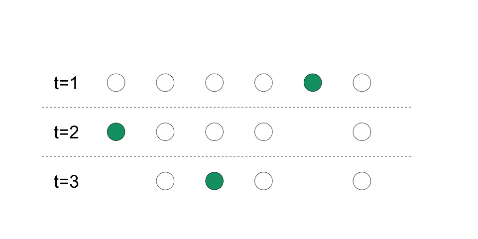

## Some common designs \| *Quelques types courants de conception*

::: {.cols data-latex=""}
::: {.col data-latex="{0.48\\textwidth}"}
1.  Factorial

2.  Waitlist (delayed access)

3.  Encouragement
:::

::: {.col data-latex="{0.04\\textwidth}"}
  <!-- an empty Div (with a white space), serving as
a column separator -->
:::

::: {.col data-latex="{0.48\\textwidth}"}
1.  Factorielle

2.  Liste d'attente (Accès graduel)

3.  Incitations
:::
:::

## 1. Factorial Design \| *Conception factorielle*

::: {.cols data-latex=""}
::: {.col data-latex="{0.48\\textwidth}"}
-   In a factorial design, there are two or more **factors** and each
    factor has two or more conditions.

-   Each unit is assigned to one of the possible combination of these
    conditions.
:::

::: {.col data-latex="{0.04\\textwidth}"}
  <!-- an empty Div (with a white space), serving as
a column separator -->
:::

::: {.col data-latex="{0.48\\textwidth}"}
-   Dans un plan factoriel, il y a au moins deux **facteurs** et chaque
    facteur comporte au moins deux conditions.

-   Chaque unité est assignée à l'une des combinaisons possibles de ces
    conditions.
:::
:::


## 1. Factorial Design \| *Conception factorielle*


\begin{table}[]
\begin{tabular}{llp{2in}p{2in}}
&&&\\
            &                          & \multicolumn{2}{c}{\textbf{Transport}}                 \\
            &                          & \multicolumn{1}{c}{Yes}                   & \multicolumn{1}{c}{No}                   \\ \cline{3-4} 
 & \multicolumn{1}{l|}{} & \multicolumn{1}{l|}{}& \multicolumn{1}{l|}{}\\ 
 & \multicolumn{1}{l|}{Yes} & \multicolumn{1}{l|}{Information + Transportation} & \multicolumn{1}{l|}{Information only} \\ 
 & \multicolumn{1}{l|}{} & \multicolumn{1}{l|}{}& \multicolumn{1}{l|}{}\\ \cline{3-4} 
\textbf{Information}    & \multicolumn{1}{l|}{} & \multicolumn{1}{l|}{}& \multicolumn{1}{l|}{}\\
        & \multicolumn{1}{l|}{No}  & \multicolumn{1}{l|}{Transport only} & \multicolumn{1}{l|}{Neither} \\ 
            & \multicolumn{1}{l|}{} & \multicolumn{1}{l|}{}& \multicolumn{1}{l|}{}\\ \cline{3-4} 
\end{tabular}
\end{table}


## 1. Factorial Design \| *Conception factorielle*

\begin{table}[]
\begin{tabular}{llp{2in}p{2in}}
&&&\\
&    & \multicolumn{2}{c}{\textbf{Transport}}                 \\
&     & \multicolumn{1}{c}{Yes}    & \multicolumn{1}{c}{No}   \\ \cline{3-4} 
\textbf{Information}   & \multicolumn{1}{l|}{Yes} & \multicolumn{1}{l|}{Information + Transportation} & \multicolumn{1}{l|}{Information only} \\ \cline{3-4}
   & \multicolumn{1}{l|}{No}  & \multicolumn{1}{l|}{Transport only} & \multicolumn{1}{l|}{Neither} \\ \cline{3-4}
\end{tabular}
\end{table}

\bigskip

::: {.cols data-latex=""}
::: {.col data-latex="{0.48\\textwidth}"}
There are many possible treatment effects (comparisons) in a factorial design:


1.   Conditional Average Treatment Effect (CATE): the ATE of one factor, fixing the level of the other factor.


:::

::: {.col data-latex="{0.04\\textwidth}"}
  <!-- an empty Div (with a white space), serving as
a column separator -->
:::

::: {.col data-latex="{0.48\\textwidth}"}
Il y a plusiers effets de traitement (comparaisons) dans une conception factorielle:

1.   Effet moyen conditionnel (CATE): L'effet du traitement, conditionnel au maintien de l'autre pour une valeur fixe. 

:::
:::


## 1. Factorial Design \| *Conception factorielle*

\begin{table}[]
\begin{tabular}{llp{2in}p{2in}}
&&&\\
&    & \multicolumn{2}{c}{\textbf{Transport}}                 \\
&     & \multicolumn{1}{c}{Yes}    & \multicolumn{1}{c}{No}   \\ \cline{3-4} 
\textbf{Information}   & \multicolumn{1}{l|}{Yes} & \multicolumn{1}{l|}{Information + Transportation} & \multicolumn{1}{l|}{Information only} \\ \cline{3-4}
   & \multicolumn{1}{l|}{No}  & \multicolumn{1}{l|}{Transport only} & \multicolumn{1}{l|}{Neither} \\ \cline{3-4}
\end{tabular}
\end{table}

\bigskip

::: {.cols data-latex=""}
::: {.col data-latex="{0.48\\textwidth}"}
-   There are four possible CATEs in this design.

-   One is the CATE of information conditional on having transport.  It compares the cell with information + transport to the cell with transport only.  We can ignore the second column.


:::

::: {.col data-latex="{0.04\\textwidth}"}
  <!-- an empty Div (with a white space), serving as
a column separator -->
:::

::: {.col data-latex="{0.48\\textwidth}"}
-   
:::
:::


## 1. Factorial Design \| *Conception factorielle*

\begin{table}[]
\begin{tabular}{llp{2in}p{2in}}
&&&\\
&    & \multicolumn{2}{c}{\textbf{Transport}}                 \\
&     & \multicolumn{1}{c}{Yes}    & \multicolumn{1}{c}{No}   \\ \cline{3-4} 
\textbf{Information}   & \multicolumn{1}{l|}{Yes} & \multicolumn{1}{l|}{Information + Transportation} & \multicolumn{1}{l|}{Information only} \\ \cline{3-4}
   & \multicolumn{1}{l|}{No}  & \multicolumn{1}{l|}{Transport only} & \multicolumn{1}{l|}{Neither} \\ \cline{3-4}
\end{tabular}
\end{table}

\bigskip

::: {.cols data-latex=""}
::: {.col data-latex="{0.48\\textwidth}"}
2.   Interaction effect: how much the ATE of one factor may differ by levels of the other factor.  A treatment effect may be larger or smaller depending on the other treatment.

:::

::: {.col data-latex="{0.04\\textwidth}"}
  <!-- an empty Div (with a white space), serving as
a column separator -->
:::

::: {.col data-latex="{0.48\\textwidth}"}
2.   Effet d'interaction : l'effet d’un traitement (peut-être) dépend de la condition d'assignation de l'unité à un autre traitment. Cela signifie qu’un traitement peut amplifier ou réduire l'effet de l'autre. 
:::
:::

## 1. Factorial Design \| *Conception factorielle*

\begin{table}[]
\begin{tabular}{llp{2in}p{2in}}
&&&\\
&    & \multicolumn{2}{c}{\textbf{Transport}}                 \\
&     & \multicolumn{1}{c}{Yes}    & \multicolumn{1}{c}{No}   \\ \cline{3-4} 
\textbf{Information}   & \multicolumn{1}{l|}{Yes} & \multicolumn{1}{l|}{Information + Transportation} & \multicolumn{1}{l|}{Information only} \\ \cline{3-4}
   & \multicolumn{1}{l|}{No}  & \multicolumn{1}{l|}{Transport only} & \multicolumn{1}{l|}{Neither} \\ \cline{3-4}
\end{tabular}
\end{table}

\bigskip

::: {.cols data-latex=""}
::: {.col data-latex="{0.48\\textwidth}"}
-   Does having transport change the effect of information?  We compare the CATE of information with transport (from before) to the CATE of information without transport.

-   If the 2 CATEs are different, we say there is an interaction effect.

:::

::: {.col data-latex="{0.04\\textwidth}"}
  <!-- an empty Div (with a white space), serving as
a column separator -->
:::
-   
::: {.col data-latex="{0.48\\textwidth}"}
:::
:::


## 1. Factorial Design \| *Conception factorielle*
\begin{table}[]
\begin{tabular}{llp{2in}p{2in}}
&&&\\
&    & \multicolumn{2}{c}{\textbf{Transport}}                 \\
&     & \multicolumn{1}{c}{Yes}    & \multicolumn{1}{c}{No}   \\ \cline{3-4} 
\textbf{Information}   & \multicolumn{1}{l|}{Yes} & \multicolumn{1}{l|}{Information + Transportation} & \multicolumn{1}{l|}{Information only} \\ \cline{3-4}
   & \multicolumn{1}{l|}{No}  & \multicolumn{1}{l|}{Transport only} & \multicolumn{1}{l|}{Neither} \\ \cline{3-4}
\end{tabular}
\end{table}

\bigskip

::: {.cols data-latex=""}
::: {.col data-latex="{0.48\\textwidth}"}
3.   Average marginal effect: Main effect of each treatment in a factorial design.  It is the average of the conditional marginal effects for all the conditions of the other treatment, weighted by the proportion of the sample that was assigned to each condition.


:::

::: {.col data-latex="{0.04\\textwidth}"}
  <!-- an empty Div (with a white space), serving as
a column separator -->
:::

::: {.col data-latex="{0.48\\textwidth}"}

3.   Effet marginal moyen: Effet principal de chaque traitement dans une conception factorielle. C'est la moyenne des effets marginaux conditionnels pour toutes les conditions de l’autre traitement, pondérée par la proportion de l'échantillon qui a été assignée à chaque condition.

:::
:::


## 1. Factorial Design \| *Conception factorielle*

```{r, echo=TRUE}
library(randomizr)
set.seed(12345)

# first randomly assign units to information or not
information <- complete_ra(N=24, m=12)

# randomly assign to transport, blocking by information
transport <- block_ra(blocks = information)

table(information, transport)

```

## 2. Waitlist design (delayed access) \| *Liste d'attente (Accès graduel)*

::: {.cols data-latex=""}
::: {.col data-latex="{0.48\\textwidth}"}
-   Situation: Only a certain number of units can be treated at a time.  Once treated, a unit stays in treatment.  

-   When an intervention can be or must be rolled out in stages, you can
    randomize the order (*timing*) in which units are treated.
    
:::

::: {.col data-latex="{0.04\\textwidth}"}
  <!-- an empty Div (with a white space), serving as
a column separator -->
:::

::: {.col data-latex="{0.48\\textwidth}"}
-   Situation: Seul un certain nombre d'unités peuvent être traitées en
    même temps. Une fois traitée, une unité reste en traitement.  

-   Lorsqu'une intervention peut ou doit être déployée par étapes, vous
    pouvez procéder à une assignation aléatoire l'ordre (*timing*) de traitement des unités.
:::
:::

## 2. Waitlist design (delayed access) \| *Liste d'attente (Accès graduel)*


```{r, echo=FALSE, fig.align='center', out.width=300}

```

::: {.cols data-latex=""}
::: {.col data-latex="{0.48\\textwidth}"}
-   Your control group are the as-yet untreated units.
:::

::: {.col data-latex="{0.04\\textwidth}"}
  <!-- an empty Div (with a white space), serving as
a column separator -->
:::

::: {.col data-latex="{0.48\\textwidth}"}
-   Votre groupe de contrôle sont les unités pas encore traitées.
:::
:::

## 2. Waitlist design (delayed access) \| *Liste d'attente (Accès graduel)*

::: {.cols data-latex=""}
::: {.col data-latex="{0.48\\textwidth}"}
-   We need to assume **no anticipation**.

-   This means that the potential outcome is not affected by future treatment status.
:::

::: {.col data-latex="{0.04\\textwidth}"}
  <!-- an empty Div (with a white space), serving as
a column separator -->
:::

::: {.col data-latex="{0.48\\textwidth}"}
-   Nous devons l'hypothèse d'**aucune anticipation**.

-   Cela signifie que le résultat potentiel n'est pas affecté par l'état futur du traitement.
:::
:::

## 2. Waitlist design (delayed access) \| *Liste d'attente (Accès graduel)*

::: {.cols data-latex=""}
::: {.col data-latex="{0.48\\textwidth}"}
-   We analyze the data from all time periods together.

-   Be careful: the probability of assignment to treatment will vary
    over time because units that are assigned to treatment in earlier
    stages are not eligible to be assigned to treatment in later stages.
:::

::: {.col data-latex="{0.04\\textwidth}"}
  <!-- an empty Div (with a white space), serving as
a column separator -->
:::

::: {.col data-latex="{0.48\\textwidth}"}
-   Nous analysons les données de toutes les périodes ensemble.

-   Attention : la probabilité d'assignation au traitement variera dans
    le temps car les unités assignées au traitement à des stades
    antérieurs ne sont plus éligibles pour être assignées à un
    traitement aux stades ultérieurs.
:::
:::

## 3. Encouragement design \| *Conception incitative*

::: {.cols data-latex=""}
::: {.col data-latex="{0.48\\textwidth}"}
-   Situation: You can't force people to take (receive) your treatment.
    Treatment assigned is not the same as treatment received.

-   We can randomize **encouragement** to take the treatment, such as a
    request to drink coffee or offering a subsidy to participate in a
    program.

-   We measure the encouragement $Z$, taking the treatment $D$, and the outcome $Y$.    


:::

::: {.col data-latex="{0.04\\textwidth}"}
  <!-- an empty Div (with a white space), serving as
a column separator -->
:::

::: {.col data-latex="{0.48\\textwidth}"}
-   Situation : Vous ne pouvez pas forcer les gens à prendre (recevoir) le traitement.
    Le traitement attribué n'est pas le même que le traitement reçu.

-   Nous pouvons assigner de manière aléotoire l'**incitation** (l'encouragement) à suivre
    le traitement, en demandant par exemple aux individus de boire un
    café ou en offrant une subvention pour participer à un programme.
    
-   On mésure l'incitation $Z$, le traitement reçu $D$, et le résultat $Y$.    
    
:::
:::

## 3. Encouragement design \| *Conception incitative*

::: {.cols data-latex=""}
::: {.col data-latex="{0.48\\textwidth}"}
-   We can learn the average effect of the *encouragement* to take the
    treatment for our study sample (ITT, the intent-to-treat effect) on the outcome $Y$. 

-   With some additional assumptions, we can also learn the average
    effect of *taking the treatment* for Compliers. This is known as the
    Complier Average Causal Effect (CACE) or Local Average Treatment
    Effect (LATE).
:::

::: {.col data-latex="{0.04\\textwidth}"}
  <!-- an empty Div (with a white space), serving as
a column separator -->
:::

::: {.col data-latex="{0.48\\textwidth}"}
-   Nous pouvons apprendre l'effet moyen de *l'encouragement* à suivre
    le traitement (ITT, l’effet d’intention de traiter) sur le résultat $Y$.

-   Avec quelques hypothèses supplémentaires, nous pouvons également
    connaître l'effet moyen de *l'acceptation du traitement* pour les
    conformistes. C'est ce qu'on appelle l'effet causal moyen du
    conformiste (CACE) ou l'effet moyen local du traitement (LATE).

:::
:::

## 3. Encouragement design \| *Conception incitative*

::: {.cols data-latex=""}
::: {.col data-latex="{0.48\\textwidth}"}
-   Who are Compliers? They are units that would take the treatment if encouraged and not take the treatment if not encouraged.

:::

::: {.col data-latex="{0.04\\textwidth}"}
  <!-- an empty Div (with a white space), serving as
a column separator -->
:::

::: {.col data-latex="{0.48\\textwidth}"}

-   Qui sont les Conformistes ? Il s'agit de sujets qui prendraient le
    traitement lorsqu'ils sont assignés à l'encouragement et qui ne
    prendraient pas le traitement lorsqu'ils ne sont pas assignés à l'encouragement.
:::
:::
| Type / *Type*  |  $Z=1$   |  $Z=0$   |
|:------------------------------|:--------:|:--------:|
| Always Taker / *Toujours preneur*  | $D(1)=1$ | $D(0)=1$ |
| **Complier / *Conformiste***  | $D(1)=1$ | $D(0)=0$ |
| Never Taker / *Jamais preneur*   | $D(1)=0$ | $D(0)=0$ |
| Defier / *Non-conformiste*  | $D(1)=0$ | $D(0)=1$ |

## 3. Encouragement design \| *Conception incitative*

::: {.cols data-latex=""}
::: {.col data-latex="{0.48\\textwidth}"}
-   For CACE, we need **excludability** (exclusion restriction): the encouragement
    $Z$ only affects the outcome $Y$ through taking the treatment $D$.
:::

::: {.col data-latex="{0.04\\textwidth}"}
  <!-- an empty Div (with a white space), serving as
a column separator -->
:::

::: {.col data-latex="{0.48\\textwidth}"}
<!-- -   Nous pouvons également connaître l'effet moyen de la prise du -->

<!--     traitement -->

<!--     \emph{pour les sujets qui prendraient le traitement lorsqu'ils sont assignés au traitement et qui ne prendraient pas le traitement lorsqu'ils sont assignés au contrôle (les conformistes)}. -->

-   Pour CACE, nous avons besoin de **l'excluabilité** (restriction d'exclusion) :
    l'encouragement $Z$ n'affecte le résultat $Y$ qu'a travers le
    traitement $D$.
:::
:::

## 3. Encouragement design \| *Conception incitative*

\begin{figure}
\begin{tikzpicture}
%nodes
\node[draw , rectangle, text centered] (d) at (0,0) {$D$ (treatment)};
\node[draw , rectangle, text centered] (z) at (-2,2) {$Z$ (encouragement)};
\node[draw , rectangle, text centered] (y) at (4,0) {$Y$ (outcome)};
\draw[->, line width= 1/2](z) to (d);
\draw[->, line width= 1/2](d) to (y);
\end{tikzpicture}
\end{figure}


## 3. Encouragement design \| *Conception incitative*

::: {.cols data-latex=""}
::: {.col data-latex="{0.48\\textwidth}"}
-   For CACE using this design, we also need the assumption of **monotonicity**. This means no Defiers.  

:::

::: {.col data-latex="{0.04\\textwidth}"}
  <!-- an empty Div (with a white space), serving as
a column separator -->
:::

::: {.col data-latex="{0.48\\textwidth}"}
<!-- -   Nous pouvons également connaître l'effet moyen de la prise du -->

<!--     traitement -->


-   Pour CACE avec cette conception, nous avons également besoin d'hypothèse de **la monotonicité**.  Cela signifie qu'il n'y a pas de Non-conformistes.


:::
:::


| Type / *Type*  |  $Z=1$   |  $Z=0$   |
|:------------------------------|:--------:|:--------:|
| Always Taker / *Toujours preneur*  | $D(1)=1$ | $D(0)=1$ |
| **Complier / *Conformiste***  | $D(1)=1$ | $D(0)=0$ |
| Never Taker / *Jamais preneur*   | $D(1)=0$ | $D(0)=0$ |


<!-- ## 3. Encouragement design \| *Conception incitative* -->

<!-- ::: {.cols data-latex=""} -->
<!-- ::: {.col data-latex="{0.48\\textwidth}"} -->

<!-- -   If the treatment is only available through the study, there are no Always Takers or Defiers.  This is *one-sided noncompliance*. -->

<!-- -   Otherwise, we have *two-sided noncompliance*. -->

<!-- ::: -->

<!-- ::: {.col data-latex="{0.04\\textwidth}"} -->
<!--   <!-- an empty Div (with a white space), serving as -->
<!-- a column separator --> 
<!-- ::: -->

<!-- ::: {.col data-latex="{0.48\\textwidth}"} -->
<!-- <!-- -   Nous pouvons également connaître l'effet moyen de la prise du --> 

<!-- <!--     traitement -->


<!-- -   Si le traitement n'est disponible par d'autres voies que l'étude, il n'y a pas aussi de Toujours preneurs ou Non-conformistes.  On a la *non-conformité unilatérale*. -->

<!-- -   Sinon, on a la *non-conformité bilatérale*. -->


<!-- ::: -->
<!-- ::: -->

## 3. Encouragement design \| *Conception incitative*
| Type / *Type*  |  $Z=1$   |  $Z=0$   | 
|:------------------------------|:--------:|:--------:| 
| Always Taker / *Toujours preneur*  | $D(1)=1$ | $D(0)=1$ |
| **Complier / *Conformiste***  | $D(1)=1$ | $D(0)=0$ | 
| Never Taker / *Jamais preneur*   | $D(1)=0$ | $D(0)=0$ | 


::: {.cols data-latex=""}
::: {.col data-latex="{0.48\\textwidth}"}

-   $D=1$ for Always Takers, no matter $Z$.

-   $D=0$ for Never Takers, no matter $Z$.  

-   $D$ may be 1 or 0 for Compliers, depending on $Z$.


:::

::: {.col data-latex="{0.04\\textwidth}"}
  <!-- an empty Div (with a white space), serving as
a column separator -->
:::

::: {.col data-latex="{0.48\\textwidth}"}


-   $D=1$ pour Toujours preneurs, peu importe $Z$.

-   $D=0$ pour Jamais preneurs, peu importe $Z$.  

-   $D$ peut être 1 ou 0 pour Conformiste, dépendant de $Z$.


:::
:::


## 3. Encouragement design \| *Conception incitative*

\begin{figure}
\begin{tikzpicture}
%nodes
\node[draw , rectangle, text centered] (d) at (0,0) {$D$ (treatment)};
\node[draw , rectangle, text centered] (z) at (-2,2) {$Z$ (encouragement)};
\node[draw , rectangle, text centered] (y) at (4,0) {$Y$ (outcome)};
\draw[->, line width= 1/2](z) to (d);
\draw[->, line width= 1/2](d) to (y);
\end{tikzpicture}
\end{figure}


::: {.cols data-latex=""}
::: {.col data-latex="{0.48\\textwidth}"}

-   Given this design, we can never see the other $D$ condition for Always-Takers and Never-Takers, so we can't learn the effect of $D$ on $Y$ for them.


:::

::: {.col data-latex="{0.04\\textwidth}"}
  <!-- an empty Div (with a white space), serving as
a column separator -->
:::

::: {.col data-latex="{0.48\\textwidth}"}


-   Avec ce modèle, nous ne pouvons jamais voir l'autre condition $D$ pour les Toujours preneurs et les Jamais preneurs, et nous ne pouvons donc pas connaître l'effet de $D$ sur $Y$ pour eux.


:::
:::

## 3. Encouragement design \| *Conception incitative*

\begin{figure}
\begin{tikzpicture}
%nodes
\node[draw , rectangle, text centered] (d) at (0,0) {$D$ (treatment)};
\node[draw , rectangle, text centered] (z) at (-2,2) {$Z$ (encouragement)};
\node[draw , rectangle, text centered] (y) at (4,0) {$Y$ (outcome)};
\draw[->, line width= 1/2](z) to (d);
\draw[->, line width= 1/2](d) to (y);
\end{tikzpicture}
\end{figure}


::: {.cols data-latex=""}
::: {.col data-latex="{0.48\\textwidth}"}


-   But we can learn the average effect of $D$ on $Y$ for Compliers because they can have $D=1$ or $D=0$.  

-   And we can learn the ATE for Compliers (CACE) using randomization of $Z$, which creates similar groups of Compliers with $D=1$ and $D=0$.


:::

::: {.col data-latex="{0.04\\textwidth}"}
  <!-- an empty Div (with a white space), serving as
a column separator -->
:::

::: {.col data-latex="{0.48\\textwidth}"}

- Mais nous pouvons apprendre l'effet moyen du traitement de $D$ sur $Y$ pour les Conformistes car ils peuvent avoir $D=1$ ou $D=0$.  

- Et nous pouvons apprendre l'ATE pour les Conformistes (CACE) avec la randomisation de $Z$, qui crée des groupes similaires de Conformistes avec $D=1$ et $D=0$.

:::
:::


## 3. Encouragement design \| *Conception incitative*

::: {.cols data-latex=""}
::: {.col data-latex="{0.48\\textwidth}"}


-   Careful (1)!  Do not compare those who take treatment ($D=1$) to those who do not ($D=0$).  Taking treatment is not randomly assigned and the two groups are not comparable.
:::

::: {.col data-latex="{0.04\\textwidth}"}
  <!-- an empty Div (with a white space), serving as
a column separator -->
:::

::: {.col data-latex="{0.48\\textwidth}"}

- Attention (1) !  Ne comparez pas les sujets qui prendraient le traitement ($D=1$) à ceux qui ne le prendraient pas ($D=0$).  La prise du traitement n'est pas aléatoire et les deux groupes ne sont pas comparables.
:::
:::


## 3. Encouragement design \| *Conception incitative*

::: {.cols data-latex=""}
::: {.col data-latex="{0.48\\textwidth}"}

-   Careful (2)!  For the CACE, we have to assess whether excludability and monotonicity hold in our study.  

-   If not, we can still target the ITT with the other standard key assumptions.

:::

::: {.col data-latex="{0.04\\textwidth}"}
  <!-- an empty Div (with a white space), serving as
a column separator -->
:::

::: {.col data-latex="{0.48\\textwidth}"}

- Attention (2) !  Il faut que évaluer si le restriction d'exclusion et la monotonicité sont raisonnables dans notre étude.

-  Si non, nous pouvons encore cibler l'ITT avec les autres hypothèses clés standardes.

:::
:::

## 3. Encouragement design \| *Conception incitative*

::: {.cols data-latex=""}
::: {.col data-latex="{0.48\\textwidth}"}

-   When would you target ITT?  When would you target CACE?

-   ITT might be a compromise, but it might be the estimand you care about.  Policy can directly change $Z$, but not $D$.  So ITT (effect of $Z$ on $Y$) may be more important.

:::

::: {.col data-latex="{0.04\\textwidth}"}
  <!-- an empty Div (with a white space), serving as
a column separator -->
:::

::: {.col data-latex="{0.48\\textwidth}"}

-   Quand cibler l'ITT ?  Quand cibleriez-vous le CACE ?

-   L'ITT peut être un compromis, mais il peut s'agir du paramètre qui vous intéresse.  La politique peut modifier directement $Z$, mais pas $D$.  L'ITT (effet de $Z$ sur $Y$) peut donc être plus important.

:::
:::

## Summary \| *Résumé*

::: {.cols data-latex=""}
::: {.col data-latex="{0.48\\textwidth}"}

-   Factorial:  2 or more treatments with possible interaction

-   Waitlist: constraint on how many treatments can be delievered at once

-   Encouragement: can't force units to take the treatment
:::

::: {.col data-latex="{0.04\\textwidth}"}
  <!-- an empty Div (with a white space), serving as
a column separator -->
:::

::: {.col data-latex="{0.48\\textwidth}"}

-   Factorielle:  2 traitements ou plus avec interaction possible

-   Liste d'attente: contrainte sur le nombre de traitements pouvant être délivrés à la fois

-   L'incitation: ne peut pas obliger les unités à recevoir le traitement


:::
:::


## Resources \| *Ressources*

-   EGAP Methods Guide on Randomization
    (<https://egap.org/resource/10-things-to-know-about-randomization/>)

-   Guide des méthodes EGAP sur la randomisation
    (<https://egap.org/fr/resource/10-choses-a-savoir-sur-la-randomisation/>)

