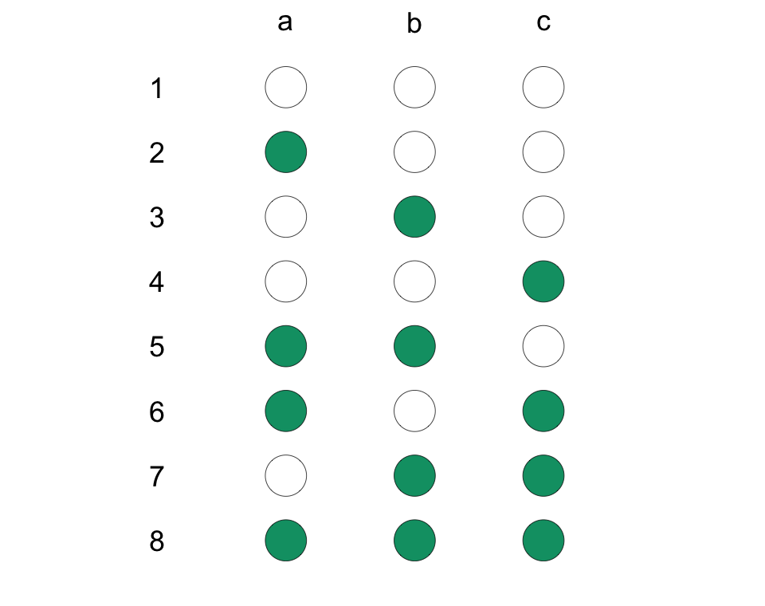
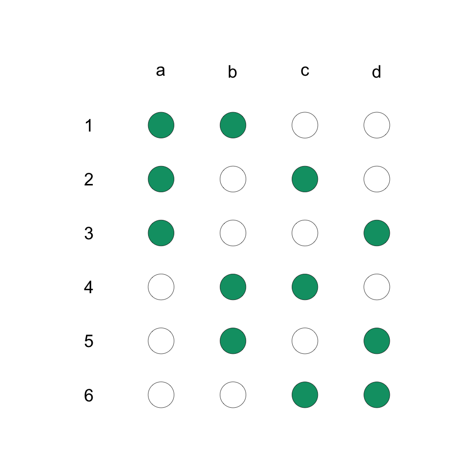

```{r setup, include=FALSE}
# source("rmd_setup.R")
# Load all the libraries we need
# library(here)
# library(tidyverse)
# library(kableExtra)
# library(DeclareDesign)
# library(estimatr)
# library(styler)
# library(coin)
# library(multcomp)
# library(devtools)
# library(randomizr)
# library(rcompanion) ## for pairwisePermutationTest()
```


## Key points for this lecture \| *Points clés*

::: {.cols data-latex=""}
::: {.col data-latex="{0.48\\textwidth}"}

-   Randomization and design: What we've learned, what's next.

-   Common constraints, more complex designs.

-   Anticipating common threats in designs.

-   A plug for simplicity.

:::

::: {.col data-latex="{0.04\\textwidth}"}
  <!-- an empty Div (with a white space), serving as
a column separator -->
:::

::: {.col data-latex="{0.48\\textwidth}"}
-   Vide pour l'instant.

-   

-  

:::
:::

# Randomization and design: What we've learned, what's next. \| *à traduire*

## Randomization and design:: What we've learned. \| *à traduire*

::: {.cols data-latex=""}
::: {.col data-latex="{0.48\\textwidth}"}
-   What we've covered:

    -   4 types of randomization: Simple, complete, block, and cluster
    -   And we can combine them: block-cluster, factorial designs

-   Most of the time these designs suffice.
    
:::

::: {.col data-latex="{0.04\\textwidth}"}
  <!-- an empty Div (with a white space), serving as
a column separator -->
:::

::: {.col data-latex="{0.48\\textwidth}"}
-   
:::
:::

## Randomization and design:: What's next. \| *à traduire*

::: {.cols data-latex=""}
::: {.col data-latex="{0.48\\textwidth}"}
-   _BUT_ we often face:
    -   Practical constraints in our context
    -   Common threats to inference

-   *So* we need to take these into account in the _design_ of our experiment.
    -   How?
    -   Designing to take into account context-specific constraints:
        -   Waitlist designs, encouragement designs
    -   Designing to anticipate problems:
        -   Attrition, spillover
    
:::

::: {.col data-latex="{0.04\\textwidth}"}
  <!-- an empty Div (with a white space), serving as
a column separator -->
:::

::: {.col data-latex="{0.48\\textwidth}"}
-   

:::
:::

# Common constraints, more complex designs. \| *à traduire*

## Common constraints \| *a traduire*

::: {.cols data-latex=""}
::: {.col data-latex="{0.48\\textwidth}"}
1. Constrained in how many units can be treated at one time
2. You can't force people to take your treatment
:::

::: {.col data-latex="{0.04\\textwidth}"}
  <!-- an empty Div (with a white space), serving as
a column separator -->
:::

::: {.col data-latex="{0.48\\textwidth}"}
1.  a traduire
2.  pareil 
:::
:::


## More complex designs (1): Waitlist design \| *a traduire*

::: {.cols data-latex=""}
::: {.col data-latex="{0.48\\textwidth}"}
- Constraint: Only certain number of units can be treated at a time
- Solution: _Waitlist_ design


:::

::: {.col data-latex="{0.04\\textwidth}"}
  <!-- an empty Div (with a white space), serving as
a column separator -->
:::

::: {.col data-latex="{0.48\\textwidth}"}

1.  a.t.

    -   a.t.
    
:::
:::

## 1. Delayed access (Phase-in or wait list) \| Accès différé (Accès graduel ou liste d'attente)

\vspace{.03in}

{width="280"}

::: {.cols data-latex=""}
::: {.col data-latex="{0.48\\textwidth}"}
-   When an intervention can be or must be rolled out in stages, you can
    randomize the order (*timing*) in which units are treated.

-   Your control group are the as-yet untreated units.
:::

::: {.col data-latex="{0.04\\textwidth}"}
  <!-- an empty Div (with a white space), serving as
a column separator -->
:::

::: {.col data-latex="{0.48\\textwidth}"}
-   Lorsqu'une intervention peut ou doit être déployée par étapes, vous
    pouvez randomiser l'ordre (*timing*) de traitement des unités.

-   Votre groupe de contrôle sont les unités pas encore traitées.

:::
:::

## 1. Delayed access (Phase-in or wait list) \| Accès différé (Accès graduel ou liste d'attente)

::: {.cols data-latex=""}
::: {.col data-latex="{0.48\\textwidth}"}
-   Be careful: the probability of assignment to treatment will vary
    over time because units that are assigned to treatment in earlier
    stages are not eligible to be assigned to treatment in later stages.
:::

::: {.col data-latex="{0.04\\textwidth}"}
  <!-- an empty Div (with a white space), serving as
a column separator -->
:::

::: {.col data-latex="{0.48\\textwidth}"}
-   Attention : la probabilité d'assignation au traitement variera dans
    le temps car les unités assignées au traitement à des stades
    antérieurs ne sont pas éligibles pour être assignées à un traitement
    à des stades ultérieurs.
:::
:::

## More complex designs (2): Encouragement design \| *à traduire.*

::: {.cols data-latex=""}
::: {.col data-latex="{0.48\\textwidth}"}
- Constraint: You can't force people to take (receive) your treatment
- Solution: __Encouragement__ design

:::

::: {.col data-latex="{0.04\\textwidth}"}
  <!-- an empty Div (with a white space), serving as
a column separator -->
:::

::: {.col data-latex="{0.48\\textwidth}"}
- a.t. 

:::
:::

## 2. Encouragement (planning for non-compliance) \| *Incitations*

::: {.cols data-latex=""}
::: {.col data-latex="{0.48\\textwidth}"}
-   Randomize **encouragement** to take the treatment, such as a request
    to drink coffee or offering a subsidy to participate in a program.

-   Useful when you cannot force a subject to take the assigned
    treatment.

-   We can learn the average effect of the encouragement to take the
    treatment.
:::

::: {.col data-latex="{0.04\\textwidth}"}
  <!-- an empty Div (with a white space), serving as
a column separator -->
:::

::: {.col data-latex="{0.48\\textwidth}"}
-   Randomisez l'**incitation** à suivre le traitement, en demandant par
    exmple aux individus de boire du café ou en offrant une subvention
    pour participer à un programme.

-   Utile lorsque vous ne pouvez pas forcer un sujet à participer.

-   Nous pouvons connaître l'effet moyen de l'encouragement à suivre le
    traitement.
:::
:::


## 2. Encouragement (planning for non-compliance) \| *Incitations*

::: {.cols data-latex=""}
::: {.col data-latex="{0.48\\textwidth}"}
-   We can also learn the average effect of the taking the treatment
    \emph{for those subjects that would take the treatment when assigned to treatment and not take the treatment when assigned to control}.

-   But we need an additional assumption (exclusion restriction) and
    estimation is more complicated (instrumental variables).
:::

::: {.col data-latex="{0.04\\textwidth}"}
  <!-- an empty Div (with a white space), serving as
a column separator -->
:::

::: {.col data-latex="{0.48\\textwidth}"}
-   Nous pouvons également connaître l'effet moyen de la prise du
    traitement
    \emph{pour les sujets qui prendraient le traitement lorsqu'ils sont assignés au traitement et qui ne prendraient pas le traitement lorsqu'ils sont assignés au contrôle (les conformistes)}.

-   Mais nous avons besoin d'une hypothèse supplémentaire (restriction
    d'exclusion) et l'estimation est plus compliquée avec l'assignation
    comme instrument.
:::
:::


# Anticipating common threats in designs. \| *a traduire*

## Common threats to inference \| *a traduire*

::: {.cols data-latex=""}
::: {.col data-latex="{0.48\\textwidth}"}

1.  Attrition: People do not respond to follow up surveys or are hard to find

2.  Spillover: The effects of a treatment may spill over from people treated to their neighbors, friends, or family members, making it hard to nail down the effect on any one person

:::

::: {.col data-latex="{0.04\\textwidth}"}
  <!-- an empty Div (with a white space), serving as
a column separator -->
:::

::: {.col data-latex="{0.48\\textwidth}"}

1.  a.t

2.  a.t

:::
:::

## Anticipating threats via design (1): Attrition \| *a traduire*

::: {.cols data-latex=""}
::: {.col data-latex="{0.48\\textwidth}"}
- Challenge: Attrition
- Solution: 


:::

::: {.col data-latex="{0.04\\textwidth}"}
  <!-- an empty Div (with a white space), serving as
a column separator -->
:::

::: {.col data-latex="{0.48\\textwidth}"}

1.  a.t.

    -   a.t.
    
:::
:::

## 1. Simple randomization (coin-flipping) \| *Randomisation simple (tirage au sort)*

::: {.cols data-latex=""}
::: {.col data-latex="{0.48\\textwidth}"}
-   For each unit, flip a coin to see if it will be treated. Then you
    measure outcomes at the same level as the coin.

-   The coins don't have to be fair (50-50), but you have to know the
    probability of treatment assignment.

-   You can't guarantee a specific number of treated units and control
    units.
:::

::: {.col data-latex="{0.04\\textwidth}"}
  <!-- an empty Div (with a white space), serving as
a column separator -->
:::

::: {.col data-latex="{0.48\\textwidth}"}
-   Pour chaque unité, lancez une pièce pour voir si elle sera traitée.
    Ensuite, vous mesurez les résultats au même niveau que la pièce.

-   Les pièces ne doivent pas nécessairement être équitables (50-50),
    mais vous devez connaître la probabilité d'assignation du
    traitement.

-   Vous ne pouvez pas garantir un nombre précis d'unités traitées et
    d'unités de contrôle.
:::
:::

## 1. Simple randomization (coin-flipping) \| *Randomisation simple (tirage au sort)*

\vspace{.03in}

{width="400"}

## 2. Complete randomization (drawing from an urn) \| *Randomisation complète (tirage d'une urne)*

::: {.cols data-latex=""}
::: {.col data-latex="{0.48\\textwidth}"}
-   A fixed number $m$ out of $N$ units are assigned to treatment.

-   The probability a unit is assigned to treatment is $m/N$.

-   This is like having an urn or bowl with $N$ balls, of which $m$ are
    marked as treatment and $N-m$ are marked as control. Public
    lotteries use this method.
:::

::: {.col data-latex="{0.04\\textwidth}"}
  <!-- an empty Div (with a white space), serving as
a column separator -->
:::

::: {.col data-latex="{0.48\\textwidth}"}
-   Un nombre fixe de $m$ sur $N$ d'unités est assigné au traitement.

-   La probabilité qu'une unité soit assignée au traitement est de
    $m/N$.

-   C'est comme avoir une urne avec $N$ boules, dont $m$ sont marquées
    comme traitement et $N-m$ sont marquées comme contrôle. La loterie
    publique utilise cette méthode.
:::
:::

## 2. Complete randomization (drawing from an urn) \| *Randomisation complète (tirage d'une urne)*

\vspace{.03in}

{width="500"}

## 3. Block (or stratified) randomization \| *Randomisation par bloc (ou stratifiée)*

::: {.cols data-latex=""}
::: {.col data-latex="{0.48\\textwidth}"}
-   We create groups of units (blocks) and randomize separately within
    each block. We are doing mini-experiments in each block so **we have
    both treated and control units in each block**.

-   Blocks that represent a substantively meaningful subgroup can help
    you learn about how effects might differ by subgroup.
:::

::: {.col data-latex="{0.04\\textwidth}"}
  <!-- an empty Div (with a white space), serving as
a column separator -->
:::

::: {.col data-latex="{0.48\\textwidth}"}
-   Nous créons des blocs d'unités et randomisons séparément dans chaque
    bloc. Nous faisons des mini-expériences dans chaque bloc. De ce
    fait, **nous avons des unités traitées et des unités de contrôle
    dans chaque bloc**

-   Les blocs qui représentent un sous-groupe significatif peuvent vous
    aider à appréhender comment les effets peuvent différer d'un
    sous-groupe à un autre.
:::
:::

## 3. Block (or stratified) randomization \| *Randomisation par bloc (ou stratifiée)*

\vspace{.03in}

{width="400"}

::: {.cols data-latex=""}
::: {.col data-latex="{0.48\\textwidth}"}
-   Example: block = region, units = municipalities. We randomize
    treatment at the community level **within region** and also measure
    outcomes at the municipality level.
:::

::: {.col data-latex="{0.04\\textwidth}"}
  <!-- an empty Div (with a white space), serving as
a column separator -->
:::

::: {.col data-latex="{0.48\\textwidth}"}
-   Exemple : bloc = région, unités = communautés. Nous randomisons le
    traitement au niveau communautaire **au sein de la région** et
    mesurons également les résultats au niveau communautaire.
:::
:::

## 3. Block (or stratified) randomization \| *Randomisation par bloc (ou stratifiée)*

::: {.cols data-latex=""}
::: {.col data-latex="{0.48\\textwidth}"}
-   You ensure that you have enough subjects in each group. Especially
    useful for rare subgroups.

-   Groups that are homogeneous on a given outcome increase precision of
    estimation for that outcome compared with experiments without
    blocks.
:::

::: {.col data-latex="{0.04\\textwidth}"}
  <!-- an empty Div (with a white space), serving as
a column separator -->
:::

::: {.col data-latex="{0.48\\textwidth}"}
-   Vous vous assurez d'avoir suffisamment de sujets dans chaque groupe.
    Particulièrement utile lorsque vous avez un groupe rare.

-   Les blocs homogènes sur un résultat donné augmentent la précision de
    l'estimation de ce résultat par rapport à l'expérience sans blocs.
:::
:::

## 4. Cluster randomization \| *Randomisation par grappe (cluster)*

::: {.cols data-latex=""}
::: {.col data-latex="{0.48\\textwidth}"}
-   In a cluster-randomized study, all units in a group of units (the
    cluster) are assigned to the **same** treatment status.

-   Why do cluster randomization? Don't if you can avoid it! Use cluster
    randomization if the intervention has to work at the cluster level.
:::

::: {.col data-latex="{0.04\\textwidth}"}
  <!-- an empty Div (with a white space), serving as
a column separator -->
:::

::: {.col data-latex="{0.48\\textwidth}"}
-   Dans une étude randomisée par grappe, toutes les unités de la grappe
    sont assignées au **même** statut de traitement.

-   Pourquoi procéder à une randomisation par grappe ? Ne le faites pas
    si vous pouvez l'éviter ! Utilisez la randomisation par grappe si
    l'intervention doit fonctionner au niveau de la grappe.
:::
:::

## 4. Cluster randomization \| *Randomisation par grappe (cluster)*

\vspace{.03in}

{width="400"}

## 4. Cluster randomization \| *Randomisation par grappe (cluster)*

::: {.cols data-latex=""}
::: {.col data-latex="{0.48\\textwidth}"}
-   Having fewer clusters hurts our ability to detect treatment effects
    and may cause misleading $p$-values and confidence intervals (or
    even estimates).

-   *How much* depends on the intra-cluster correlation (ICC or $\rho$).

-   Higher $\rho$ is worse.
:::

::: {.col data-latex="{0.04\\textwidth}"}
  <!-- an empty Div (with a white space), serving as
a column separator -->
:::

::: {.col data-latex="{0.48\\textwidth}"}
-   Un nombre réduit de grappes nuit à votre capacité à détecter les
    effets du traitement et conduit à des $p$-valeurs et des intervalles
    de confiance (ou même des estimations) trompeurs.

-   Cela dépendra de la corrélation intra-grappe (intra cluster
    correlation, ICC ou $\rho$).

-   Un $\rho$ plus élevé est pire.
:::
:::

## 5. You can combine blocks and clusters \| *Vous pouvez combiner blocs et grappes*

\vspace{.03in}

{width="400"}

::: {.cols data-latex=""}
::: {.col data-latex="{0.48\\textwidth}"}
-   You can have clusters within blocks.

-   Can you have blocks within clusters?
:::

::: {.col data-latex="{0.04\\textwidth}"}
  <!-- an empty Div (with a white space), serving as
a column separator -->
:::

::: {.col data-latex="{0.48\\textwidth}"}
-   Vous pouvez avoir des grappes dans des blocs.

-   Est-ce que vous pouvez avoir de blocs dans les grappes?
:::
:::

# Some experimental designs \| *Quelques conceptions expérimentales*

## 1. Delayed access (Phase-in or wait list) \| Accès différé (Accès graduel ou liste d'attente)

\vspace{.03in}

{width="280"}

::: {.cols data-latex=""}
::: {.col data-latex="{0.48\\textwidth}"}
-   When an intervention can be or must be rolled out in stages, you can
    randomize the order (*timing*) in which units are treated.

-   Your control group are the as-yet untreated units.
:::

::: {.col data-latex="{0.04\\textwidth}"}
  <!-- an empty Div (with a white space), serving as
a column separator -->
:::

::: {.col data-latex="{0.48\\textwidth}"}
-   Lorsqu'une intervention peut ou doit être déployée par étapes, vous
    pouvez randomiser l'ordre (*timing*) de traitement des unités.

-   Votre groupe de contrôle sont les unités pas encore traitées.
:::
:::

## 1. Delayed access (Phase-in or wait list) \| Accès différé (Accès graduel ou liste d'attente)

::: {.cols data-latex=""}
::: {.col data-latex="{0.48\\textwidth}"}
-   Be careful: the probability of assignment to treatment will vary
    over time because units that are assigned to treatment in earlier
    stages are not eligible to be assigned to treatment in later stages.
:::

::: {.col data-latex="{0.04\\textwidth}"}
  <!-- an empty Div (with a white space), serving as
a column separator -->
:::

::: {.col data-latex="{0.48\\textwidth}"}
-   Attention : la probabilité d'assignation au traitement variera dans
    le temps car les unités assignées au traitement à des stades
    antérieurs ne sont pas éligibles pour être assignées à un traitement
    à des stades ultérieurs.
:::
:::

## 2. Factorial (Crossed-assignment) \| *Assignation factorielle ou croisée*

```{=tex}
\begin{table}
\begin{tabular}{r|c|c}
 & $T_1=0$ & $T_1=1$ \\ \hline
$T_2=0$ & A  & D  \\ \hline
$T_2=1$ & B  & E  \\ \hline
$T_2=2$ & C  & F  \\
\hline
\end{tabular}
\end{table}
```
\bigskip

\bigskip

::: {.cols data-latex=""}
::: {.col data-latex="{0.48\\textwidth}"}
-   You can analyze one treatment at a time or combinations thereof.\
:::

::: {.col data-latex="{0.04\\textwidth}"}
  <!-- an empty Div (with a white space), serving as
a column separator -->
:::

::: {.col data-latex="{0.48\\textwidth}"}
-   Vous pouvez analyser un traitement à la fois ou leurs combinaisons.
:::
:::

## 3. Encouragement (planning for non-compliance) \| *Incitations*

::: {.cols data-latex=""}
::: {.col data-latex="{0.48\\textwidth}"}
-   Randomize **encouragement** to take the treatment, such as a request
    to drink coffee or offering a subsidy to participate in a program.

-   Useful when you cannot force a subject to take the assigned
    treatment.

-   We can learn the average effect of the encouragement to take the
    treatment.
:::

::: {.col data-latex="{0.04\\textwidth}"}
  <!-- an empty Div (with a white space), serving as
a column separator -->
:::

::: {.col data-latex="{0.48\\textwidth}"}
-   Randomisez l'**incitation** à suivre le traitement, en demandant par
    exmple aux individus de boire du café ou en offrant une subvention
    pour participer à un programme.

-   Utile lorsque vous ne pouvez pas forcer un sujet à participer.

-   Nous pouvons connaître l'effet moyen de l'encouragement à suivre le
    traitement.
:::
:::


## 3. Encouragement (planning for non-compliance) \| *Incitations*

::: {.cols data-latex=""}
::: {.col data-latex="{0.48\\textwidth}"}
-   We can also learn the average effect of the taking the treatment
    \emph{for those subjects that would take the treatment when assigned to treatment and not take the treatment when assigned to control}.

-   But we need an additional assumption (exclusion restriction) and
    estimation is more complicated (instrumental variables).
:::

::: {.col data-latex="{0.04\\textwidth}"}
  <!-- an empty Div (with a white space), serving as
a column separator -->
:::

::: {.col data-latex="{0.48\\textwidth}"}
-   Nous pouvons également connaître l'effet moyen de la prise du
    traitement
    \emph{pour les sujets qui prendraient le traitement lorsqu'ils sont assignés au traitement et qui ne prendraient pas le traitement lorsqu'ils sont assignés au contrôle (les conformistes)}.

-   Mais nous avons besoin d'une hypothèse supplémentaire (restriction
    d'exclusion) et l'estimation est plus compliquée avec l'assignation
    comme instrument.
:::
:::


<!-- ## 3. Encouragement (planning for non-compliance) \| *Incitations* -->

<!-- Add graphic -->


# Best Practices \| *Bonnes pratiques*

## Best practices \| *Bonnes pratiques*

::: {.cols data-latex=""}
::: {.col data-latex="{0.48\\textwidth}"}
-   Avoid cluster randomization if you can.

-   Set a seed and save your code for random assignment.

    -   But sometimes transparency is more important than replicability.

-   Analyze as you randomize. Compare groups that are created by
    randomization.
:::

::: {.col data-latex="{0.04\\textwidth}"}
  <!-- an empty Div (with a white space), serving as
a column separator -->
:::

::: {.col data-latex="{0.48\\textwidth}"}
-   Évitez la randomisation par grappes si vous le pouvez.

-   Définissez une "graine" aléatoire et sauvegardez votre code et votre
    assignation aléatoire

    -   Cependant, la transparence est parfois plus importante que la
        réplicabilité.

-   Analysez selon le niveau de randomisation. Comparez les groupes
    créés par la randomisation.
:::
:::

## Best practices \| *Bonnes pratiques*

::: {.cols data-latex=""}
::: {.col data-latex="{0.48\\textwidth}"}
-   Check for balance on pre-treatment variables (variables not affected
    by the treatment).

-   Use an F-test with a regression with treatment assignment on the
    left-hand side and the covariates on the right-hand side.

-   Other techniques for overall balance.
:::

::: {.col data-latex="{0.04\\textwidth}"}
  <!-- an empty Div (with a white space), serving as
a column separator -->
:::

::: {.col data-latex="{0.48\\textwidth}"}
-   Vérifier si les caractéristiques des individus du groupe de
    traitement et du groupe de contrôle sont similaires avant
    l'intervention (variables non affectées par le traitement).

-   Utiliser un test F pour une régression entre l'assignation de
    traitement à gauche et les covariables à droite.

-   Autres techniques pour vérifier l'équilibre général.
:::
:::

## Resource \| *Ressource*

-   EGAP Methods Guide on Randomization
    (<https://egap.org/resource/10-things-to-know-about-randomization/>)

-   Guide des méthodes EGAP sur la randomisation
    (<https://egap.org/fr/resource/10-choses-a-savoir-sur-la-randomisation/>)
