```{r setup, include=FALSE}
# source("rmd_setup.R")
# Load all the libraries we need
# library(here)
# library(tidyverse)
# library(kableExtra)
# library(DeclareDesign)
# library(estimatr)
# library(styler)
# library(coin)
# library(multcomp)
# library(devtools)
# library(randomizr)
# library(rcompanion) ## for pairwisePermutationTest()
```

## Key points for this lecture \| *Points clés du cours*

::: {.cols data-latex=""}
::: {.col data-latex="{0.48\\textwidth}"}
-   Look for:

    -   Estimand (what we want to know)
    -   Estimator (procedure applied to data)
    -   Estimate (produced by that procedure)
    -   Standard error and type
    -   $p$-value
    -   Sample size
    -   Clusters
    -   Blocks
    -   Control group mean

-   Interpret:

    -   Coefficient on treatments
    -   Coefficient on interaction terms
:::

::: {.col data-latex="{0.04\\textwidth}"}
  <!-- an empty Div (with a white space), serving as
a column separator -->
:::

::: {.col data-latex="{0.48\\textwidth}"}
-   Cherchez:

    -   Le paramètre (ce que nous voulons savoir)
    -   L'estimateur (la procédure appliquée aux données)
    -   l'estimation (produite par l'estimateur)
    -   L'erreur type
    -   $p$-valueur
    -   La taille d'échantillon
    -   Grappes
    -   Groupes
    -   La moyenne de groupe contrôle

-   Interprétez:

    -   Le(-s) coefficient(-s) sur le(-s) traitemente(-s)
    -   Le(-s) coefficient(-s) sur le(-s) termes d'interaction
:::
:::

<!-- # Review: Estimation \| *Révision: L'estimation* -->

<!-- ## Review: Estimation \| *Révision: L'estimation* -->

<!-- ::: {.cols data-latex=""} -->
<!-- ::: {.col data-latex="{0.48\\textwidth}"} -->
<!-- -   Estimation: application of a procedure to the data to produce an -->
<!--     estimate -->

<!-- -   Examples of estimators (these procedures): -->

<!--     1.  Difference-in-means -->

<!--     2.  Regression -->

<!--     <!-- 3.  Others? --> -->
<!-- ::: -->

<!-- ::: {.col data-latex="{0.04\\textwidth}"} -->
<!--   <!-- an empty Div (with a white space), serving as -->
<!-- a column separator --> -->
<!-- ::: -->

<!-- ::: {.col data-latex="{0.48\\textwidth}"} -->
<!-- -   L'estimation: l'application d'une procédure aux données pour -->
<!--     produire une estimation -->

<!-- -   Exemples d'estimateurs (ces procedures): -->

<!--     1.  La différence de moyennes -->

<!--     2.  La régression -->

<!--     <!-- 3.  Les autres? --> -->
<!-- ::: -->
<!-- ::: -->

## Regression \| *La régression*

$$ Y_i = \alpha_0 + \alpha_1 T_i + \epsilon_i$$

::: {.cols data-latex=""}
::: {.col data-latex="{0.48\\textwidth}"}
-   A technique to estimate the relationship between an outcome variable
    and predictor variables.

-   Often we propose and estimate a linear relationship because
    regression without covariates is closely related to the
    difference-in-means.
:::

::: {.col data-latex="{0.04\\textwidth}"}
  <!-- an empty Div (with a white space), serving as
a column separator -->
:::

::: {.col data-latex="{0.48\\textwidth}"}
-   Une méthode pour estimer la relation entre une variable de resultat
    et des variables prédictives.

-   Nous proposons et estimons souvent une rélation linéaire parce qu'il
    existe une relation étroite entre la régression sans covariables et
    la différence de moyennes.
:::
:::

## Some Regression Equations \| *Quelques équations de régression*

$$ Y_i = \alpha_0 + \alpha_1 T_i + \epsilon_i$$
<!-- $$ Y_i = \beta_0 + \beta_1 T_{1i} + \beta_2 T_{2i} + \nu_i$$ -->
$$ Y_i = \gamma_0 + \gamma_1 T_i + \gamma_2 X_i + \upsilon_i$$
$$ Y_i = \delta_0 + \delta_1 T_i + \delta_2 X_i + \delta_3 T_iX_i + \zeta_i$$

-   Outcome/Le resultat: $Y_i$

-   Treatment/Le traitement: $T_i$
<!-- , $T_{1i}$, $T_{2i}$ -->

-   Covariate/La covariable: $X_i$

# Main Components of a Regression Table \| *Principaux éléments d'un tableau de régression*

## The study \| *L'étude*


## The study \| *L'étude*

::: {.cols data-latex=""}
::: {.col data-latex="{0.48\\textwidth}"}
-   Rural-to-urban migration in India.

-   Possible explanations for low political integration of internal
    migrants:

    -   Strong ties to home region

    -   Bureaucratic barriers

    -   Exclusion by local-born residents and elites
:::

::: {.col data-latex="{0.04\\textwidth}"}
  <!-- an empty Div (with a white space), serving as
a column separator -->
:::

::: {.col data-latex="{0.48\\textwidth}"}
-   L'exode rurale d'Inde.

-   Explications possibles de l'intégration politique faible des
    migrants internes:

    -   Liens forts avec la région d'origine

    -   Obstacles bureaucratiques

    -   Exclusion par les résidents et les élites nés dans la ville
:::
:::

## The study \| *L'étude*

::: {.cols data-latex=""}
::: {.col data-latex="{0.48\\textwidth}"}
-   Treatment (binary): door-to-door campaign to facilitate voter
    registration of internal migrants.

-   Three indicators of political integration.
:::

::: {.col data-latex="{0.04\\textwidth}"}
  <!-- an empty Div (with a white space), serving as
a column separator -->
:::

::: {.col data-latex="{0.48\\textwidth}"}
-   Le traitement (binaire): campagne de porte à porte pour faciliter
    l'inscription des migrants sur les listes électorales.

-   Trois indicateurs d'intégration politique.
:::
:::

## Table \| *Le tableau*

\centering

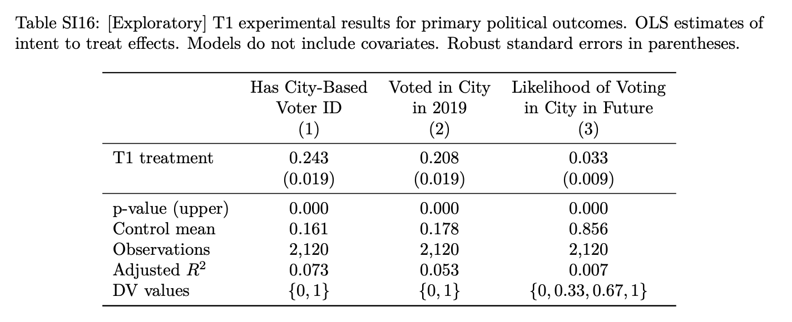{width="450"}

::: {.cols data-latex=""}
::: {.col data-latex="{0.48\\textwidth}"}
-   Each column is a different regression and has a different outcome
    (indicator).
:::

::: {.col data-latex="{0.04\\textwidth}"}
  <!-- an empty Div (with a white space), serving as
a column separator -->
:::

::: {.col data-latex="{0.48\\textwidth}"}
-   Chaque colonne est une différente régression et a un résultat
    (indicateur) différent.
:::
:::

## The Table \| *Le tableau*

\centering

{width="450"}

-   For each column / *Pour chaque colonne*:
    $Y_i = \widehat{\alpha}_0 + \widehat{\alpha}_1 T_i$

-   No covariates / *Aucune covariable*.

<!-- -   Estimate of the average treatment effect / *L'estimation de l'effect -->

<!--     moyen du traitement*: $\widehat{\alpha}$. -->

## Outcome variable \| *La variable de resultat*

\centering

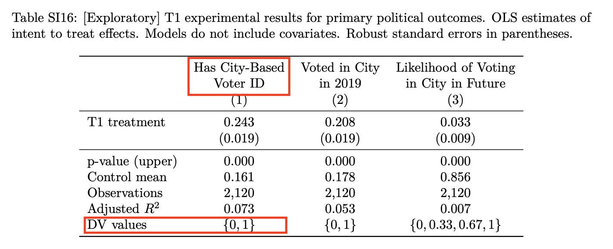{width="450"}

-   DV (dependent variable) values = {0,1}

-   *Les valeurs de variable de resultat* = {0,1}

## The estimand \| *Le paramètre*

\centering

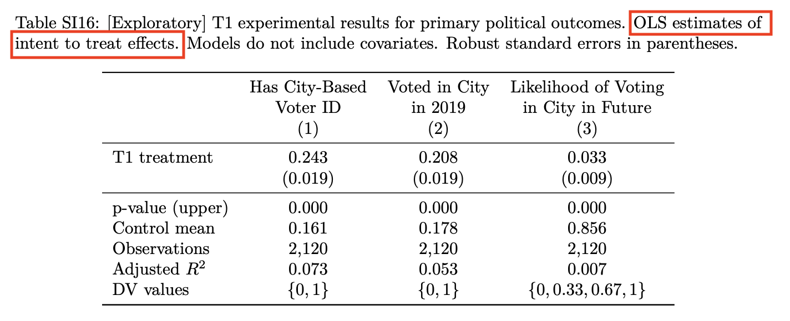{width="450"}

-   The estimand is the intent-to-treat effect (ITT, the effect of
    assignment to treatment = offer of aid in voter registration).

-   *Le paramètre est l'effet d'intention de traiter (ITT, l'effet
    d'assignation de traitement = offre d'aide à l'inscription sur les
    listes électorales).*

## The estimator \| *L'estimateur*

\centering

{width="450"}

-   The estimator is OLS (ordinary least squares) regression.

-   *Le estimateur est la régression par MCO (moindres carrés
    ordinaires).*

## Intent-to-Treat Effect (ATE of the offer of help) \| *Effet d'intention de traiter (l'ATE d'offre d'aide)*

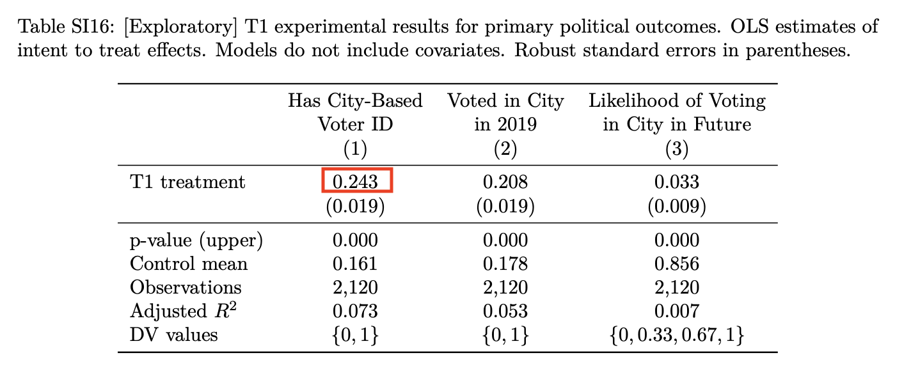{width="450"}

-   Estimate of the average treatment effect on whether a migrant has a
    city-based voter ID card / *L'estimation de l'effet moyen du
    traitement sur le fait qu'un migrant possède ou non une carte
    d'électeur pour la ville de destination*: 0.243.

## Robust standard errors \| *Les erreurs type robuste*

\centering
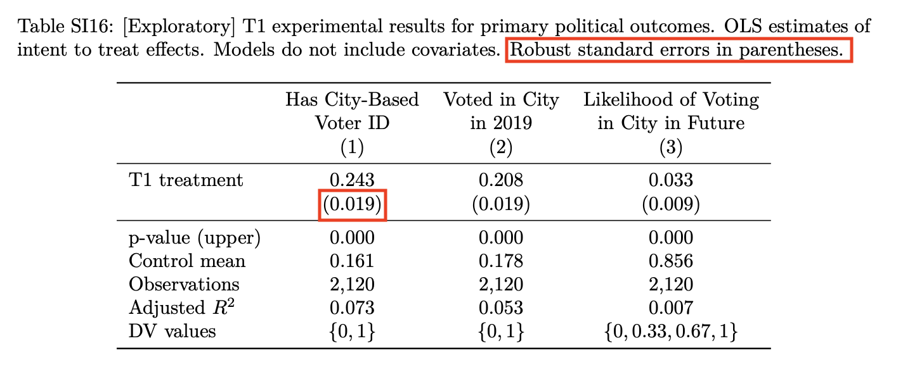{width="450"}


-   Standard error of this estimate / *L'érreur type de cette estimation* : 0.019.

## Control group mean \| *Le resultat moyen pour le groupe contrôle*

\centering

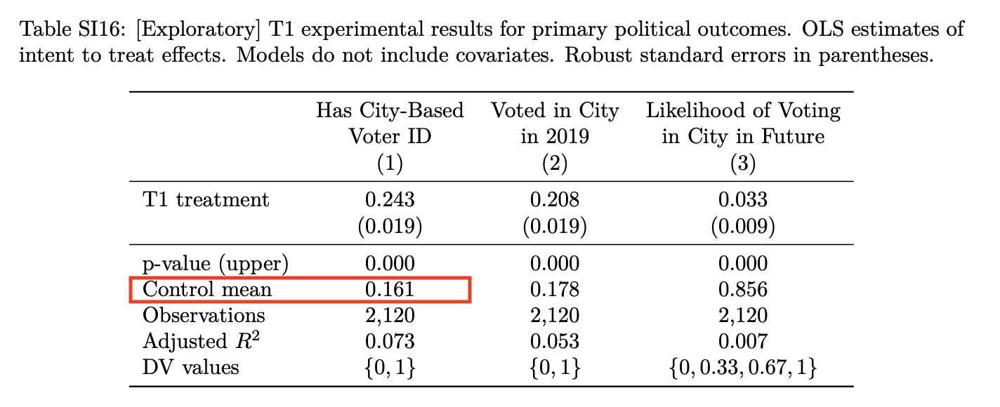{width="450"}

-   \% of migrants without treatment who have a city-based voter ID card
    / *% migrants qui possède une carte d'électeur pour la ville de
    destination*: 0.161.

## Control group mean \| *Le resultat moyen pour le groupe contrôle*

Sometimes you will see / *Vouz verrez parfois*:

|             |                    |
|-------------|-------------------:|
|             |     Has City-based |
|             |           Voter ID |
| ----------- | ------------------ |
| Treatment   |              0.243 |
|             |            (0.019) |
| Intercept   |              0.161 |
|             |             (s.e.) |

-   With one treatment group and one control group, without covariates: intercept = control
    group mean.

-   *Avec un groupe de traitement et un groupe de contrôle, sans covariables: l'intercept
    = le resultat moyen pour les unités de contrôle*

## $p$-value \| $p$-*valeur*

\centering

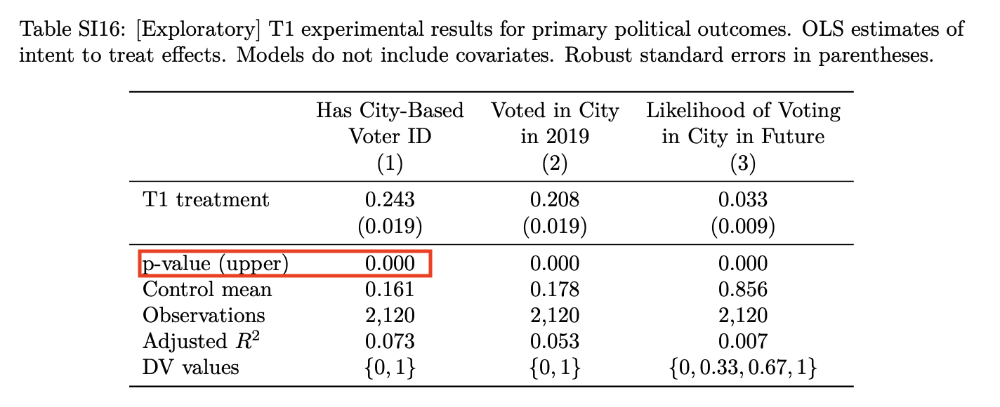{width="450"}

-   $p$-value (upper bound) / $p$-*valeur (limite supérieure)* :
    $p< 0.001$

## Sample Size ($n$) / *La taille d'échantillon (*$n$)

\centering

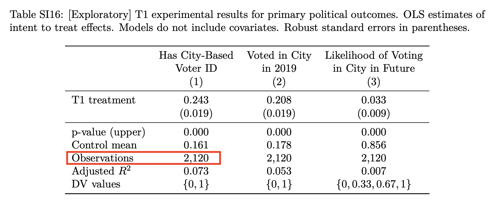{width="450"}

-   Observations ($n$) / *Taille d'échantillon (*$n$) = 2120

## Regression with covariates \| *Le régression avec les covariables*

\centering

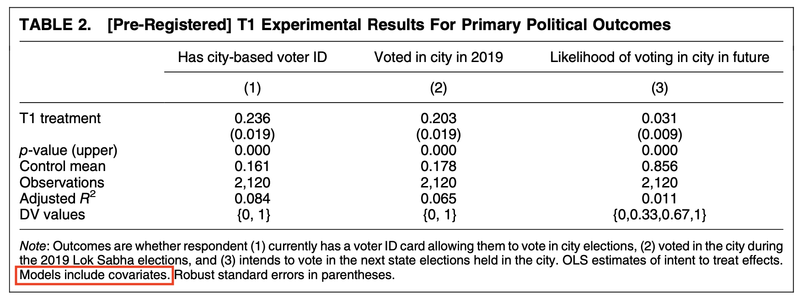

-   What is the estimate of the ATE on the first outcome? *Quelle est
    l'estimation de l'effet moyen du traitement pour le premier
    résultat?*

-   Is it different from the estimate of the ATE without covariates?
    *Est-elle différente de l'estimation de l'ATE sans covariables ?*

## Regression with covariates \| *Le régression avec les covariables*

\centering


-   $Y_i = \gamma_0 + \gamma_1 T_i + \gamma_2 X_i + \upsilon_i$

-   Estimate of the average treatment effect / *l'estimation de l'effet
    moyen du traitement* : $\widehat{\gamma}_1$ = 0.236

## Coefficients on the covariates \| *Les coefficients sur les covariables*

::: {.cols data-latex=""}
::: {.col data-latex="{0.48\\textwidth}"}
-   You can generally ignore coefficients on the covariates. They are
    not even reported here.

-   If they are reported, do not interpret them as the causal effect of
    the covariate.
:::

::: {.col data-latex="{0.04\\textwidth}"}
  <!-- an empty Div (with a white space), serving as
a column separator -->
:::

::: {.col data-latex="{0.48\\textwidth}"}
-   Vous pouvez généralement ignorer les coefficients des covariables.
    Ils ne sont même pas mentionnés ici.

-   S'ils sont indiqués, ne les interprétez pas comme l'effet causal de
    la covariable.
:::
:::

# Regression with interaction terms \| *La régression avec termes d'interaction*

## Regression with interaction terms \| *La régression avec termes d'interaction*

$$Y_i = \widehat{\delta}_0 + \widehat{\delta}_1 T_i + \widehat{\delta}_2 \text{PrimEduc}_i + \widehat{\delta}_3 T_i\cdot\text{PrimEduc}_i$$

::: {.cols data-latex=""}
::: {.col data-latex="{0.48\\textwidth}"}
-   We often use regressions with interaction terms when we want to
    estimate the ATE for different subsets of units (conditional average
    treatment effect, CATE).

-   For example: The ATE for people who have completed primary education
    and the ATE for people who have not completed primary education.
:::

::: {.col data-latex="{0.04\\textwidth}"}
  <!-- an empty Div (with a white space), serving as
a column separator -->
:::

::: {.col data-latex="{0.48\\textwidth}"}
-   Nous utilisons souvent des régressions avec des termes d'interaction
    lorsque nous voulons estimer l'ATE pour différents sous-ensembles
    d'unités (l'effet moyen conditionnel du traitement, CATE).

-   Par exemple: l'ATE pour les personnes ayant terminé l'enseignement
    primaire et l'ATE pour les personnes n'ayant pas terminé
    l'enseignement primaire.
:::
:::

## Regression with interaction terms \| *La régression avec termes d'interaction*

$$Y_i = \widehat{\delta}_0 + \widehat{\delta}_1 T_i + \widehat{\delta}_2 \text{PrimEduc}_i + \widehat{\delta}_3 T_i\cdot\text{PrimEduc}$$

-   Average $Y_i$ if $T_i=0$ and $PrimEduc_i=0$ : $\widehat{\delta}_0$

-   Average $Y_i$ if $T_i=1$ and $PrimEduc_i=0$ :
    $\widehat{\delta}_0 + \widehat{\delta}_1$

-   Average $Y_i$ if $T_i=0$ and $PrimEduc_i=1$ :

-   Average $Y_i$ if $T_i=1$ and $PrimEduc_i=1$ :

## Regression with interaction terms \| *La régression avec termes d'interaction*

\centering

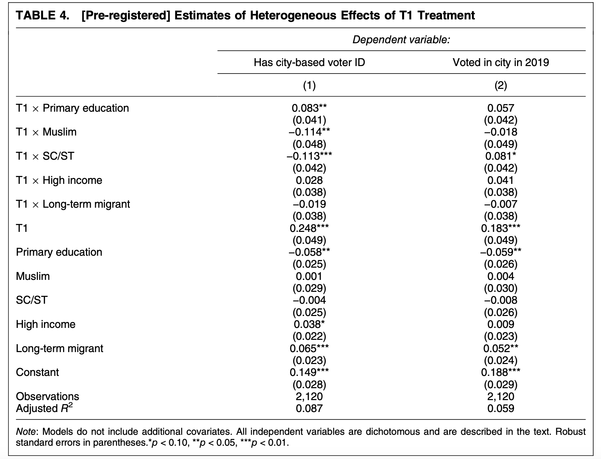{width="400"}

## Regression with interaction terms \| *La régression avec termes d'interaction*

\centering

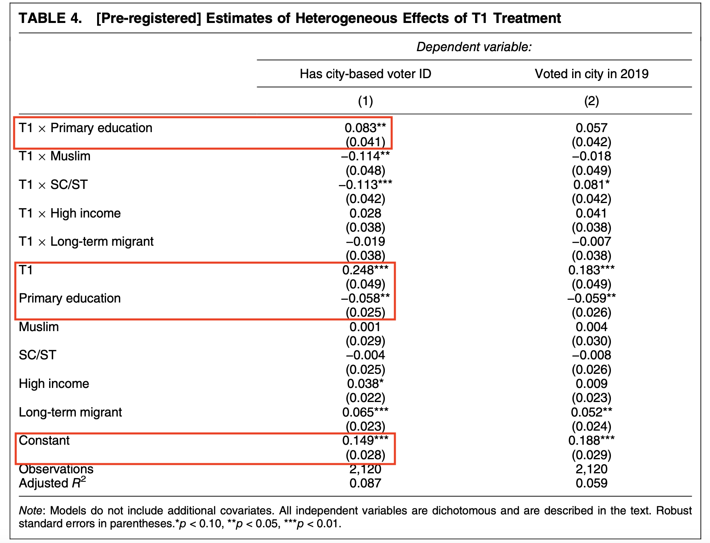{width="400"}

## Regression with interaction terms \| *La régression avec termes d'interaction*

With/*Avec* $Muslim_i=0$, $SC/ST_i=0$, $HighIncome_i=0$, and/*et*
$LongTermMigrant_i=0$:

-   $Y_i = \delta_0 + \delta_1 T_i + \delta_2 X_i + \delta_3 T_iX_i + \zeta_i$

-   $Y_i = \delta_0 + \widehat{\delta}_1 T_i + \widehat{\delta}_2 \text{PrimEduc}_i + \widehat{\delta}_3 T_i\cdot\text{PrimEduc}$

-   $Y_i = 0.149 + 0.248 T_i - 0.058 \text{PrimEduc}_i + 0.083 T_i\cdot\text{PrimEduc}_i$

## Regression with interaction terms \| *La régression avec termes d'interaction*

$$Y_i = 0.149 + 0.248 T_i - 0.058 \text{PrimEduc}_i + 0.083 T_i\cdot\text{PrimEduc}_i$$

::: {.cols data-latex=""}
::: {.col data-latex="{0.48\\textwidth}"}
-   What is the average treatment effect (ATE) for $PrimEduc_i=0$?

-   What is the average treatment effect (ATE) for $PrimEduc_i=1$?

-   Are these conditional average treatment effects different?
:::

::: {.col data-latex="{0.04\\textwidth}"}
  <!-- an empty Div (with a white space), serving as
a column separator -->
:::

::: {.col data-latex="{0.48\\textwidth}"}
-   *Quel est l'effet moyen du traitement pour* $PrimEduc_i=0$?

-   *Quel est l'effet moyen du traitement pour* $PrimEduc_i=1$?

-   *Ces effets moyens conditionnels de traitement sont-ils différents
    ?*
:::
:::

## Conditional average treatment effects \| *Les effets moyens conditionnels de traitement*

Are these conditional average treatment effects different? / *Ces effets
moyens conditionnels de traitement sont-ils différents ?*


# Cluster Randomization \| *Randomisation par grappe*

## Second treatment in the India study \| *Le 2me traitement de l'étude d'Inde*

::: {.cols data-latex=""}
::: {.col data-latex="{0.48\\textwidth}"}
-   Possible explanations for low political integration of internal
    migrants:

    -   Strong ties to home region

    -   Bureaucratic barriers $\rightarrow T1$

    -   Exclusion by local-born residents and elites $\rightarrow T2$

-   Approximateoy 2000 people around 87 polling stations in 4 blocks:
    Delhi/Lucknow \* above/below median number of experimental subjects
    at polling station
:::

::: {.col data-latex="{0.04\\textwidth}"}
  <!-- an empty Div (with a white space), serving as
a column separator -->
:::

::: {.col data-latex="{0.48\\textwidth}"}
-   Explications possibles de l'intégration politique faible des
    migrants internes:

    -   Liens forts avec la région d'origine

    -   Obstacles bureaucratiques $\rightarrow T1$

    -   Exclusion par les résidents et les élites nés dans la ville
        $\rightarrow T2$

-   Environ 2000 personnes autour de 87 bureaux de vote dans 4 blocs :
    Delhi/Lucknow \* supérieur/inférieur de nombre médian de sujets
    expérimentaux dans le bureau de vote.
:::
:::

## Second treatment in the India study \| *Le 2me traitement de l'étude d'Inde*

::: {.cols data-latex=""}
::: {.col data-latex="{0.48\\textwidth}"}
-   Letters, Whatsapp messages, and emails in 2-4 weeks before election
    to incumbent MP, MP candidates, other local officials informing them
    that a voter registration drive among migrants had recently been
    carried out.
:::

::: {.col data-latex="{0.04\\textwidth}"}
  <!-- an empty Div (with a white space), serving as
a column separator -->
:::

::: {.col data-latex="{0.48\\textwidth}"}
-   Lettres, messages Whatsapp, et courriels dans les 2 à 4 semaines
    précédant l'élection au député (MP) sortant, aux candidats au poste
    de MP et à d'autres fonctionnaires locaux, les informant qu'une
    campagne d'inscription sur les listes électorales a récemment été
    menée auprès des migrants.
:::
:::

## The outcomes \| *Les variables de résultat*

\centering

{width="400"}

-   Index = average of $z$ scores

-   $z$-score for indicator $k$ for individual $i$: $z_i^k$ = ($y_i^k$ -
    control group mean) / control group standard deviation

## Units and Clusters \| *Les unités et les grappes*

\centering

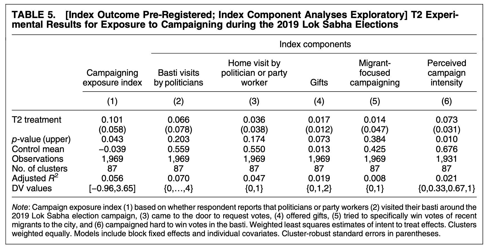{width="350"}

-   Number of observations / *Taille d'échantillon* =

-   Number of clusters / *Le nombre de grappes* =

## The estimator \| *L'estimateur*

\centering

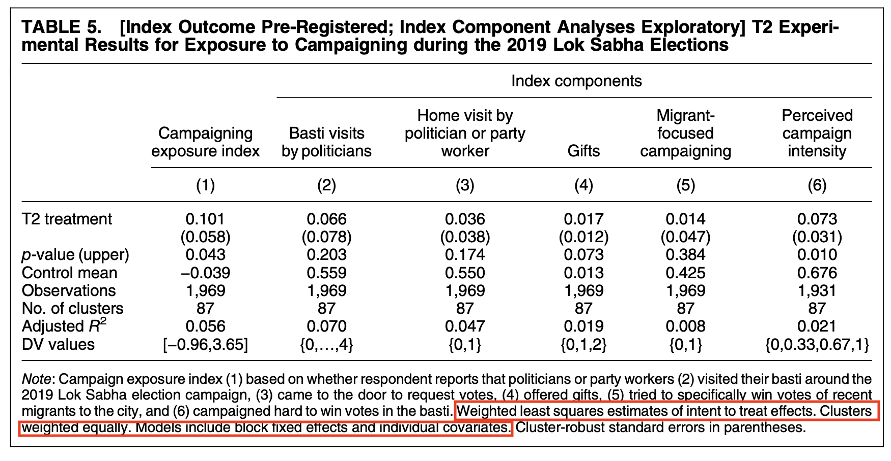{width="350"}

-   Estimator: weighted least squares, with clusters weighted equally,
    with block fixed effects and individual covariates.

-   *L'estimateur: moindres carrés pondérés, les grappes étant pondérées
    également, avec des effets fixes par bloc et des covariables
    individuelles.*

## Cluster-robust standard errors \| *Les erreurs type robuste groupées*

\centering

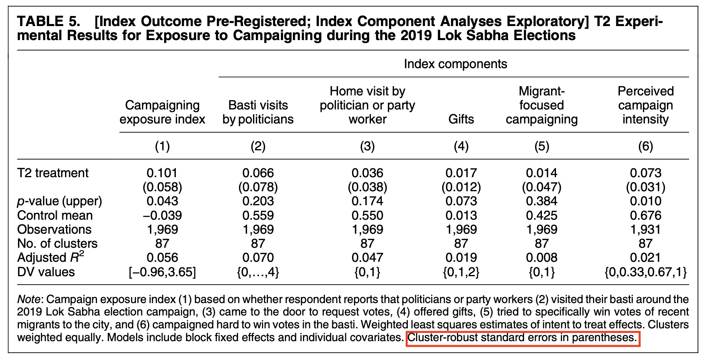{width="350"}

## Estimation \| *L'estimation*

\centering

{width="350"}

-   What is the estimated average effect of $T2$ on the outcome index?
    *Quel est l'effet moyen estimé de* $T2$ sur l'indice de résultat ?

## Hypothesis testing \| *Les tests d'hypothèses*

\centering

{width="350"}

-   On which components of the index does $T2$ have a statistically
    significant effect? *Sur quelles composantes de l'indice* $T2$
    a-t-il un effet statistiquement significatif ?

## Intepretation \| *L'interprétation*

\centering

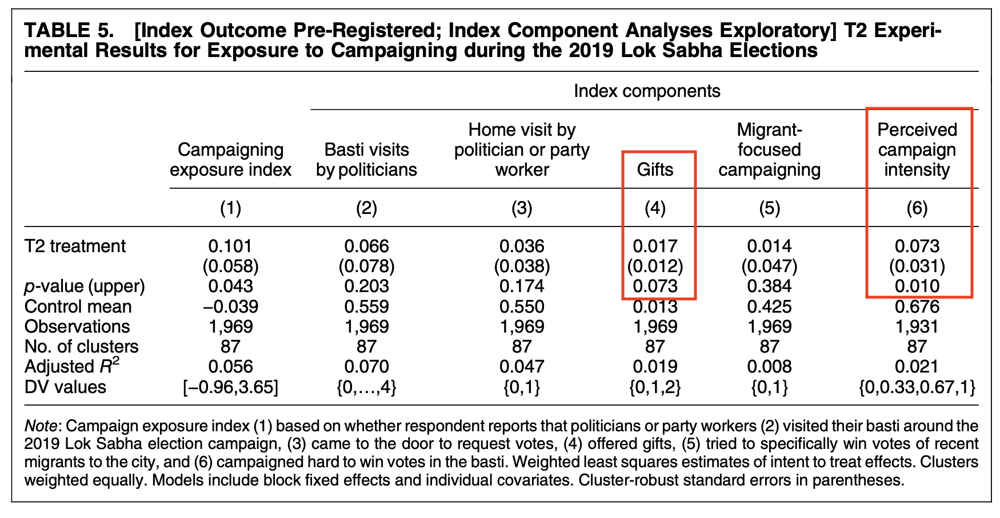{width="350"}

::: {.cols data-latex=""}
::: {.col data-latex="{0.48\\textwidth}"}
-   Are these results positive or negative for internal migrants?
:::

::: {.col data-latex="{0.04\\textwidth}"}
  <!-- an empty Div (with a white space), serving as
a column separator -->
:::

::: {.col data-latex="{0.48\\textwidth}"}
-   *Pour les migrants internes, ces résultats sont-ils positifs ou
    négatifs?*
:::
:::
