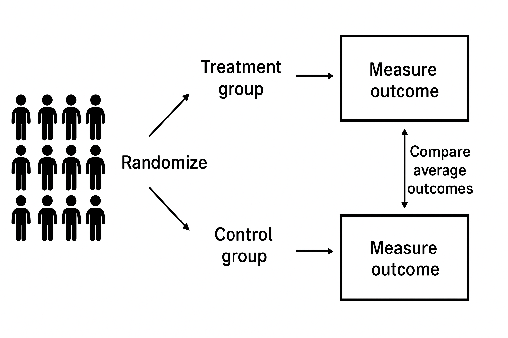
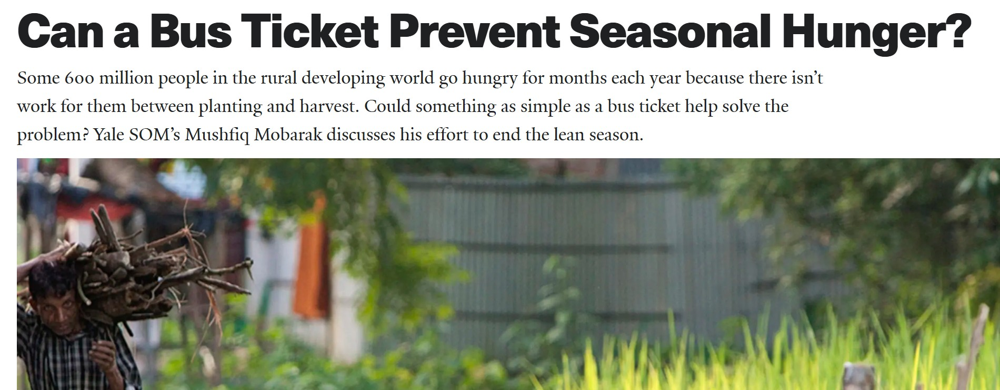

## Key points for this lecture \| Points clés de ce cours

::: {.cols data-latex=""}
::: {.col data-latex="{0.48\\textwidth}"}

- What are the limitations of observational research?
- What is a randomized experiment?  
- Who uses experiments?  
- What are experiments good for (and not)?  

:::

::: {.col data-latex="{0.04\\textwidth}"}
 <!-- an empty Div (with a white space), serving as
a column separator -->
:::

::: {.col data-latex="{0.48\\textwidth}"}

- Quelles sont les limitations des études observationnelles ?
- Qu'est-ce qu'une expérience aléatoire?  
- Qui utilise les expériences?  
- À quoi servent (ou ne servent pas) les expériences?  

:::
:::


## What is the impact of decentralization on corruption? \| Quel est l'impact de la décentralisation sur la corruption ?

:::::: {.cols data-latex=""}
::: {.col data-latex="{0.48\textwidth}"}

- How would we try to answer that question?

:::
  
::: {.col data-latex="{0.04\textwidth}"}

<!-- an empty Div (with a white space), serving as
a column separator -->
:::

  
::: {.col data-latex="{0.48\textwidth}"}

-   Comment y répondre ?

:::
::::::


## Observational research: the usual approach \| Études observationnelles : l'approche typique

:::::: {.cols data-latex=""}
::: {.col data-latex="{0.48\textwidth}"}

- Download and merge existing datasets
- Measure naturally occurring behaviors or outcomes, perhaps by running a survey
- Observe, don't intervene or treat 


:::
  
::: {.col data-latex="{0.04\textwidth}"}

<!-- an empty Div (with a white space), serving as
a column separator -->
:::

  
::: {.col data-latex="{0.48\textwidth}"}

- Télécharger et fusionner les jeux de données existants
- Mesurer les comportements ou d'autres résultats, par exemple en menant un sondage
- On observe, on n’intervient pas, on ne traite pas

  

:::
::::::


## An observational study of decentralization \| Une étude observationnelle de la décentralisation

:::::: {.cols data-latex=""}
::: {.col data-latex="{0.48\textwidth}"}

- Fisman and Gatti (2002): "Decentralization and corruption: evidence across countries" (cited 2,423 times)
- Data from transparency international and IMF on 80 countries; OLS regression (with controls) 
- Finds a strong country-level correlation between fiscal decentralization in government expenditure and lower corruption
- World Bank heavily promoted decentralization in the 1990s and 2000s

:::
  
::: {.col data-latex="{0.04\textwidth}"}

<!-- an empty Div (with a white space), serving as
a column separator -->
:::

  
::: {.col data-latex="{0.48\textwidth}"}

- Fisman et Gatti (2002) : "Decentralization and corruption: evidence across countries" (cité 2 423 fois)
- Données de Transparency International et du FMI sur 80 pays ; régressions OLS (avec variables de contrôle)
- Met en évidence une forte corrélation au niveau des pays entre la décentralisation fiscale des dépenses publiques et une moindre corruption
- La Banque mondiale a fortement promu la décentralisation dans les années 1990 et 2000


:::
::::::


## Should the World Bank believe that decentralization decreases corruption, based on Fisman and Gatti (2002)? \| 	La Banque mondiale devrait-elle croire que la décentralisation réduit la corruption ?


## Should the World Bank believe that decentralization decreases corruption, based on Fisman and Gatti (2002)? \| 	La Banque mondiale devrait-elle croire que la décentralisation réduit la corruption ?

:::::: {.cols data-latex=""}
::: {.col data-latex="{0.48\textwidth}"}


- Countries that decentralize may  
    - Be less corrupt to begin with
    - Have stronger civil societies
    - Adopt other governance reforms at the same time

:::
  
::: {.col data-latex="{0.04\textwidth}"}

<!-- an empty Div (with a white space), serving as
a column separator -->
:::

  
::: {.col data-latex="{0.48\textwidth}"}

- Les pays qui se décentralisent peuvent 
    - être moins corrompus au départ
    - avoir des sociétés civiles plus actives
    - adopter d’autres réformes de gouvernance en même temps


:::
::::::


## Confounding \| Facteurs de confusion


:::::: {.cols data-latex=""}
::: {.col data-latex="{0.48\textwidth}"}

- *Confounding*: a hidden factor that makes it look like there's a causal effect when there might not be
- Observational research can show patterns and associations, but rarely causality

:::
  
::: {.col data-latex="{0.04\textwidth}"}
\ 
<!-- an empty Div (with a white space), serving as
a column separator -->
:::

  
::: {.col data-latex="{0.48\textwidth}"}

- *Facteurs de confusion* : des facteurs cachés qui donnent l’impression qu’il y a un effet causal alors qu’il n’y en a peut-être pas
- Les études observationnelles peuvent montrer des tendances et des associations, mais rarement une relation causale

:::
::::::


## What is a randomized experiment? \| Qu'est-ce qu'une expérience aléatoire?

:::::: {.cols data-latex=""}
::: {.col data-latex="{0.48\textwidth}"}

-   You have a treatment (intervention)

-   *You randomly assign units to treatment and control conditions*

-   You compare the outcomes for the units that were assigned to
    treatment to outcomes for those that were not

:::
  
::: {.col data-latex="{0.04\textwidth}"}
\ 
<!-- an empty Div (with a white space), serving as
a column separator -->
:::

  
::: {.col data-latex="{0.48\textwidth}"}

-   Vous avez un traitement (intervention)

-   *Vous assignez de manière aléatoire des sujets aux conditions de
    traitement et de contrôle*

-   Vous comparez les résultats des unités qui sont assignées au groupe de
    traitement et de celles qui sont assignées au groupe de contrôle

:::
::::::


##

```{r, echo=FALSE, fig.align='center', out.width=360}

```


## Example


:::::: {.cols data-latex=""}
::: {.col data-latex="{0.48\textwidth}"}
- Question: Does informing citizens about school oversight committees improve education outcomes?
- India's Village Education Committees (VECs): Include 3 parents, head teacher, and village leader
- Study: 65 Indian villages received info on VEC roles and responsibilities, 80 villages did not (*randomly chosen*) 
- Outcome: Children's scores on basic reading, writing, and math tests
:::
  
::: {.col data-latex="{0.04\textwidth}"}
\ 
<!-- an empty Div (with a white space), serving as
a column separator -->
:::

  
::: {.col data-latex="{0.48\textwidth}"}

- Question de recherche : Informer les citoyens sur les comités de surveillance scolaire améliore-t-il les résultats scolaires ?
-	Comités d’éducation villageois (CEV) en Inde : composés de 3 parents, du directeur d’école et du chef du village.
-	Étude : 65 villages indiens ont reçu des informations sur les rôles et responsabilités des CEV, tandis que 80 villages ne les ont pas reçues (choisis de manière aléatoire).
-	Variable dépendante : les scores des enfants aux tests de lecture, écriture et mathématiques


:::
::::::

## 

```{r, echo=FALSE, fig.align='center', out.width=360}
knitr::include_graphics("images/gramsabha.pdf")
```


## Results \| Résultats


:::::: {.cols data-latex=""}
::: {.col data-latex="{0.48\textwidth}"}

- No changes in children's test scores
- Was the study worth doing?

:::
  
::: {.col data-latex="{0.04\textwidth}"}
\ 
<!-- an empty Div (with a white space), serving as
a column separator -->
:::

  
::: {.col data-latex="{0.48\textwidth}"}

- Aucun changement dans les résultats des enfants aux tests
- L’étude valait-elle la peine d’être menée ?

:::
::::::


## Why an experiment? \| Pourquoi une expérimentation?

:::::: {.cols data-latex=""}
::: {.col data-latex="{0.48\textwidth}"}

- Random assignment $\rightarrow$ highly credible evidence that there is no effect
- If politicians/bureaucrats believe results, they won't spend money on a useless intervention

:::
  
::: {.col data-latex="{0.04\textwidth}"}
\ 
<!-- an empty Div (with a white space), serving as
a column separator -->
:::

  
::: {.col data-latex="{0.48\textwidth}"}

- Affectation aléatoire $\rightarrow$ preuve hautement crédible qu’il n’y a aucun effet
- Si les politiciens ou les fonctionnaires croient aux résultats, ils ne dépenseront pas d’argent pour une intervention inutile

:::
::::::
  


## Long history of the method \| Une longue histoire de la méthode

:::::: {.cols data-latex=""}
::: {.col data-latex="{0.48\textwidth}"}

- Late 1700s: Early double-blind experiments with comparison group (not randomized) 
- 1920s: First randomized experiments in agriculture, education, and political science
- 1948: First clinical randomized trial (Streptomycin for TB)
- 2019: Nobel prize for popularizing randomized experiments in economics

:::
  
::: {.col data-latex="{0.04\textwidth}"}
\ 
<!-- an empty Div (with a white space), serving as
a column separator -->
:::

  
::: {.col data-latex="{0.48\textwidth}"}

- Fin des années 1700 : Premières expériences en double aveugle avec groupe témoin (non randomisé) 
- Années 1920 : Premières expériences randomisées dans les domaines de l'agriculture, de l'éducation et des sciences politiques
- 1948 : Premier essai clinique randomisé (Streptomycine pour la tuberculose)
- 2019 : Prix Nobel pour avoir popularisé les expériences aléatoires en économie

:::
::::::


## 

```{r, echo=FALSE, fig.align='center', out.width=360}
knitr::include_graphics("images/experiments-history.pdf")
```

  


## Widespread use |\ Utilisation répandue

:::::: {.cols data-latex=""}
::: {.col data-latex="{0.48\textwidth}"}


- Clinical trials for medicine  
- Political campaigns  
- Tech A/B testing  
- Policy trials in governments 


:::
  
::: {.col data-latex="{0.04\textwidth}"}
\ 
<!-- an empty Div (with a white space), serving as
a column separator -->
:::

  
::: {.col data-latex="{0.48\textwidth}"}


- Essais cliniques  
- Campagnes politiques  
- Tests A/B en tech  
- Essais politiques dans les gouvernements

:::
::::::
  


## Use in social science |\  Utilisation en sciences sociales

:::::: {.cols data-latex=""}
::: {.col data-latex="{0.48\textwidth}"}

- Corrected wrong beliefs  
- Found that some things don't scale  
- Encouraged good policies 
:::
  
::: {.col data-latex="{0.04\textwidth}"}
\ 
<!-- an empty Div (with a white space), serving as
a column separator -->
:::

  
::: {.col data-latex="{0.48\textwidth}"}


- Corrigé des croyances erronées  
- Montré que certaines politiques ne s'étendent pas bien  
- Soutenu les bonnes politiques 

:::
::::::


## Proving beliefs wrong \| Démontrer que les croyances sont fausses

:::::: {.cols data-latex=""}
::: {.col data-latex="{0.48\textwidth}"}

- Belief: Microfinance boosts poverty reduction
- Multiple studies have randomized microcredit at the group or neighborhood level
- Result: No impact on household income, consumption, or women's empowerment


:::
  
::: {.col data-latex="{0.04\textwidth}"}
\ 
<!-- an empty Div (with a white space), serving as
a column separator -->
:::

  
::: {.col data-latex="{0.48\textwidth}"}


- Croyance : La microfinance réduit la pauvreté
- Plusieurs études ont randomisé l’accès au microcrédit au niveau du groupe ou du quartier
- Résultat : Aucun impact sur le revenu des ménages, la consommation ou l’autonomisation des femmes


:::
::::::


## Proving beliefs right \| Prouver que les croyances sont justes

:::::: {.cols data-latex=""}
::: {.col data-latex="{0.48\textwidth}"}

- Belief: Conditional cash transfers improve school attendance
- Study: PROGRESA in Mexico randomized whether families were paid to keep children in school
- Result: Large increases in enrollment, especially for girls and secondary students


:::
  
::: {.col data-latex="{0.04\textwidth}"}
\ 
<!-- an empty Div (with a white space), serving as
a column separator -->
:::

  
::: {.col data-latex="{0.48\textwidth}"}

- Croyance : Les transferts monétaires conditionnels augmentent la fréquentation scolaire
- Étude : Le programme PROGRESA au Mexique a randomisé le versement d’allocations aux familles pour maintenir leurs enfants à l’école
- Résultat : Forte hausse des inscriptions, en particulier pour les filles et les élèves du secondaire


:::
::::::


## Scaling up challenges |\ Transposition à plus grande échelle des succès remportés


```{r, echo=FALSE, fig.align='center', out.width=160}

```

:::::: {.cols data-latex=""}
::: {.col data-latex="{0.48\textwidth}"}

- Belief: Paying bus tickets for rural laborers would help them earn money in city in lean season  
- Program: Scale up from one 1,292 landless households to 150,000 households
- Result: No longer effective at scale 

:::
  
::: {.col data-latex="{0.04\textwidth}"}
\ 
<!-- an empty Div (with a white space), serving as
a column separator -->
:::

  
::: {.col data-latex="{0.48\textwidth}"}

- Croyance : Payer les billets de bus pour les travailleurs ruraux les aiderait à gagner de l’argent en ville pendant la saison creuse
- Programme : Passage à l’échelle de 1 292 ménages sans terre à 150 000 ménages
- Résultat : Plus d’effet à grande échelle 

:::
::::::
  

## Limitations to experiments \|  Limites des expériences

:::::: {.cols data-latex=""}
::: {.col data-latex="{0.48\textwidth}"}

- Some things don't need an experiment (smoking and parachutes) 
- Some experiments aren't ethical
- Some interventions can't be randomized

:::
  
::: {.col data-latex="{0.04\textwidth}"}
\ 
<!-- an empty Div (with a white space), serving as
a column separator -->
:::

  
::: {.col data-latex="{0.48\textwidth}"}

- Certaines choses ne nécessitent pas d’expérience (le tabac et les parachutes)
- Certaines expériences ne sont pas éthiques
- Certaines interventions ne peuvent pas être randomisées
  
:::
::::::


## Why experiments \| Pourquoi des expérimentations?

:::::: {.cols data-latex=""}
::: {.col data-latex="{0.48\textwidth}"}

- Let’s put beliefs to the test  
- What works? $\rightarrow$ Let's find out!

:::
  
::: {.col data-latex="{0.04\textwidth}"}
\ 
<!-- an empty Div (with a white space), serving as
a column separator -->
:::

  
::: {.col data-latex="{0.48\textwidth}"}

- Mettons les croyances à l’épreuve  
- Qu’est-ce qui fonctionne ? $\rightarrow$ Découvrons-le !

:::
::::::
  


