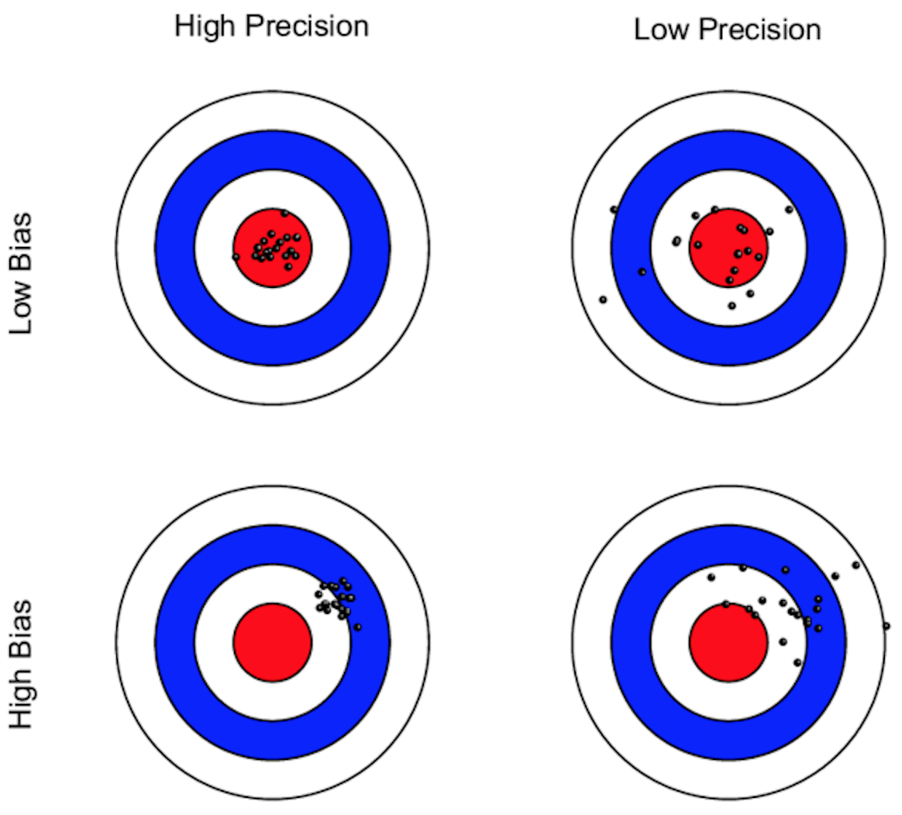

## Estimation and Hypothesis Testing | *L'estimation et les tests d'hypothèses*

```{r, include = FALSE}
library(DeclareDesign)
set.seed(1)
df <- fabricate(N = 100, 
               Sporty_Sportive = rep(0:1, N/2), 
               Coffee =  block_ra(Sporty_Sportive), 
               Energy = .2 + .8*Coffee  + Sporty_Sportive + rnorm(N))
```

::: {.columns}
::: {.column .lang-en width="50%"}

- We have randomly assigned treatment and collected our outcome data.
- Now we use that data for:
    - **Estimation**: produce an estimate of the true treatment effect
    - **Hypothesis testing**: assess how consistent the results are with there being no effect

:::
::: {.column .lang-fr width="50%"}

- Le traitement a été assigné de façon aléatoire et nous avons mesuré les résultats.
- Nous utilisons maintenant ces données pour :
    - **Estimation** : produire une estimation du véritable effet du traitement
    - **Test d'hypothèse** : évaluer la cohérence des résultats avec l'absence d'effet

:::
:::

# Estimation | *L'estimation*

## Estimation | *L'estimation*

::: {.columns}
::: {.column .lang-en width="50%"}

- Remember that there is a *true* ATE but we can't observe it because of the fundamental problem of causal inference. This is our target, our **estimand**.
    - For example, the ATE.
- We use our data to make an educated guess, our **estimate**.
    - $\widehat{ATE}$
- If we run the experiment again, different units may be assigned to treatment, and our estimate will likely be different.

:::
::: {.column .lang-fr width="50%"}

- Rappelez qu'il y a un *vrai* ATE, mais nous ne pouvons pas l'observer à cause du problème fondamental de l'inférence causale. C'est notre cible, notre **paramètre**.
    - Par exemple, l'ATE.
- Nous utilisons nos données pour faire une supposition éclairée, notre **estimation**.
    - $\widehat{ATE}$
- Si nous renouvelons l'expérience, différentes unités peuvent être assignées au traitement, et notre estimation sera probablement différente.

:::
:::

## Estimators | *Estimateurs*

::: {.columns}
::: {.column .lang-en width="50%"}

- The procedure we apply to our data to produce this estimate is our **estimator**.
- There are many possible estimators for the same estimand.
- We will introduce several estimators that are commonly used to analyze experiments.

:::
::: {.column .lang-fr width="50%"}

- **L'estimateur** est comment on devine la valeur du paramètre à partir des données dont on dispose (les données observées).
- Il y a plusieurs estimateurs possibles pour le même paramètre.
- Nous présenterons plusieurs estimateurs couramment utilisés pour analyser des expériences.

:::
:::

## Estimators | *Estimateurs*

::: {.columns}
::: {.column .lang-en width="50%"}

- In general, we prefer estimators that are:
    - **Unbiased**: If we run the experiment many times, each estimate might be a little too high or low, but it will be correct on average.
    - **Precise**: The estimates do not vary much from one run of the experiment to another.
- The best: unbiased and precise.

:::
::: {.column .lang-fr width="50%"}

- En général, nous préférons les estimateurs qui sont :
    - **Non biaisés** : si vous exécutez l'expérience plusieurs fois, l'estimation peut parfois être trop élevée ou trop faible, mais elle sera correcte en moyenne.
    - **Précis** : les estimations ne varient pas beaucoup d'une exécution de l'expérience à l'autre.
- Le meilleur : non biaisé et précis.

:::
:::

## Estimators | *Estimateurs*

{fig-align="center"}

## General principle: Analyze as you randomize | *Un principe général : analysez comme vous randomisez*

::: {.columns}
::: {.column .lang-en width="50%"}

- This means follow the design of the experiment.
- Compare groups that are created by random assignment.

:::
::: {.column .lang-fr width="50%"}

- Cela signifie suivre la conception de l'expérience.
- Comparez les groupes créés par l'assignation aléatoire.

:::
:::

## Estimator 1: Difference-in-means | *Estimateur 1 : la différence des moyennes*

::: {.columns}
::: {.column .lang-en width="50%"}

- We have a simple experiment:
    - Random assignment to treatment or control.
    - All units have the same probability of treatment assignment.
    - Our *estimand* is the ATE.
- The simplest *estimator* for the ATE is the **difference-in-means**: take the average outcome for the treatment group and subtract the average outcome for the control group.

:::
::: {.column .lang-fr width="50%"}

- Nous avons une expérience simple :
    - Assignation aléatoire au traitement ou au contrôle.
    - Toutes les unités ont la même probabilité de recevoir le traitement.
    - Notre *paramètre* est l'ATE.
- L'estimateur le plus simple de l'ATE est **la différence des moyennes** : soustrayez la moyenne des unités assignées au contrôle de la moyenne des unités assignées au traitement.

:::
:::

## Estimator 1: Difference-in-means | *Estimateur 1 : la différence des moyennes*

{fig-align="center"}

## Estimator 1: Difference-in-means | *Estimateur 1 : la différence des moyennes*

| Unit | $Z_i$ | $Y_i$ | $Y_i(1)$ | $Y_i(0)$ |
|:----:|:-----:|:-----:|:--------:|:--------:|
|  a   |   1   |   5   |    5     |          |
|  b   |   1   |   4   |    4     |          |
|  c   |   1   |   2   |    2     |          |
|  d   |   1   |   1   |    1     |          |
|  e   |   0   |   1   |          |    1     |
|  f   |   0   |   1   |          |    1     |
|  g   |   0   |   0   |          |    0     |
|  h   |   0   |   2   |          |    2     |

::: {.fragment}

$$\frac{5+4+2+1}{4} - \frac{1+1+0+2}{4} = 3 - 1 = 2$$

:::

## Estimator 1: Difference-in-means | *Estimateur 1 : la différence des moyennes*

```{r, eval = FALSE, echo = TRUE}
mean(Y[treatment==1]) - mean(Y[treatment==0])

library(estimatr)
difference_in_means(Y ~ treatment)
```

## Estimator 2: Linear regression | *Estimateur 2 : la régression linéaire*

$$Y_i = \beta_0 + \beta_1 Z_i + e_i$$

::: {.columns}
::: {.column .lang-en width="50%"}

- With this simple experiment, we can also use a linear regression. It will produce exactly the same estimate ($\hat{\beta_1}$) of the ATE as the difference-in-means estimator.
- $\hat{\beta_0}$ is the average outcome in the control group.

:::
::: {.column .lang-fr width="50%"}

- Pour cette expérience simple, nous pouvons également utiliser la régression linéaire. Elle produira exactement la même estimation ($\hat{\beta_1}$) de l'ATE que l'estimateur de la différence des moyennes.
- $\hat{\beta_0}$ est le résultat moyen des unités assignées au contrôle.

:::
:::

## Estimator 2: Linear regression | *Estimateur 2 : la régression linéaire*

::: {.columns}
::: {.column width="60%"}

{fig-align="center"}

:::
::: {.column width="40%"}

$$Y_i = {\beta_0} + {\beta_1} Z_i + e_i$$

:::
:::

## Estimator 2: Linear regression | *Estimateur 2 : la régression linéaire*

```{r, eval = FALSE, echo = TRUE}
lm(Y ~ treatment)
```

# Hypothesis Testing | *Les tests d'hypothèses*

## Hypothesis: A woman is pregnant | *Hypothèse : une femme est enceinte*

## Truth: the woman is pregnant | *La vérité : la femme est enceinte*

{fig-align="center"}


## Type I and Type II errors | *Erreurs de type I et de type II* {.compact-table}

::: {.columns}
::: {.column .lang-en width="50%"}

| | Reject $H_0$ | Do not reject $H_0$ |
|:--|:--|:--|
| **$H_0$ true** (no effect) | Type I error ($\alpha$) | Correct |
| **$H_0$ false** (effect exists) | Correct (power $= 1-\beta$) | Type II error ($\beta$) |

- **Type I error** ($\alpha$): reject $H_0$ when $H_0$ is true — a false positive.
- **Type II error** ($\beta$): fail to reject $H_0$ when $H_0$ is false — a false negative.
- **Power** $= 1 - \beta$: probability of correctly rejecting $H_0$ when there is an effect.

:::
::: {.column .lang-fr width="50%"}

| | Rejeter $H_0$ | Ne pas rejeter $H_0$ |
|:--|:--|:--|
| **$H_0$ vraie** (aucun effet) | Erreur de type I ($\alpha$) | Correct |
| **$H_0$ fausse** (effet existant) | Correct (puissance $= 1-\beta$) | Erreur de type II ($\beta$) |

- **Erreur de type I** ($\alpha$) : rejeter $H_0$ alors que $H_0$ est vraie — un faux positif.
- **Erreur de type II** ($\beta$) : ne pas rejeter $H_0$ alors que $H_0$ est fausse — un faux négatif.
- **Puissance** $= 1 - \beta$ : probabilité de rejeter correctement $H_0$ lorsqu'il y a un effet.

:::
:::

## Hypothesis Testing | *Les tests d'hypothèses*

::: {.columns}
::: {.column .lang-en width="50%"}

- Let's say that the truth is that a medicine has no effect on height. But all the short people were randomly assigned to the medicine and all the tall people to control.
- If we apply the difference in means, it looks like the medicine made people shorter!

:::
::: {.column .lang-fr width="50%"}

- Supposons qu'un médicament n'ait aucun effet sur la taille. Mais toutes les personnes de petite taille ont été assignées au médicament et les personnes de grande taille au contrôle.
- Si on utilise la différence de moyennes, on dirait que le médicament a rendu les gens plus petits !

:::
:::


## Hypothesis Testing | *Les tests d'hypothèses*

::: {.columns}
::: {.column .lang-en width="50%"}

- Warning: We can get an estimate that is not zero even when there is no effect!
- Are we confident that our non-zero estimate reflects a truly non-zero estimand (truth)?

:::
::: {.column .lang-fr width="50%"}

- Avertissement : on peut obtenir une estimation non nulle même s'il n'y a aucun effet !
- Sommes-nous convaincus que notre estimation non nulle reflète un paramètre véritablement non nul (la vérité) ?

:::
:::

## Hypothesis Testing | *Les tests d'hypothèses*

::: {.columns}
::: {.column .lang-en width="50%"}

- **Hypothesis**: a claim about the world that we will evaluate with data.
    - A good hypothesis is specific and falsifiable.
- Start with a **null hypothesis**, a claim we might reject when we examine the data. We will use the null hypothesis that the true ATE is 0.
- But remember that we can get $\widehat{ATE}$ that is not 0, just by chance.

:::
::: {.column .lang-fr width="50%"}

- **Hypothèse** : une affirmation sur le monde que nous évaluerons à l'aide de données.
    - Une bonne hypothèse est spécifique et réfutable.
- Commencer par une **hypothèse nulle**, une affirmation que nous pourrions rejeter lorsque nous examinons les données. Nous utiliserons l'hypothèse nulle que le vrai ATE est 0.
- Mais rappelez-vous que nous pouvons obtenir un $\widehat{ATE}$ différent de 0 par hasard.

:::
:::

## Hypothesis Testing | *Les tests d'hypothèses*

{fig-align="center"}

::: {.columns}
::: {.column .lang-en width="50%"}

- Distribution of possible $\widehat{ATE}$ if the null hypothesis is true

:::
::: {.column .lang-fr width="50%"}

- Distribution des $\widehat{ATE}$ possibles si l'hypothèse nulle est vraie

:::
:::

## Hypothesis Testing | *Les tests d'hypothèses*

{fig-align="center"}

::: {.columns}
::: {.column .lang-en width="50%"}

- Rejection (white) and non-rejection (yellow) regions for a two-sided alternative hypothesis at $\alpha=0.05$

:::
::: {.column .lang-fr width="50%"}

- Régions de rejet (blanche) et de non-rejet (jaune) pour une hypothèse alternative bilatérale à $\alpha=0{,}05$

:::
:::

## Hypothesis Testing | *Les tests d'hypothèses*

::: {.columns}
::: {.column .lang-en width="50%"}

- $\alpha$ is a value that you choose/set **before** hypothesis testing. It is often 0.05 or 5% in the social sciences.
- $\alpha$ of the area under the curve is in the rejection region.

:::
::: {.column .lang-fr width="50%"}

- $\alpha$ est une valeur que vous choisissez / fixez **avant** le test d'hypothèse. Il s'agit souvent de 0,05 ou de 5 % dans les sciences sociales.
- La proportion $\alpha$ de l'aire sous la courbe se trouve dans la région de rejet.

:::
:::

## Hypothesis Testing | *Les tests d'hypothèses*

{fig-align="center"}

::: {.columns}
::: {.column .lang-en width="50%"}

- <span style="color:red">$\widehat{ATE}$</span> falls in the rejection region → reject the null hypothesis

:::
::: {.column .lang-fr width="50%"}

- <span style="color:red">$\widehat{ATE}$</span> se situe dans la région de rejet → rejetez l'hypothèse nulle

:::
:::

## Hypothesis Testing | *Les tests d'hypothèses*

{fig-align="center"}

::: {.columns}
::: {.column .lang-en width="50%"}

- <span style="color:blue">$\widehat{ATE}$</span> falls outside the rejection region → do not reject the null hypothesis

:::
::: {.column .lang-fr width="50%"}

- <span style="color:blue">$\widehat{ATE}$</span> se situe en dehors de la région de rejet → ne rejetez pas l'hypothèse nulle

:::
:::

## Hypothesis Testing | *Les tests d'hypothèses*

{fig-align="center"}

::: {.columns}
::: {.column .lang-en width="50%"}

- Rejection and non-rejection regions for a one-sided alternative hypothesis at $\alpha=0.05$

:::
::: {.column .lang-fr width="50%"}

- Régions de rejet et de non-rejet pour une hypothèse alternative unilatérale à $\alpha=0{,}05$

:::
:::

## $p$-value | *$p$-valeur*

{fig-align="center"}

::: {.columns}
::: {.column .lang-en width="50%"}

- **$p$-value**: For a one-sided test, the probability of seeing a *test statistic* as large as or larger than the test statistic calculated from observed data when the null hypothesis is true.

:::
::: {.column .lang-fr width="50%"}

- **$p$-valeur** : pour un test d'hypothèse unilatéral, la probabilité de voir une *statistique de test* aussi grande ou plus grande que la statistique de test calculée à partir des données observées lorsque l'hypothèse nulle est vraie.

:::
:::

## Hypothesis Testing with Linear Regression | *Les tests d'hypothèses avec la régression linéaire*

::: {.columns}
::: {.column .lang-en width="50%"}

- There are many ways to do hypothesis testing. We are going to take the simplest approach that uses regression.
- Use linear regression to calculate a $p$-value (two-sided test).

:::
::: {.column .lang-fr width="50%"}

- Il existe de nombreuses façons de tester des hypothèses. Nous allons utiliser l'approche la plus simple : la régression.
- Utiliser la régression linéaire pour calculer une $p$-valeur (test bilatéral).

:::
:::

## Hypothesis Testing with Linear Regression | *Les tests d'hypothèses avec la régression linéaire*

::: {.columns}
::: {.column .lang-en width="50%"}

- Compare this $p$-value to $\alpha$, a standard we have set in advance.
- $\alpha$ is the probability of making the mistake of rejecting the null hypothesis when we should not.

:::
::: {.column .lang-fr width="50%"}

- Comparez cette $p$-valeur à $\alpha$, une norme que nous avons fixée à l'avance.
- $\alpha$ est la probabilité de faire l'erreur de rejeter l'hypothèse nulle alors que nous ne devrions pas le faire.

:::
:::

## Hypothesis Testing with Linear Regression | *Les tests d'hypothèses avec la régression linéaire*

::: {.columns}
::: {.column .lang-en width="50%"}

- If the $p$-value is smaller than or equal to the $\alpha$ level, we reject the null hypothesis of no effect.
- If the $p$-value is greater than the $\alpha$ level, we fail to reject the null hypothesis of no effect.
- Remember: We do not accept the null.

:::
::: {.column .lang-fr width="50%"}

- Si la $p$-valeur est plus petite ou égale au niveau $\alpha$, nous rejetons l'hypothèse nulle d'aucun effet.
- Si la $p$-valeur est plus grande que le niveau $\alpha$, nous ne parvenons pas à rejeter l'hypothèse nulle d'aucun effet.
- Rappel : nous n'acceptons pas l'hypothèse nulle.

:::
:::


## Hypothesis Testing with Linear Regression | *Les tests d'hypothèses avec la régression linéaire*

```{r, echo = TRUE, eval = FALSE}
lm_robust(Energy ~ Coffee, data = df)

```

```{r, echo = FALSE, results = 'asis'}

lm_robust(Energy ~ Coffee, data = df) |> 
  texreg::htmlreg(include.ci = FALSE) 


```

# Covariate Adjustment | *Ajustement des covariables*

## Estimator: Linear regression with covariates | *Estimateur : la régression linéaire avec des covariables*

$$Y_i = \alpha_0 + \beta_1 Z_i + \gamma X_i + e_i$$

::: {.columns}
::: {.column .lang-en width="50%"}

- We can include a **pre-treatment covariate** $X$ that is *predictive of* the outcome variable in our regression model.
- Think of $X$ as fixed before the randomization. For example: pre-treatment measure of the outcome.
- Careful: This can bias our estimates, but improve their precision.

:::
::: {.column .lang-fr width="50%"}

- Nous pouvons inclure une **covariable pré-traitement** $X$ qui est *prédictive* de la variable de résultat dans notre modèle de régression.
- Considérez que $X$ est fixé avant la randomisation. Par exemple : une mesure du résultat avant le traitement.
- Attention : cela peut biaiser nos estimations, mais améliorer leur précision.

:::
:::

## Estimator: Linear regression with covariates | *Estimateur : la régression linéaire avec des covariables*

$$Y_i = {\alpha_0} + {\beta_1} Z_i + {\gamma} X_i + e_i$$

::: {.columns}
::: {.column .lang-en width="50%"}

- The estimated coefficient on the treatment variable ($\hat{\beta_1}$) is again our $\widehat{ATE}$.
- The estimated coefficient on the covariate ($\hat{\gamma}$) is *not* the causal effect of that variable.

:::
::: {.column .lang-fr width="50%"}

- Le coefficient estimé sur la variable de traitement ($\hat{\beta_1}$) est encore notre $\widehat{ATE}$.
- Le coefficient estimé de la covariable ($\hat{\gamma}$) n'est *pas* l'effet causal de cette variable.

:::
:::

## Estimator: Linear regression with covariates | *Estimateur : la régression linéaire avec des covariables* {.smaller}

```{r, echo = TRUE, eval = FALSE}
lm_robust(Energy ~ Coffee + Sporty_Sportive, data = df)

```

```{r, echo = FALSE, results = 'asis'}

lm_robust(Energy ~ Coffee  + Sporty_Sportive, data = df) |>   texreg::htmlreg(include.ci = FALSE) 

```

## Estimator: Linear regression with covariates | *Estimateur : la régression linéaire avec des covariables* {.smaller}


```{r,  results = 'asis'}

lm_robust(Energy ~ Coffee, data = df) |>   texreg::htmlreg(include.ci = FALSE) 

```
