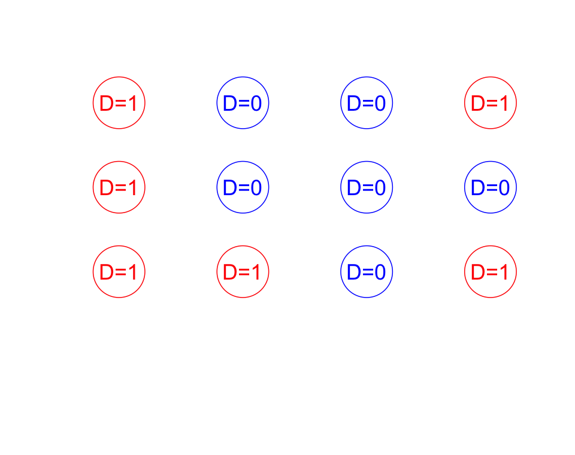

# Abidjan 2026 slides — source routing

Canonical bilingual sources live in `Slides_bilingual_fr_en/`.  
Abidjan outputs live here as Quarto `.qmd` → reveal.js HTML (`format: revealjs`, defaults in `_quarto.yml`).

## Deck map

| Abidjan output | Canonical source (`Slides_bilingual_fr_en/`) | Status |
|----------------|-----------------------------------------------|--------|
| `1_causalinference-slides-en-fr.qmd` | `causalinference-slides-en-fr.Rmd` | done |
| `2_estimation-slides-en-fr.qmd` | `estimation-slides-en-fr.Rmd` | done |
| `1_why-experiment.qmd` | `1_why-experiment.Rmd` (from `2026_slides/`) | done |
| `8_estimation_2.qmd` | `8_estimation_2.Rmd` | done |
| `6_randomization_2.qmd` | `6_randomization_2.Rmd` | done |
| `4_randomization_1.qmd` | `2026_slides/4_randomization-1-slides-en-fr-2025.Rmd` | done |
| `2_experiment_slides.qmd` | derived from `in_class_experiment.qmd` (participant briefing) | done |
| `3_design_intro.qmd` | derived from `3_design.qmd` (MIDA intro, bilingual) | done |
| `9_power_intro.qmd` | derived from `9_power.qmd` (power intro, bilingual) | done |
| `11_threats.qmd` | `11_threats-slides.Rmd` | done |
| `12_lifecycle.qmd` | `12_lifecycle-en-fr-2025.Rmd` | done |
| `13_grants.qmd` | `13_grants-slides-en-fr.Rmd` | done |
| `R_exercises.qmd` | self-contained student workbook (replaces `R_exercises/E|F/*.R`) | done |

## Publish to GitHub Pages (`docs/`)

1. Render decks when slide content changes, then copy the `.html` into `docs/`.
2. Edit `index.csv` to add or reorder deck cards, then render the index:

```bash
quarto render index.qmd
```

Push the `docs/` folder (GitHub Pages source: `/docs`).

### Index page (`index.qmd` + `index.csv`)

Deck cards are **not** edited in `index.qmd`. Edit **`index.csv`** instead:

| Column | Meaning |
|--------|---------|
| `sort_order` | Display order (integer) |
| `label` | Badge text, e.g. `Lecture 1`, `Exercise` |
| `href` | Link target, e.g. `1_why-experiment.html` |
| `title` | Card title |
| `blurb` | Short subtitle under the title |
| `placeholder` | `TRUE` for a non-linked “Coming soon” tile; leave `href`/`label` empty |

Then `quarto render index.qmd` — an R chunk reads the CSV and builds the grid HTML.

## Render

### Lecture PDFs (bilingual beamer)

From this folder, render all index decks that have a source `.qmd`:

```bash
Rscript scripts/render_lecture_pdfs.R
```

Outputs go to `pdf/<href-stem>.pdf` (e.g. `pdf/1_why-experiment.pdf`), keeping both EN and FR columns. Beamer styling is in `_quarto.yml` + `assets/beamer-header.tex`; `assets/abidjan-bilingual.lua` puts French slide titles in `\framesubtitle{}` on PDF exports. The script renders to a temp file, moves the PDF into `pdf/`, and deletes auxiliary resource folders. Skips placeholders, rows that are already `.pdf`, and rows with no matching `.qmd` (e.g. `15_wrap_up.html`). `15_grants.html` maps to `13_grants.qmd`.

Then refresh the index so deck cards show a **PDF** link where files exist:

```bash
quarto render index.qmd
```

### HTML slides

From this folder (or repo root with path):

```bash
quarto render 1_causalinference-slides-en-fr.qmd
quarto render 1_why-experiment.qmd
quarto render 8_estimation_2.qmd
quarto render 6_randomization_2.qmd
quarto render 4_randomization_1.qmd
quarto render 2_experiment_slides.qmd
quarto render 3_design_intro.qmd
quarto render 9_power_intro.qmd
quarto render 11_threats.qmd
quarto render 12_lifecycle.qmd
quarto render 13_grants.qmd
quarto render R_exercises.qmd
quarto render index.qmd
```

Project defaults: `_quarto.yml` + `assets/` (CSS, JS, Lua filter).

**Single-file HTML:** set `embed-resources: true` in the deck YAML (as in the causal deck). Do not enable the reveal **chalkboard** plugin with that option — they are incompatible. Chalkboard is only for live on-slide drawing; notes + search remain available.

## Authoring conventions

### Slide titles (auto two-column, colored)

Use a pipe between English and French. French is usually italic:

```markdown
## What can we learn from a randomized experiment? | *Qu'apprendre d'une expérience aléatoire?*
```

The Lua filter turns this into:

1. A **small gray placeholder** `##` (keeps the reveal.js slide break, id, and menu label)
2. A **two-column title row** below it (styled text divs, blue / pink — not `###`, which would break reveal.js)

You still author one `## English | *Français*` line — no need for empty `##` plus manual `###` pairs.

**Repeated slide titles:** many decks reuse the same `## English | …` line on consecutive slides (e.g. several “Inquiries” slides). The Lua filter assigns unique ids (`inquiries`, `inquiries-2`, …). Without that, Reveal.js navigation jumps back to the first slide with that id (e.g. slide 17 → slide 9). Re-render after filter changes.

### Spotting EN/FR body that is still stacked (needs columns)

The **title** line `## English | *Français*` is auto-split by the Lua filter. **Body** text is not — you must wrap it yourself.

Look for these on a slide (after the bilingual title row):

1. **No** `::: {.columns}` before the next `##` heading.
2. **Two markdown tables** in a row — first header `| Inquiry |`, second `| Requêtes |` (or similar EN then FR).
3. **One line with both languages** joined by `|` inside bold, e.g. `**English: | Français: **` — split into two columns.
4. **Converted `.cols` missed** — rare; most Rmd `:::::: {.cols}` blocks become columns, but tables and some beamer-only layouts do not.

Quick search in a deck:

```bash
# Stacked FR tables (common leak)
rg "^\| Requêtes" Slides_abidjan_2026/2_estimation-slides-en-fr.qmd

# Inline EN|FR in one line (not a ## title)
rg "\*\*[^*]+\|[^*]+\*\*" Slides_abidjan_2026/*.qmd
```

**Fix pattern:**

```markdown
::: {.columns}
::: {.column .lang-en width="50%"}

English table or prose.

:::
::: {.column .lang-fr width="50%"}

Tableau ou texte français.

:::
:::
```

### Body text — two columns (preferred)

```markdown
::: {.columns}
::: {.column .lang-en width="50%"}

English bullets or prose.

:::
::: {.column .lang-fr width="50%"}

Texte français.

:::
:::
```

### Body text — shorthand (optional)

Consecutive fenced divs are merged into columns by the filter:

```markdown
::: en
English bullets.
:::

::: fr
Puces en français.
:::
```

### Figures (not bilingual — keep outside `.lang-en` / `.lang-fr`)

Use one image per slide, **below** the `## English | *Français*` title, **not** inside language columns:

```markdown
## A random assignment | *Une assignation aléatoire*

{width="320px" fig-align="center"}
```

- Path: `Images/...` or `images/...` (both junction to repo `Images/` via `scripts/ensure_local_images.py` on pre-render)
- Why-experiment-only assets still in `../2026_slides/images/...` if not copied locally
- Do **not** wrap in `::: {.center}` (use `fig-align="center"` instead)
- Side-by-side figures (no translation): use plain `.columns` **without** `.lang-en` / `.lang-fr`
- **Figures inside columns:** omit `{width=...}` — CSS scales them to the column width. Use `{width="320px"}` only for single full-width figures below the title.

### Inline bilingual line (manual)

Rare lines like `English / français` on one row should be split into the column pattern above (see slide with ATE label).

### Presenter language focus (optional)

During HTML presentation:

- **B** — both languages (default)
- **E** — English only (hides French columns/title halves)
- **F** — French only

Or use the **Both / EN / FR** toolbar (top-right).

## New deck from bilingual Rmd

### Fast conversion workflow (2026_slides → Abidjan `.qmd`)

For lecture Rmds already in this folder (`6_randomization_2.Rmd`, `8_estimation_2.Rmd`, …):

1. **Scaffold** (optional — often needs manual cleanup anyway):

```bash
py scripts/convert_bilingual_rmd.py 6_randomization_2.Rmd 6_randomization_2.qmd
```

2. **YAML** — replace beamer/reveal Rmd header with:

```yaml
---
title: "English | *Français*"
author: "..."
date: today
bibliography: learningdays-book.bib
format:
  revealjs:
    embed-resources: true
---
```

3. **Simple decks** (slides + static figures, no live R output):

- Drop `{r setup}` and all `{r}` chunks.
- Put example code in markdown fences inside `.lang-en` / `.lang-fr` columns (same code in both columns is fine).
- Replace `knitr::include_graphics("../Images/foo.png")` with `{width="300px" fig-align="center"}` below the slide title.
- Remove beamer-only markup: `\begin{table}...\end{table}`, `\begin{tikzpicture}...`, `\medskip`, `\bigskip`, `\footnotesize`, `\textcolor`.

4. **LaTeX tables → markdown** — one compact table per slide; add `{.compact-table}` on the `##` line when the table is tight:

```markdown
## Factorial example | *Exemple factoriel* {.compact-table}

| | Transport: Yes | Transport: No |
|:--|:--|:--|
| **Information: Yes** | Both | Info only |
```

5. **TikZ diagrams** — replace with inline math arrows (`$Z \rightarrow D \rightarrow Y$`) or a PNG if you export one.

6. **Resources slide** — split EN/FR links into `.lang-en` / `.lang-fr` columns (do not stack both URLs in one column).

7. **QA grep** before first render:

```bash
rg "\\begin\{" 6_randomization_2.qmd          # leftover LaTeX
rg "\.cols"     6_randomization_2.qmd          # missed column conversion
rg '```\{r'     6_randomization_2.qmd          # R chunks to remove or keep
rg "include_graphics" 6_randomization_2.qmd     # should be markdown images
```

8. Add a row to the deck map table above and render:

```bash
quarto render 6_randomization_2.qmd
```

**Copy images first:** put any deck-specific PNGs/PDFs into local `images/` (junction to repo `Images/`) before rendering.

**Participant briefing decks** (e.g. `2_experiment_slides.qmd`): read the instructor `.qmd`/`.Rmd`, extract the task logic, simplify into slides — do **not** include answer keys or simulation code from instructor materials. Card photo: `images/cards.jpg`.

### Canonical bilingual sources (`Slides_bilingual_fr_en/`)

```bash
py scripts/convert_bilingual_rmd.py Slides_bilingual_fr_en/<source>.Rmd <n>_<name>.qmd
```

Then open the `.qmd`, remove any leftover comments, and add a row to the table above.

**R-heavy decks** (e.g. estimation): keep the setup/diagnosis `{r}` chunks at the top; render requires R with `DeclareDesign`, `tidyverse`, `estimatr`, `patchwork`. First render runs `diagnose_design(..., sims = 1000)` and can take several minutes.

## Shared files (do not duplicate per deck)

| File | Role |
|------|------|
| `_quarto.yml` | Shared `revealjs` defaults (white theme, slide-level 2, filters, header) |
| `assets/abidjan-bilingual.css` | EN blue / FR pink styling |
| `assets/abidjan-bilingual.js` | Language focus toggle |
| `assets/abidjan-bilingual.lua` | Title split + `::: en` / `::: fr` pairing |
| `assets/header.html` | Links CSS/JS + EGAP logo |
| `assets/force-image-src.lua` | Writes `` (reveal `data-src` lazy load broke figures) |
| `assets/reveal-images.js` | Backup loader after Reveal starts (in `after-body.html`) |
| `scripts/fix_figures_qmd.py` | Unwrap `.center` divs; add `fig-align` / `px` widths |
