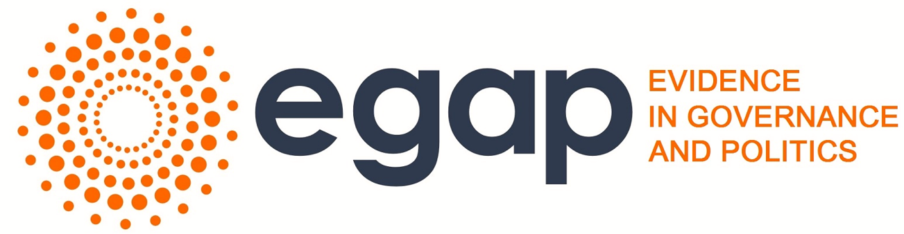
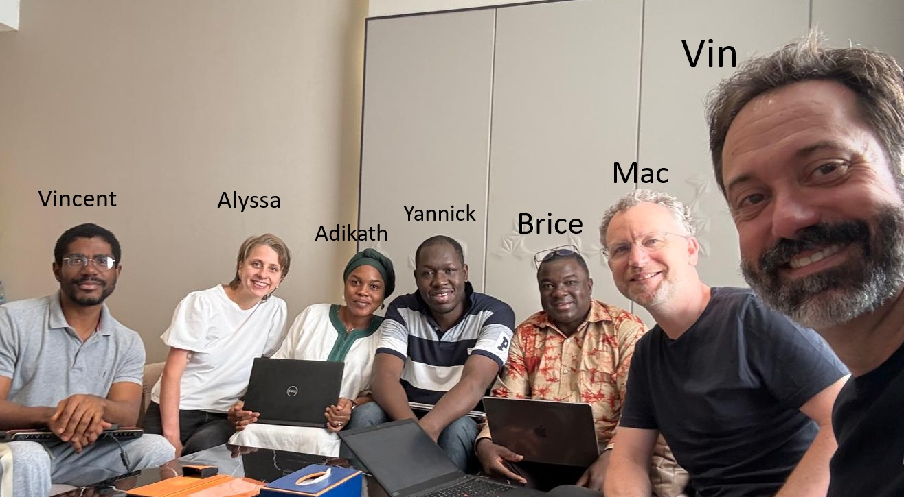

```{r deck-grid-setup, include=FALSE}
source("scripts/index_helpers.R")

quiz_stem <- c(
  "quizzes/quiz-tuesday",
  "quizzes/quiz-wednesday",
  "quizzes/quiz-thursday"
)
quiz_label_en <- c("Day 2", "Day 3", "Day 4")
quiz_label_fr <- c("Quiz du jour 2", "Quiz du jour 3", "Quiz du jour 4")
```

::: {.hero}
{.logo width="150px"}

<nav class="index-lang-switch" aria-label="Language">
  <button type="button" class="lang-opt is-active" data-lang="en" aria-pressed="true" aria-label="English">
    
    
    
    EN
  </button>
  <button type="button" class="lang-opt" data-lang="fr" aria-pressed="false" aria-label="Français">
    
    
    
    FR
  </button>
</nav>
:::

::: {#index-lang-en .index-lang-panel .is-active}

::: {.panel-tabset .index-main-tabs}

### Slides

# Slides for Abidjan Learning Days 2026

Teaching slides for the [EGAP](https://egap.org/) Learning Days in Abidjan, 2026.

```{r}
#| label: deck-grid-en
#| results: asis
render_deck_grid("en")
```

### Quizzes

```{r}
#| label: quiz-list-en
#| results: asis
render_quiz_list("en", quiz_stem, quiz_label_en)
```

### Resources

- The book is available in English and French:

- [Theory and Practice of Field Experiments](https://egap.github.io/theory_and_practice_of_field_experiments/)

- [English glossary](https://egap.github.io/theory_and_practice_of_field_experiments/glossary-of-terms.html)

- EGAP Methods Guide on Randomization
  (<https://egap.org/resource/10-things-to-know-about-randomization/>)

- [EGAP's Metaketa Initiative](https://egap.org/our-work/the-metaketa-initiative/)
  works to accumulate knowledge by pre-planning a meta-analysis of
  multiple studies that have high internal validity due to randomization.

- [DeclareDesign](https://declaredesign.org/) — software, tutorials, and design library (MIDA framework)

- [_Research Design in the Social Sciences_](https://book.declaredesign.org/) — declaration, diagnosis, and redesign (free online)

- **Research design form** (reference):
  [English version](research_design_forms/0_research_design_form_en.html)

- **Download the fill-in Word document** for group work:
  [English (.docx)](research_design_forms/0_research_design_form_blank_en.docx){.docx-link}

### Schedule

::: {.schedule-panel}

::: {.panel-tabset}

#### Monday

| Time | Session | Slides |
|:-----|:--------|:-------|
| 9:00–10:30 | Welcome and introductions: experiment examples | Lecture 1 |
| 10:30–11:15 | Exercise Part A | |
| 11:15–11:30 | Short break | Exercise |
| 11:30–13:00 | The fundamental problem of causal inference | Lecture 2 |
| 13:00–14:00 | Lunch | |
| 14:00–15:00 | Exercise Part B | Exercise |
| 15:00–15:30 | Feedback / discussion | Discussion |
| 15:30–16:15 | DeclareDesign | Lecture 3 |
| 16:15–16:30 | Break | |
| 16:15–17:45 | Randomization 1 | Lectures 4 f & e |
| 17:45–18:00 | Wrap-up | |
| 19:00 | Group dinner | |

#### Tuesday

| Time | Session | Slides |
|:-----|:--------|:-------|
| 9:00–9:30 | Quiz and review | |
| 9:30–10:30 | Introduction to R + randomizing with R | Lecture 5 |
| 10:30–10:45 | Break | |
| 10:45–12:00 | Randomization 2: types of designs | Lectures 6 f & e |
| 12:00–13:00 | Research design form in groups | Activity |
| 13:00–14:00 | Lunch | |
| 14:00–15:30 | Estimation / statistical inference 1 | Lectures 7 f & e |
| 15:30–16:30 | Estimation / statistical inference, with R exercise | Activity |
| 16:30–16:45 | Break | |
| 16:45–17:45 | Workshop | Activity |
| 17:45–18:00 | Wrap-up | |

#### Wednesday

| Time | Session | Slides |
|:-----|:--------|:-------|
| 9:00–9:30 | Quiz | |
| 9:30–11:00 | Estimation / statistical inference 2 | Lectures 8 f & e |
| 11:00–11:15 | Break | |
| 11:15–12:30 | Statistical power | Lectures 9 f & e |
| 12:30–13:30 | Lunch | |
| 13:30–14:30 | Ethics | Lecture 10 |
| 14:30–15:00 | Presenting and interpreting experimental designs and results | Lecture 11 |
| 15:00–18:00 | Workshop | |

#### Thursday

| Time | Session | Slides |
|:-----|:--------|:-------|
| 9:00–9:30 | Quiz | |
| 9:30–10:45 | Threats to causal inference | Lectures 12 f & e |
| 10:45–11:00 | Break | |
| 11:00–12:00 | Life cycle | Lecture 13 |
| 12:00–13:00 | Grant writing | Lecture 14 |
| 13:00–14:00 | Lunch | |
| 14:00–18:00 | Workshop and design clinic | |

#### Friday

| Time | Session | Slides |
|:-----|:--------|:-------|
| 9:00–11:30 | Presentations by language group (40 min × 3 groups × 2 languages) | |
| 11:30–11:45 | Break | |
| 11:45–12:15 | Feedback session | |
| 12:15–13:00 | Next steps, grant opportunities | Lecture 15 |
| 13:00–14:00 | Lunch | |
| 15:00 | Celebration! | |

:::

:::

### Instructors

{width="95%" fig-align="center"}

:::

:::

::: {#index-lang-fr .index-lang-panel}

::: {.panel-tabset .index-main-tabs}

### Diapos

# Diapositives — Learning Days Abidjan 2026

Diapositives pour les [Learning Days EGAP](https://egap.org/) à Abidjan, 2026.

```{r}
#| label: deck-grid-fr
#| results: asis
render_deck_grid("fr")
```

### Quiz

```{r}
#| label: quiz-list-fr
#| results: asis
render_quiz_list("fr", quiz_stem, quiz_label_fr)
```

### Ressources

- Le livre est disponible en anglais et en français :

- [Théorie et pratique des expériences de terrain](https://egap.github.io/theory_and_practice_of_field_experiments_french/)

- [Glossaire français](https://egap.github.io/theory_and_practice_of_field_experiments_french/glossaire-des-termes.html)

- Guide des méthodes EGAP sur la randomisation
  (<https://egap.org/fr/resource/10-choses-a-savoir-sur-la-randomisation/>)

- [L'initiative Metaketa d'EGAP](https://egap.org/our-work/the-metaketa-initiative/)
  vise à accumuler des connaissances en pré-planifiant une méta-analyse de
  plusieurs études qui ont une validité interne élevée en raison de la
  randomisation.

- [DeclareDesign](https://declaredesign.org/) — logiciels, tutoriels et bibliothèque de designs (cadre MIDA)

- [_Research Design in the Social Sciences_](https://book.declaredesign.org/) — déclaration, diagnostic et reconception (livre en ligne gratuit)

- **Formulaire de design de recherche** (référence) :
  [version française](research_design_forms/0_research_design_form_fr.html)

- **Téléchargez le document Word à compléter** pour le travail en groupe :
  [Français (.docx)](research_design_forms/0_research_design_form_blank_fr.docx){.docx-link}

### Programme

::: {.schedule-panel}

::: {.panel-tabset}

#### Lundi

| Horaire | Session | Diapos |
|:--------|:--------|:-------|
| 9:00–10:30 | Accueil et présentations : exemples d'expériences | Cours 1 |
| 10:30–11:15 | Exercice — partie A | |
| 11:15–11:30 | Pause | Exercice |
| 11:30–13:00 | Le problème fondamental de l'inférence causale | Cours 2 |
| 13:00–14:00 | Déjeuner | |
| 14:00–15:00 | Exercice — partie B | Exercice |
| 15:00–15:30 | Retour / discussion | Discussion |
| 15:30–16:15 | DeclareDesign | Cours 3 |
| 16:15–16:30 | Pause | |
| 16:15–17:45 | Randomisation 1 | Cours 4 f & e |
| 17:45–18:00 | Clôture | |
| 19:00 | Dîner de groupe | |

#### Mardi

| Horaire | Session | Diapos |
|:--------|:--------|:-------|
| 9:00–9:30 | Quiz et révision | |
| 9:30–10:30 | Introduction à R + randomisation avec R | Cours 5 |
| 10:30–10:45 | Pause | |
| 10:45–12:00 | Randomisation 2 : types de conceptions | Cours 6 f & e |
| 12:00–13:00 | Formulaire de design en groupes | Activité |
| 13:00–14:00 | Déjeuner | |
| 14:00–15:30 | Estimation / inférence statistique 1 | Cours 7 f & e |
| 15:30–16:30 | Estimation / inférence statistique, exercice R | Activité |
| 16:30–16:45 | Pause | |
| 16:45–17:45 | Atelier | Activité |
| 17:45–18:00 | Clôture | |

#### Mercredi

| Horaire | Session | Diapos |
|:--------|:--------|:-------|
| 9:00–9:30 | Quiz | |
| 9:30–11:00 | Estimation / inférence statistique 2 | Cours 8 f & e |
| 11:00–11:15 | Pause | |
| 11:15–12:30 | Puissance statistique | Cours 9 f & e |
| 12:30–13:30 | Déjeuner | |
| 13:30–14:30 | Éthique | Cours 10 |
| 14:30–15:00 | Présenter et interpréter des designs et résultats expérimentaux | Cours 11 |
| 15:00–18:00 | Atelier | |

#### Jeudi

| Horaire | Session | Diapos |
|:--------|:--------|:-------|
| 9:00–9:30 | Quiz | |
| 9:30–10:45 | Menaces à l'inférence causale | Cours 12 f & e |
| 10:45–11:00 | Pause | |
| 11:00–12:00 | Cycle de vie | Cours 13 |
| 12:00–13:00 | Rédaction de demandes de subvention | Cours 14 |
| 13:00–14:00 | Déjeuner | |
| 14:00–18:00 | Atelier et clinique de design | |

#### Vendredi

| Horaire | Session | Diapos |
|:--------|:--------|:-------|
| 9:00–11:30 | Présentations par groupe linguistique (40 min × 3 groupes × 2 langues) | |
| 11:30–11:45 | Pause | |
| 11:45–12:15 | Session de feedback | |
| 12:15–13:00 | Prochaines étapes, opportunités de subventions | Cours 15 |
| 13:00–14:00 | Déjeuner | |
| 15:00 | Célébration ! | |

:::

:::

### Instructeurs

{width="95%" fig-align="center"}

:::

:::
