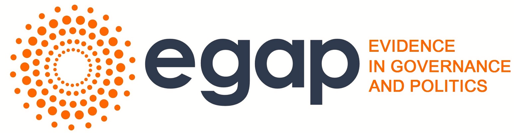

```{r index-setup, include=FALSE}
source("scripts/index_helpers.R")

r_session_hrefs <- c(
  "r_sessions/TA-rsession1.pdf",
  "r_sessions/TA-rsession1.Rmd",
  "r_sessions/ta-r-session-1-2025.R",
  "r_sessions/ta-r-session-2-2025.R",
  "r_sessions/activity1-basics.R",
  "r_sessions/activity2-randomization.R",
  "r_sessions/activity3-estimation.R",
  "r_sessions/act3.R",
  "r_sessions/activity5-estimation.R",
  "r_sessions/LearningsDay2_2025.R",
  "r_sessions/hypothesistesting-slidesMontevideo15.R",
  "r_sessions/data_for_analysis.csv"
)
r_session_labels_es <- c(
  "Sesión de R 1: diapositivas (PDF)",
  "Sesión de R 1: fuente (Rmd)",
  "Sesión de R 1: código (2025)",
  "Sesión de R 2: código (2025)",
  "Actividad 1: fundamentos de R",
  "Actividad 2: aleatorización",
  "Actividad 3: estimación",
  "Ejercicio 3: analizar según el diseño",
  "Actividad 5: estimación 2",
  "Ejercicio del día 2 (2025)",
  "Código: prueba de hipótesis",
  "Datos para las actividades (CSV)"
)
r_session_labels_en <- c(
  "R session 1: slides (PDF)",
  "R session 1: source (Rmd)",
  "R session 1: code (2025)",
  "R session 2: code (2025)",
  "Activity 1: R basics",
  "Activity 2: randomization",
  "Activity 3: estimation",
  "Exercise 3: analyze as you randomized",
  "Activity 5: estimation 2",
  "Day 2 exercise (2025)",
  "Code: hypothesis testing",
  "Data for the activities (CSV)"
)
```

::: {.hero}
{.logo width="150px"}

<nav class="index-lang-switch" aria-label="Idioma / Language">
  <button type="button" class="lang-opt is-active" data-lang="es" aria-pressed="true" aria-label="Espa&ntilde;ol">
    
    
    
    ES
  </button>
  <button type="button" class="lang-opt" data-lang="en" aria-pressed="false" aria-label="English">
    
    EN
  </button>
</nav>
:::

::: {#index-lang-es .index-lang-panel .is-active}

::: {.panel-tabset .index-main-tabs}

### Diapositivas

# Learning Days EGAP LatAm, Santiago 2026

Materiales del taller [EGAP](https://egap.org/) Learning Days en la
Universidad Cat&oacute;lica de Chile, Santiago, del 27 al 31 de julio de 2026.
El libro del taller est&aacute; disponible en espa&ntilde;ol, ingl&eacute;s
y portugu&eacute;s:

```{r}
#| label: textbook-links-es
#| results: asis
render_textbook_links("es")
```

Las tarjetas siguen el orden del programa (D&iacute;a-Sesi&oacute;n). La
insignia EN marca los materiales disponibles solo en ingl&eacute;s.

```{r}
#| label: deck-grid-es
#| results: asis
render_deck_grid("es")
```

### Sesiones de R

Scripts de R y datos para las sesiones pr&aacute;cticas. Descargue cada
archivo (clic derecho, "guardar enlace como") y &aacute;bralo en RStudio.

```{r}
#| label: r-sessions-es
#| results: asis
render_r_session_list("es", r_session_hrefs, r_session_labels_es)
```

- Instale R desde [CRAN](https://cran.r-project.org/) y
  [RStudio](https://posit.co/download/rstudio-desktop/) antes del taller.

### Lecturas

Las lecturas del taller est&aacute;n en la carpeta compartida de Dropbox:
**[enlace de Dropbox por confirmar]**. Versiones p&uacute;blicas:

- Freedman (2008), "Randomization Does Not Justify Logistic Regression",
  *Statistical Science* 23(2):
  [doi:10.1214/08-STS262](https://doi.org/10.1214/08-STS262) (acceso abierto).
- Lin (2013), "Agnostic Notes on Regression Adjustments to Experimental
  Data", *Annals of Applied Statistics* 7(1):
  [doi:10.1214/12-AOAS583](https://doi.org/10.1214/12-AOAS583);
  preprint en [arXiv:1208.2301](https://arxiv.org/abs/1208.2301).
- Rubin (1991), "Practical Implications of Modes of Statistical Inference
  for Causal Effects and the Critical Role of the Assignment Mechanism",
  *Biometrics* 47(4):
  [doi:10.2307/2532381](https://doi.org/10.2307/2532381).
- Bowers y Leavitt (2020), "Causality and Design-Based Inference",
  cap&iacute;tulo 41 del *SAGE Handbook of Research Methods in Political
  Science and IR*:
  [doi:10.4135/9781526486387.n44](https://doi.org/10.4135/9781526486387.n44).

### Recursos

- **El libro del taller**, *Theory and Practice of Field Experiments*:
  [espa&ntilde;ol](https://egap.github.io/theory_and_practice_of_field_experiments_spanish/)
  ([glosario](https://egap.github.io/theory_and_practice_of_field_experiments_spanish/glosario-de-t%C3%A9rminos.html)),
  [ingl&eacute;s](https://egap.github.io/theory_and_practice_of_field_experiments/),
  [portugu&eacute;s](https://egap.github.io/theory_and_practice_of_field_experiments_portuguese/).
- **El proceso del dise&ntilde;o de investigaci&oacute;n** (cap&iacute;tulo
  del libro, con el formulario de dise&ntilde;o):
  [en espa&ntilde;ol](https://egap.github.io/theory_and_practice_of_field_experiments_spanish/el-proceso-del-dise%C3%B1o-de-investigaci%C3%B3n.html).
- **Formulario de dise&ntilde;o de investigaci&oacute;n** (en ingl&eacute;s):
  [HTML](forms/design-form.html) &middot; [Rmd](forms/design-form.Rmd).
- **Formato de presentaci&oacute;n** para el viernes:
  [PDF](forms/formato-presentacion.pdf) &middot;
  [PowerPoint](forms/formato-presentacion.pptx) &middot;
  [Rmd](forms/formato-presentacion.Rmd).
- **Gu&iacute;as de m&eacute;todos de EGAP** (en espa&ntilde;ol):
  [10 cosas que debe saber sobre la aleatorizaci&oacute;n](https://egap.org/es/resource/10-cosas-que-debe-saber-sobre-la-aleatorizacion/),
  [10 cosas que debe saber sobre la inferencia causal](https://egap.org/es/resource/10-cosas-que-debe-saber-sobre-la-inferencia-causal/),
  [10 estrategias para entender si X causa Y](https://egap.org/es/resource/10-estrategias-para-entender-si-x-causa-y/),
  [10 cosas que debe saber sobre poder estad&iacute;stico](https://egap.org/es/resource/10-cosas-que-debe-saber-sobre-poder-estadistico/),
  [10 cosas que debe saber sobre ajuste de covariables](https://egap.org/es/resource/10-cosas-que-debe-saber-sobre-ajuste-de-covariables/).
- [DeclareDesign](https://declaredesign.org/): software y biblioteca de
  dise&ntilde;os (marco MIDA); el libro
  [*Research Design in the Social Sciences*](https://book.declaredesign.org/)
  est&aacute; disponible gratis en l&iacute;nea.
- Calculadoras de EGAP:
  [poder estad&iacute;stico](https://egap.shinyapps.io/Power_Calculator/) y
  [derrames (spillovers)](https://egap.shinyapps.io/spillover-app/).

### Programa

Universidad Cat&oacute;lica de Chile, Instituto de Sociolog&iacute;a,
Av. Vicu&ntilde;a Mackenna 4860, Macul (Sala de Mag&iacute;ster, piso 3).

::: {.schedule-panel}

::: {.panel-tabset}

#### Lunes

| Horario | Sesi&oacute;n | Diapositivas |
|:--------|:--------------|:-------|
| 9:00-9:30 | Bienvenida | D1-1 |
| 9:30-10:30 | Presentaciones de participantes; introducci&oacute;n a EGAP y expectativas de colaboraci&oacute;n | |
| 10:30-11:30 | Charla de dise&ntilde;o 1: &iquest;por qu&eacute; un experimento? Ejemplo de un estudio real | D1-2 |
| 11:30-11:45 | Caf&eacute; | |
| 11:45-12:15 | Hagamos un experimento (pr&aacute;ctica en clase) | D1-3 |
| 12:15-13:15 | Revelar T e Y; discusi&oacute;n sobre la importancia de la teor&iacute;a | D1-4 |
| 13:15-14:15 | Almuerzo | |
| 14:15-15:00 | Inferencia causal | D1-5 |
| 15:00-16:00 | Taller: definir un T aleatorizable y c&oacute;mo y a qu&eacute; nivel medir Y | |
| 16:00-17:00 | Sesi&oacute;n de R | D1-6 |
| 17:00-17:30 | Resumen y cierre | |
| 17:30-18:30 | Horas de consulta | |

#### Martes

| Horario | Sesi&oacute;n | Diapositivas |
|:--------|:--------------|:-------|
| 9:00-9:30 | Quiz de repaso del d&iacute;a 1 (Kahoot!) | |
| 9:30-10:30 | Aleatorizaci&oacute;n: tipos de dise&ntilde;os, incluido el dise&ntilde;o de est&iacute;mulo | D2-1 |
| 10:30-11:30 | Sesi&oacute;n de R: &iexcl;a aleatorizar! | D2-2 |
| 11:30-11:45 | Caf&eacute; | |
| 11:45-13:15 | Charla de dise&ntilde;o 2: el formulario de dise&ntilde;o de investigaci&oacute;n, recorriendo un estudio completo | D2-3 |
| 13:15-14:15 | Almuerzo | |
| 14:15-15:00 | Prueba de hip&oacute;tesis, con ejercicio en R | D2-4 |
| 15:00-16:00 | Formato de las presentaciones finales; tiempo de taller | D2-5 |
| 16:00-17:00 | Entrevistas individuales | |
| 17:00-17:30 | Resumen y cierre | |
| 17:30-18:30 | Horas de consulta | |

#### Mi&eacute;rcoles

| Horario | Sesi&oacute;n | Diapositivas |
|:--------|:--------------|:-------|
| 9:00-9:30 | Quiz de repaso de los d&iacute;as 1 y 2 | |
| 9:30-11:30 | Estimaci&oacute;n e inferencia estad&iacute;stica, con ejercicio en R | D3-1 |
| 11:30-11:45 | Caf&eacute; | |
| 11:45-12:15 | Tiempo de taller | |
| 12:15-13:15 | Discusi&oacute;n sobre &eacute;tica, con ejercicio | D3-2 |
| 13:15-14:15 | Almuerzo | |
| 14:15-15:00 | Poder estad&iacute;stico, con ejercicio en R | D3-3 |
| 15:00-16:00 | Tiempo de taller | |
| 16:00-17:00 | Entrevistas individuales | |
| 17:00-17:30 | Resumen y cierre | |
| 17:30-18:30 | Horas de consulta | |

#### Jueves

| Horario | Sesi&oacute;n | Diapositivas |
|:--------|:--------------|:-------|
| 9:00-9:30 | Quiz de repaso de los d&iacute;as 1 a 3 | |
| 9:30-10:30 | Amenazas a la validez y problemas de dise&ntilde;o previsibles | D4-1 |
| 10:30-11:30 | Ejercicio: presentar e interpretar resultados | D4-2 |
| 11:30-11:45 | Caf&eacute; | |
| 11:45-12:15 | Tiempo de taller | |
| 12:15-13:15 | Preparaci&oacute;n final de las presentaciones | |
| 13:15-14:15 | Almuerzo | |
| 14:15-15:00 | Transparencia; colaboraciones y financiamiento | D4-3 |
| 15:00-16:00 | Charla de dise&ntilde;o 3 (por confirmar) | D4-4 |
| 16:00-17:00 | Entrevistas individuales | |
| 17:00-17:30 | Resumen y cierre | |
| 17:30-18:30 | Horas de consulta | |

#### Viernes

| Horario | Sesi&oacute;n | Diapositivas |
|:--------|:--------------|:-------|
| 9:00-11:30 | Presentaciones de participantes | D5-1 |
| 11:30-11:45 | Caf&eacute; | |
| 11:45-13:15 | Presentaciones de participantes (continuaci&oacute;n) | D5-1 |
| 13:15-14:15 | Almuerzo | |
| 14:15-15:00 | Retroalimentaci&oacute;n, evaluaci&oacute;n y certificados | |
| 15:00-18:00 | Actividad cultural | |
| 18:00 | Cierre del taller | |

:::

:::

### Instructores

**Equipo docente**

- Jake Bowers (University of Illinois)
- Omar Garc&iacute;a Ponce (George Washington University)
- Santiago L&oacute;pez-Cariboni (Universidad de la Rep&uacute;blica)
- Ana Paula Pellerino (Universidad Cat&oacute;lica de Chile)

**Ayudante de docencia**

- Susana Chac&oacute;n (Universidad Cat&oacute;lica de Chile)

**Organizaci&oacute;n**

- Leopoldo Fergusson (Universidad de los Andes; codirector del hub EGAP
  LatAm)
- Luis Maldonado (Universidad Cat&oacute;lica de Chile; anfitri&oacute;n)
- Kevin (Vin) Arceneaux (Sciences Po) y Jake Bowers (University of
  Illinois), codirectores de Training & Methods de EGAP

:::

:::

::: {#index-lang-en .index-lang-panel}

::: {.panel-tabset .index-main-tabs}

### Slides

# EGAP LatAm Learning Days, Santiago 2026

Materials for the [EGAP](https://egap.org/) Learning Days workshop at
Universidad Cat&oacute;lica de Chile, Santiago, July 27-31, 2026. The
workshop book is available in Spanish, English, and Portuguese:

```{r}
#| label: textbook-links-en
#| results: asis
render_textbook_links("en")
```

Cards follow the program order (Day-Session). Most decks are in Spanish;
the ES badge marks materials available only in Spanish.

```{r}
#| label: deck-grid-en
#| results: asis
render_deck_grid("en")
```

### R sessions

R scripts and data for the hands-on sessions. Download each file
(right-click, "save link as") and open it in RStudio.

```{r}
#| label: r-sessions-en
#| results: asis
render_r_session_list("en", r_session_hrefs, r_session_labels_en)
```

- Install R from [CRAN](https://cran.r-project.org/) and
  [RStudio](https://posit.co/download/rstudio-desktop/) before the workshop.

### Readings

Workshop readings live in the shared Dropbox folder:
**[Dropbox link to be confirmed]**. Public versions:

- Freedman (2008), "Randomization Does Not Justify Logistic Regression",
  *Statistical Science* 23(2):
  [doi:10.1214/08-STS262](https://doi.org/10.1214/08-STS262) (open access).
- Lin (2013), "Agnostic Notes on Regression Adjustments to Experimental
  Data", *Annals of Applied Statistics* 7(1):
  [doi:10.1214/12-AOAS583](https://doi.org/10.1214/12-AOAS583);
  preprint at [arXiv:1208.2301](https://arxiv.org/abs/1208.2301).
- Rubin (1991), "Practical Implications of Modes of Statistical Inference
  for Causal Effects and the Critical Role of the Assignment Mechanism",
  *Biometrics* 47(4):
  [doi:10.2307/2532381](https://doi.org/10.2307/2532381).
- Bowers and Leavitt (2020), "Causality and Design-Based Inference",
  chapter 41 of the *SAGE Handbook of Research Methods in Political
  Science and IR*:
  [doi:10.4135/9781526486387.n44](https://doi.org/10.4135/9781526486387.n44).

### Resources

- **The workshop book**, *Theory and Practice of Field Experiments*:
  [Spanish](https://egap.github.io/theory_and_practice_of_field_experiments_spanish/)
  ([glossary](https://egap.github.io/theory_and_practice_of_field_experiments_spanish/glosario-de-t%C3%A9rminos.html)),
  [English](https://egap.github.io/theory_and_practice_of_field_experiments/),
  [Portuguese](https://egap.github.io/theory_and_practice_of_field_experiments_portuguese/).
- **The research design process** (book chapter, with the design form):
  [in Spanish](https://egap.github.io/theory_and_practice_of_field_experiments_spanish/el-proceso-del-dise%C3%B1o-de-investigaci%C3%B3n.html).
- **Research design form** (English):
  [HTML](forms/design-form.html) &middot; [Rmd](forms/design-form.Rmd).
- **Presentation template** for Friday:
  [PDF](forms/formato-presentacion.pdf) &middot;
  [PowerPoint](forms/formato-presentacion.pptx) &middot;
  [Rmd](forms/formato-presentacion.Rmd).
- **EGAP methods guides** (Spanish versions; English versions at
  [egap.org](https://egap.org/methods-guides/)):
  [randomization](https://egap.org/es/resource/10-cosas-que-debe-saber-sobre-la-aleatorizacion/),
  [causal inference](https://egap.org/es/resource/10-cosas-que-debe-saber-sobre-la-inferencia-causal/),
  [did X cause Y](https://egap.org/es/resource/10-estrategias-para-entender-si-x-causa-y/),
  [statistical power](https://egap.org/es/resource/10-cosas-que-debe-saber-sobre-poder-estadistico/),
  [covariate adjustment](https://egap.org/es/resource/10-cosas-que-debe-saber-sobre-ajuste-de-covariables/).
- [DeclareDesign](https://declaredesign.org/): software and design library
  (MIDA framework); the book
  [*Research Design in the Social Sciences*](https://book.declaredesign.org/)
  is free online.
- EGAP calculators:
  [statistical power](https://egap.shinyapps.io/Power_Calculator/) and
  [spillovers](https://egap.shinyapps.io/spillover-app/).

### Schedule

Universidad Cat&oacute;lica de Chile, Instituto de Sociolog&iacute;a,
Av. Vicu&ntilde;a Mackenna 4860, Macul (Sala de Mag&iacute;ster, 3rd floor).

::: {.schedule-panel}

::: {.panel-tabset}

#### Monday

| Time | Session | Slides |
|:-----|:--------|:-------|
| 9:00-9:30 | Welcome | D1-1 |
| 9:30-10:30 | Participant introductions; introduction to EGAP and collaboration expectations | |
| 10:30-11:30 | Design talk 1: why an experiment? Example from a real study | D1-2 |
| 11:30-11:45 | Coffee | |
| 11:45-12:15 | Do an experiment (in-class practicum) | D1-3 |
| 12:15-13:15 | Reveal T and Y; discussion of the importance of theory | D1-4 |
| 13:15-14:15 | Lunch | |
| 14:15-15:00 | Causal inference | D1-5 |
| 15:00-16:00 | Workshop: fix a randomizable T and how/at what level to measure Y | |
| 16:00-17:00 | R session | D1-6 |
| 17:00-17:30 | Recap and closing | |
| 17:30-18:30 | Office hours | |

#### Tuesday

| Time | Session | Slides |
|:-----|:--------|:-------|
| 9:00-9:30 | Day 1 recap quiz (Kahoot!) | |
| 9:30-10:30 | Randomization: types of designs, including encouragement designs | D2-1 |
| 10:30-11:30 | R session: randomize! | D2-2 |
| 11:30-11:45 | Coffee | |
| 11:45-13:15 | Design talk 2: the research design form, walking through a full study | D2-3 |
| 13:15-14:15 | Lunch | |
| 14:15-15:00 | Hypothesis testing, with an R exercise | D2-4 |
| 15:00-16:00 | Template for the final presentations; workshop time | D2-5 |
| 16:00-17:00 | Individual interviews | |
| 17:00-17:30 | Recap and closing | |
| 17:30-18:30 | Office hours | |

#### Wednesday

| Time | Session | Slides |
|:-----|:--------|:-------|
| 9:00-9:30 | Days 1-2 recap quiz | |
| 9:30-11:30 | Estimation and statistical inference, with an R exercise | D3-1 |
| 11:30-11:45 | Coffee | |
| 11:45-12:15 | Workshop time | |
| 12:15-13:15 | Ethics discussion, with an exercise | D3-2 |
| 13:15-14:15 | Lunch | |
| 14:15-15:00 | Statistical power, with an R exercise | D3-3 |
| 15:00-16:00 | Workshop time | |
| 16:00-17:00 | Individual interviews | |
| 17:00-17:30 | Recap and closing | |
| 17:30-18:30 | Office hours | |

#### Thursday

| Time | Session | Slides |
|:-----|:--------|:-------|
| 9:00-9:30 | Days 1-3 recap quiz | |
| 9:30-10:30 | Threats to validity and design pitfalls you can anticipate | D4-1 |
| 10:30-11:30 | Exercise: presenting and interpreting results | D4-2 |
| 11:30-11:45 | Coffee | |
| 11:45-12:15 | Workshop time | |
| 12:15-13:15 | Final preparation of presentations | |
| 13:15-14:15 | Lunch | |
| 14:15-15:00 | Transparency; collaborations and funding | D4-3 |
| 15:00-16:00 | Design talk 3 (to be confirmed) | D4-4 |
| 16:00-17:00 | Individual interviews | |
| 17:00-17:30 | Recap and closing | |
| 17:30-18:30 | Office hours | |

#### Friday

| Time | Session | Slides |
|:-----|:--------|:-------|
| 9:00-11:30 | Participant presentations | D5-1 |
| 11:30-11:45 | Coffee | |
| 11:45-13:15 | Participant presentations (continued) | D5-1 |
| 13:15-14:15 | Lunch | |
| 14:15-15:00 | Feedback, evaluation, and certificates | |
| 15:00-18:00 | Cultural activity | |
| 18:00 | End of the workshop | |

:::

:::

### Instructors

**Teaching team**

- Jake Bowers (University of Illinois)
- Omar Garc&iacute;a Ponce (George Washington University)
- Santiago L&oacute;pez-Cariboni (Universidad de la Rep&uacute;blica)
- Ana Paula Pellerino (Universidad Cat&oacute;lica de Chile)

**Teaching assistant**

- Susana Chac&oacute;n (Universidad Cat&oacute;lica de Chile)

**Organization**

- Leopoldo Fergusson (Universidad de los Andes; EGAP LatAm hub co-director)
- Luis Maldonado (Universidad Cat&oacute;lica de Chile; host)
- Kevin (Vin) Arceneaux (Sciences Po) and Jake Bowers (University of
  Illinois), EGAP Training & Methods co-directors

:::

:::
